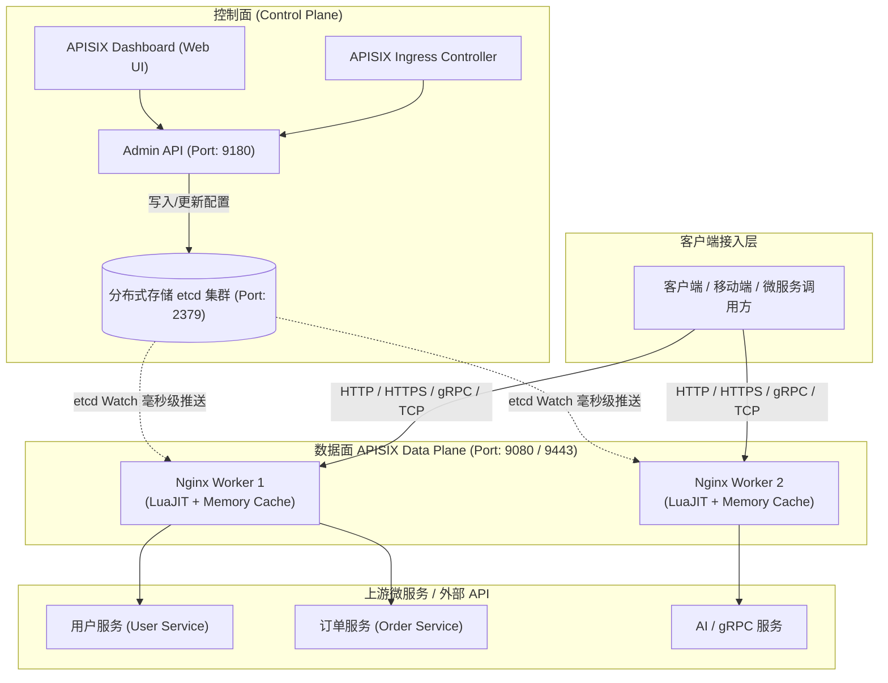
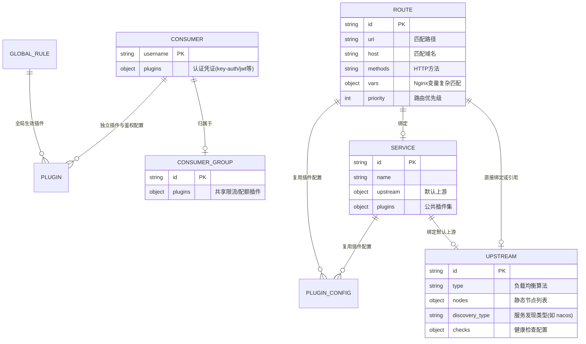

# 00. Apache APISIX 3.15 核心架构与核心概念

## 1. Apache APISIX 概览与设计哲学

Apache APISIX 是一个动态、实时、高性能的云原生 API 网关与微服务流量调度平台。它基于 Nginx 核心与 LuaJIT（OpenResty 生态）构建，底层采用无锁设计与事件驱动模型（Epoll/Kqueue），同时将控制面与数据面完全解耦。

### 1.1 核心设计原则
* **全动态（All Dynamic）**：路由增删改、上游节点变更、证书更新、插件加载与参数调整等所有操作均**无需 Reload 或重启 Nginx 进程**，真正做到 0 停机、毫秒级生效。
* **数据面与控制面分离**：
  * **数据面（Data Plane）**：负责拦截、路由、过滤与转发业务流量。纯内存处理，不直连任何业务关系型数据库。
  * **控制面（Control Plane）**：由 Admin API 或 APISIX Dashboard 构成，负责接收管理员配置指令并写入分布式配置中心 `etcd`。
* **低延迟与高吞吐**：单核 QPS 可达数万，平均处理延迟保持在亚毫秒（Sub-millisecond）级别。
* **插件化架构**：核心功能高度内聚，所有业务特性（认证、限流、熔断、日志、指标、安全）均作为插件挂载，支持热拔插。

---

## 2. 总体架构与数据流



### 2.1 为什么选择 etcd 而不是传统数据库？
1. **基于 Raft 协议的高可用强一致性**：保证多节点配置分发的一致性。
2. **高效的 Watch 增量监听机制**：APISIX 各 Worker 进程通过 `etcd` 的 HTTP/gRPC Watch 机制监听配置变更。当 Admin API 修改配置时，变更直接推送到所有 Worker 的共享内存/Lua 缓存中，**耗时小于 10ms**。
3. **彻底摒弃 Nginx Config Reload**：传统 Nginx reload 需要重新加载配置、创建新 Worker 并等待老 Worker 优雅退出，在高并发长连接场景下极易造成连接震荡、内存飙升甚至短时丢包；APISIX 彻底消除了这一痛点。

---

## 3. APISIX 3.15 核心资源对象模型

APISIX 的资源模型是面向对象且模块化的。以下为核心资源的关系与职责：



### 3.1 Route（路由）
* 路由是网关请求匹配的最基本单元。
* 包含三要素：
  1. **匹配规则**：`uri`（支持前缀、精确、通配符）、`host`、`methods`、`remote_addrs`、`vars`（通过 Nginx 内置变量如 `$arg_id`、`$http_token` 进行任意逻辑判断）。
  2. **插件列表（Plugins）**：在当前路由上生效的限流、鉴权、日志、改写等插件。
  3. **上游目标（Upstream）**：可内联定义 `upstream` 对象，也可通过 `upstream_id` 引用外部独立 Upstream。

### 3.2 Upstream（上游服务）
* 代表一组后端服务的物理或逻辑集群。
* 核心能力：
  * **负载均衡算法**：`roundrobin`（轮询）、`chash`（一致性哈希，支持基于 IP/Header/Cookie/Uri 路由）、`ewma`（指数加权移动平均，延迟最低优先）、`least_conn`（最小连接数）。
  * **服务发现**：支持通过 `nacos`、`consul`、`eureka`、`kubernetes` 等注册中心动态拉取节点，无需手动维护静态 IP。
  * **主动/被动健康检查**：自动剔除异常节点并在恢复后重新加入。

### 3.3 Service（服务抽象）
* 多个路由往往具有相同的一组插件或指向相同的 Upstream。
* `Service` 提供了路由的模板化抽象。Route 绑定 `service_id` 后，即可自动继承 Service 上配置的插件和上游，同时 Route 自身的插件具有更高的覆盖优先级。

### 3.4 Consumer 与 Consumer Group（消费者与用户组）
* `Consumer` 代表网关的调用方身份（例如客户端 App、某个 SaaS 租户、第三方开发者）。
* 通常配合认证插件（`key-auth`、`jwt-auth`、`hmac-auth` 等）使用。
* `Consumer Group`（消费者组）支持将多个 Consumer 归类，统一配置配额与限流策略。

### 3.5 PluginConfig（插件配置模板）
* 用于跨 Route / Service 共享同一组插件配置。
* 当需要修改一组路由的限流参数时，只需修改一个 `PluginConfig` 实体，所有引用的路由立即同步生效。

### 3.6 GlobalRule（全局规则 - 3.15 重点变动）
* 全局规则对网关处理的**所有请求**生效，常用于配置全局 Prometheus 指标采集、全局链路追踪（SkyWalking/OpenTelemetry）、全局 CORS 或全局防护。
* **APISIX 3.15 关键变更**：禁止在多个 GlobalRule 中配置相同的插件；若存在重复，插件仅在首次出现的 GlobalRule 中执行，避免执行顺序混乱。

### 3.7 Secret（密钥管理器）
* APISIX 3.x 引入的统一安全凭证管理机制。支持将数据库密码、API Key、TLS 证书等敏感数据保存在 HashiCorp Vault、AWS Secrets Manager 或操作系统环境变量中，配置文件中仅保留引用路径（URI），避免明文硬编码。

---

## 4. APISIX 请求处理生命周期（Phase 流转）

APISIX 的插件执行严格映射到 Nginx / OpenResty 的核心处理阶段：

```
客户端请求到达
       │
       ▼
┌──────────────────┐
│  rewrite 阶段    │ ───► 修改 URI、修改 Header、前置变量重定向
└────────┬─────────┘
         │
         ▼
┌──────────────────┐
│   access 阶段    │ ───► 身份鉴权 (JWT/Key-Auth)、白名单校验、限流防刷 (limit-req)
└────────┬─────────┘
         │
         ▼
┌──────────────────┐
│   upstream 转发  │ ───► 负载均衡选节点、建立 TCP/HTTP 连接、健康检查、超时重试
└────────┬─────────┘
         │
         ▼
┌──────────────────┐
│ header_filter 阶段│ ───► 动态修改响应头、注入安全响应头
└────────┬─────────┘
         │
         ▼
┌──────────────────┐
│  body_filter 阶段 │ ───► 流式修改响应体（如敏感信息脱敏、压缩）
└────────┬─────────┘
         │
         ▼
┌──────────────────┐
│    log 阶段      │ ───► 异步记录访问日志、向 Prometheus/SkyWalking 发送指标与追踪
└──────────────────┘
```

> [!NOTE]
> 在整个执行流中，APISIX 的 `log` 阶段完全异步进行，绝不阻塞主请求的响应速度。
