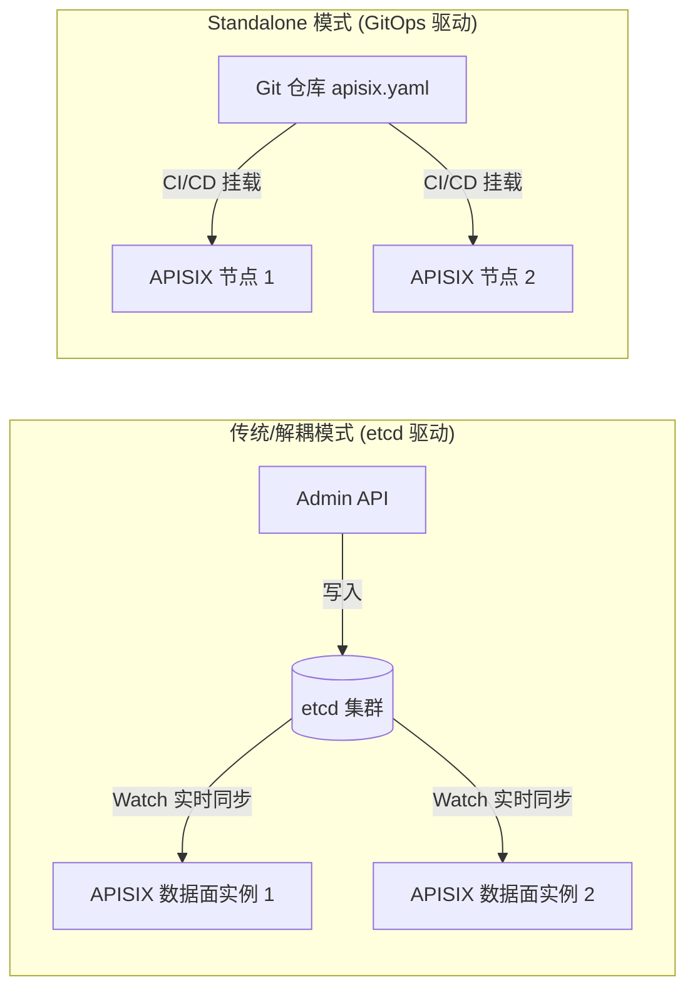

# 01. Apache APISIX 3.15 快速上手与部署安装

## 1. 快速入门：一键脚本体验

针对本地快速体验与开发测试，官方提供了全自动化 Quickstart 脚本（基于 Docker）：

```bash
# 运行官方一键快速体验脚本
curl -sL https://run.api7.ai/apisix/quickstart | sh
```

验证网关运行状态：
```bash
curl -sI "http://127.0.0.1:9080" | grep Server
# 输出示例: Server: APISIX/3.15.0
```

---

## 2. 生产级 Docker Compose 编排实战

在容器化与微服务架构中，推荐使用 Docker Compose 部署包含 `etcd 3.5+` 与 `APISIX 3.15` 的完整环境。

### 2.1 目录结构规划
```text
apisix-deploy/
├── docker-compose.yml
├── apisix_conf/
│   └── config.yaml
└── etcd_data/
```

### 2.2 核心配置文件：`apisix_conf/config.yaml`
```yaml
apisix:
  node_listen: 9080              # 数据面 HTTP 监听端口
  ssl:
    enable: true
    listen_port: 9443            # 数据面 HTTPS 监听端口
  admin_key:
    - name: "admin"
      key: "edd1c9f034335f136f87ad84b625c8f1"  # 生产环境务必修改此 Token
      role: admin
    - name: "viewer"
      key: "4054f7cf07e344346cd3f287985e76a2"
      role: viewer

deployment:
  role: traditional              # traditional: 控制面与数据面同实例运行
  role_traditional:
    config_provider: etcd
  admin:
    admin_listen:
      ip: 0.0.0.0
      port: 9180                 # 控制面 Admin API 监听端口
    allow_admin:                 # Admin API 访问白名单，生产环境务必限制
      - 127.0.0.1/32
      - 172.16.0.0/12
      - 192.168.0.0/16
      - 10.0.0.0/8
  etcd:
    host:
      - "http://etcd:2379"
    prefix: "/apisix"
    timeout: 30
```

### 2.3 容器编排文件：`docker-compose.yml`
```yaml
version: '3.8'

services:
  etcd:
    image: bitnami/etcd:3.5.11
    container_name: apisix-etcd
    restart: always
    environment:
      - ALLOW_NONE_AUTHENTICATION=yes
      - ETCD_ENABLE_V2=true
    volumes:
      - ./etcd_data:/bitnami/etcd-data
    ports:
      - "2379:2379"
    networks:
      - apisix-net

  apisix:
    image: apache/apisix:3.15.0-debian
    container_name: apisix-gateway
    restart: always
    depends_on:
      - etcd
    volumes:
      - ./apisix_conf/config.yaml:/usr/local/apisix/conf/config.yaml:ro
    ports:
      - "9080:9080"    # HTTP 流量入口
      - "9443:9443"    # HTTPS 流量入口
      - "9180:9180"    # Admin API 管理入口
      - "9091:9091"    # Prometheus 监控指标入口
    networks:
      - apisix-net

networks:
  apisix-net:
    driver: bridge
```

启动服务集群：
```bash
docker compose up -d
# 查看容器状态
docker compose ps
```

---

## 3. 两种核心运行模式

APISIX 支持根据企业运维架构选择不同的运行模式：



### 3.1 etcd 模式（默认推荐）
* **特点**：支持通过 Admin API 和 Dashboard 动态在线修改，无需重启或重新下发文件，适合微服务高频动态变更场景。

### 3.2 Standalone 模式（无 etcd 依赖）
* **特点**：网关启动时不依赖 etcd，所有路由、上游和插件配置直接定义在本地 `apisix.yaml` 文件中。
* **适用场景**：极端追求轻量化、完全通过 GitOps (Kubernetes ConfigMap / CI/CD) 声明式管理配置的场景。
* **配置方式**：在 `config.yaml` 中设置 `deployment.role: data_plane` 且 `config_provider: yaml`。

---

## 4. Admin API 鉴权与首次交互实战

APISIX 通过 RESTful Admin API 进行所有资源操作，默认请求头需要附带 `X-API-KEY`。

### 4.1 创建第一条路由（测试代理到 httpbin.org）

执行以下命令，创建一条将 `/get` 请求代理至后端公共测试服务 `httpbin.org:80` 的路由：

```bash
curl -i "http://127.0.0.1:9180/apisix/admin/routes/1" \
  -H "X-API-KEY: edd1c9f034335f136f87ad84b625c8f1" \
  -X PUT \
  -d '{
    "name": "first-test-route",
    "desc": "代理到 httpbin 测试接口",
    "methods": ["GET"],
    "uri": "/get",
    "upstream": {
      "type": "roundrobin",
      "nodes": {
        "httpbin.org:80": 1
      }
    }
  }'
```

**响应结果（HTTP 201 / 200）：**
```json
{
  "key": "/apisix/routes/1",
  "value": {
    "id": "1",
    "name": "first-test-route",
    "uri": "/get",
    "methods": ["GET"],
    "upstream": {
      "nodes": {
        "httpbin.org:80": 1
      },
      "type": "roundrobin"
    }
  }
}
```

### 4.2 通过数据面验证流量访问

请求数据面端口 `9080`：
```bash
curl -i "http://127.0.0.1:9080/get?foo=bar"
```

**返回报文关键信息：**
```http
HTTP/1.1 200 OK
Content-Type: application/json
Server: APISIX/3.15.0

{
  "args": {
    "foo": "bar"
  }, 
  "headers": {
    "Host": "httpbin.org",
    "X-Forwarded-Host": "127.0.0.1"
  }, 
  "origin": "x.x.x.x", 
  "url": "http://127.0.0.1/get?foo=bar"
}
```

> [!TIP]
> 成功返回说明：
> 1. 数据面 `9080` 正确捕获了请求；
> 2. 路由匹配命中规则 `/get`；
> 3. 请求被透明负载均衡并转发至目标节点 `httpbin.org:80`；
> 4. 响应报文完整返回至客户端。
