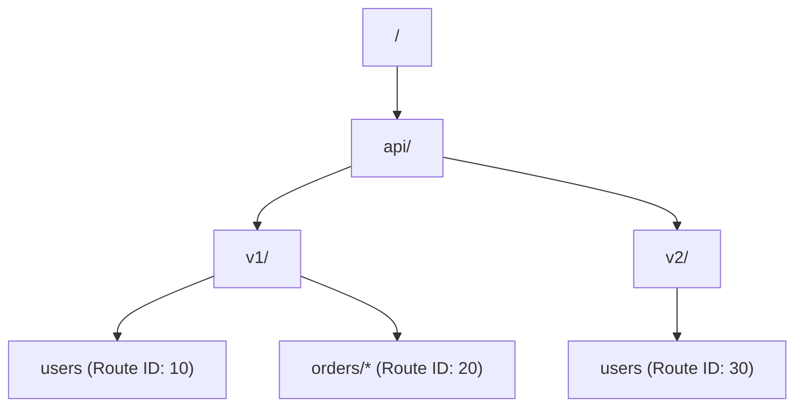
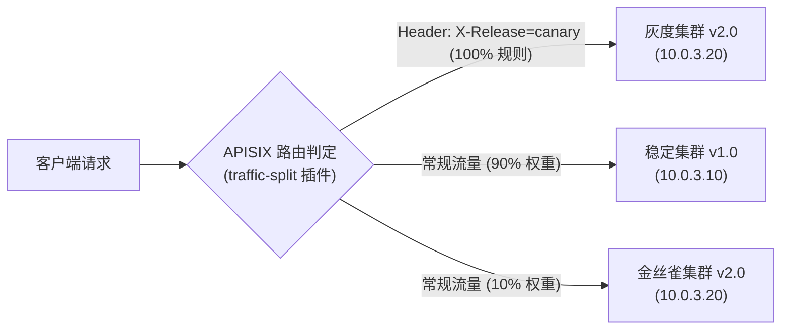

# 02. Apache APISIX 3.15 路由与流量调度实战

## 1. 高性能 Radixtree 路由匹配引擎

APISIX 底层采用自研的 **Radixtree（基数树）** 路由匹配引擎（`libradixtree`）。与传统基于正则遍历或简单哈希表的匹配机制相比，Radixtree 在路由数量从几十增长至数万条时，匹配耗时依然保持在微秒级且性能基本不衰减。



### 1.1 核心匹配规则与优先级
APISIX 支持多维度的请求特征匹配：
* **URI 路径**：支持精确匹配（`/api/login`）、前缀匹配（`/api/v1/*`）、多路径数组匹配（`["/api/v1", "/api/v2"]`）。
* **HTTP 方法**：`methods: ["GET", "POST", "PUT"]`。
* **域名/主机名**：`hosts: ["api.example.com", "*.example.com"]`。
* **客户端源 IP**：`remote_addrs: ["192.168.1.0/24", "10.0.0.1"]`。
* **优先级（Priority）**：当同一个请求同时满足多条路由时，`priority` 字段数值越大，优先级越高（默认值为 0）。

### 1.2 高级条件变量匹配（vars）
APISIX 允许直接提取 Nginx 内置变量、HTTP 请求头、URL 查询参数、Cookie 或 Post 表单进行任意逻辑运算（`AND` / `OR`）：

```bash
curl "http://127.0.0.1:9180/apisix/admin/routes/vip_route" -X PUT \
  -H "X-API-KEY: edd1c9f034335f136f87ad84b625c8f1" \
  -d '{
    "uri": "/api/order/create",
    "vars": [
      ["http_x_user_tier", "==", "VIP"],
      ["arg_amount", ">", "1000"]
    ],
    "priority": 100,
    "upstream": {
      "type": "roundrobin",
      "nodes": {
        "10.0.1.10:8080": 1
      }
    }
  }'
```

---

## 2. Upstream 负载均衡与健康检查

### 2.1 独立 Upstream 对象管理
推荐在生产环境中将 Upstream 声明为独立实体，多个 Route 仅需通过 `upstream_id` 引用，避免配置重复：

```bash
# 1. 创建独立 Upstream
curl "http://127.0.0.1:9180/apisix/admin/upstreams/ups_order" -X PUT \
  -H "X-API-KEY: edd1c9f034335f136f87ad84b625c8f1" \
  -d '{
    "name": "Order Service Cluster",
    "type": "chash",
    "key": "header_x_user_id",
    "nodes": {
      "10.0.1.20:8080": 10,
      "10.0.1.21:8080": 20
    },
    "timeout": {
      "connect": 3,
      "send": 5,
      "read": 5
    },
    "retries": 2
  }'

# 2. 路由引用该 Upstream
curl "http://127.0.0.1:9180/apisix/admin/routes/order_route" -X PUT \
  -H "X-API-KEY: edd1c9f034335f136f87ad84b625c8f1" \
  -d '{
    "uri": "/orders/*",
    "upstream_id": "ups_order"
  }'
```

### 2.2 负载均衡算法全景

| 算法类型 (`type`) | 配置参数 (`key`) | 适用场景 | 优势与机制 |
| :--- | :--- | :--- | :--- |
| **`roundrobin`** | 无 | 通用无状态微服务集群 | 经典加权轮询，平滑分配流量 |
| **`chash` (一致性哈希)** | `remote_addr`, `header_xxx`, `cookie_xxx`, `arg_xxx` | 有状态会话、本地缓存热点服务 | 节点增减时最小化哈希重分布 |
| **`ewma` (指数加权)** | 无 | 节点性能异构、存在网络抖动集群 | 根据各节点的历史平均响应延迟动态调度，延迟低的节点承载更多流量 |
| **`least_conn`** | 无 | 长连接密集型服务、耗时大计算接口 | 将新请求优先派发给当前并发连接数最少的节点 |

### 2.3 生产级主动与被动健康检查（Health Checks）

APISIX 内置高可靠健康检查探针，能够在后端实例发生故障时在秒级内自动将其从转发池剔除：

```json
{
  "nodes": {
    "10.0.2.10:8080": 1,
    "10.0.2.11:8080": 1
  },
  "type": "roundrobin",
  "checks": {
    "active": {
      "type": "http",
      "http_path": "/actuator/health",
      "healthy": {
        "interval": 2,
        "successes": 2,
        "http_statuses": [200]
      },
      "unhealthy": {
        "interval": 1,
        "http_failures": 3,
        "http_statuses": [500, 502, 503, 504]
      },
      "timeout": 2
    },
    "passive": {
      "type": "http",
      "healthy": {
        "http_statuses": [200, 201],
        "successes": 3
      },
      "unhealthy": {
        "http_statuses": [500, 502, 503],
        "http_failures": 3
      }
    }
  }
}
```

---

## 3. 灰度发布与流量调度实战（Traffic Split）

借助 `traffic-split` 插件，可以基于权重、Header、Cookie 或用户 ID 实现全链路灰度发布与金丝雀发布。



### 3.1 灰度配置示例
```bash
curl "http://127.0.0.1:9180/apisix/admin/routes/canary_route" -X PUT \
  -H "X-API-KEY: edd1c9f034335f136f87ad84b625c8f1" \
  -d '{
    "uri": "/api/v1/payment",
    "plugins": {
      "traffic-split": {
        "rules": [
          {
            "match": [
              {
                "vars": [["http_x_release_tag", "==", "internal-beta"]]
              }
            ],
            "weighted_upstreams": [
              {
                "upstream": {
                  "name": "v2-canary",
                  "type": "roundrobin",
                  "nodes": { "10.0.3.20:8080": 1 }
                },
                "weight": 1
              }
            ]
          },
          {
            "weighted_upstreams": [
              {
                "upstream_id": "ups_v1_stable",
                "weight": 90
              },
              {
                "upstream_id": "ups_v2_canary",
                "weight": 10
              }
            ]
          }
        ]
      }
    },
    "upstream_id": "ups_v1_stable"
  }'
```

---

## 4. 多协议网关支持（gRPC / WebSocket / Stream）

### 4.1 gRPC 原生代理
APISIX 原生支持 HTTP/2 与 gRPC 流量代理，只需将 Upstream 的 `scheme` 指定为 `grpc` 或 `grpcs`：

```bash
curl "http://127.0.0.1:9180/apisix/admin/routes/grpc_route" -X PUT \
  -H "X-API-KEY: edd1c9f034335f136f87ad84b625c8f1" \
  -d '{
    "methods": ["POST"],
    "uri": "/helloworld.Greeter/SayHello",
    "upstream": {
      "scheme": "grpc",
      "type": "roundrobin",
      "nodes": {
        "10.0.4.10:50051": 1
      }
    }
  }'
```

### 4.2 WebSocket 自动升级
APISIX 对所有 HTTP 路由默认支持 WebSocket 协议的 `Upgrade` 握手，无需特殊配置即可透传长连接。如需增加保活时间，可在 Route 的 `enable_websocket: true` 或设置 Upstream 的 `read_timeout: 3600`。

### 4.3 四层 TCP/UDP 代理（Stream Proxy）
APISIX 支持四层透明负载均衡（如 MySQL 集群代理、Redis 读写分离分发、DNS UDP 转发）。
需在 `config.yaml` 中开启 `stream_proxy`：

```yaml
apisix:
  stream_proxy:
    tcp:
      - addr: "0.0.0.0:9000"
    udp:
      - addr: "0.0.0.0:9001"
```

配置 Stream 路由规则：
```bash
curl "http://127.0.0.1:9180/apisix/admin/stream_routes/1" -X PUT \
  -H "X-API-KEY: edd1c9f034335f136f87ad84b625c8f1" \
  -d '{
    "server_port": 9000,
    "upstream": {
      "type": "roundrobin",
      "nodes": {
        "10.0.5.10:3306": 1,
        "10.0.5.11:3306": 1
      }
    }
  }'
```
