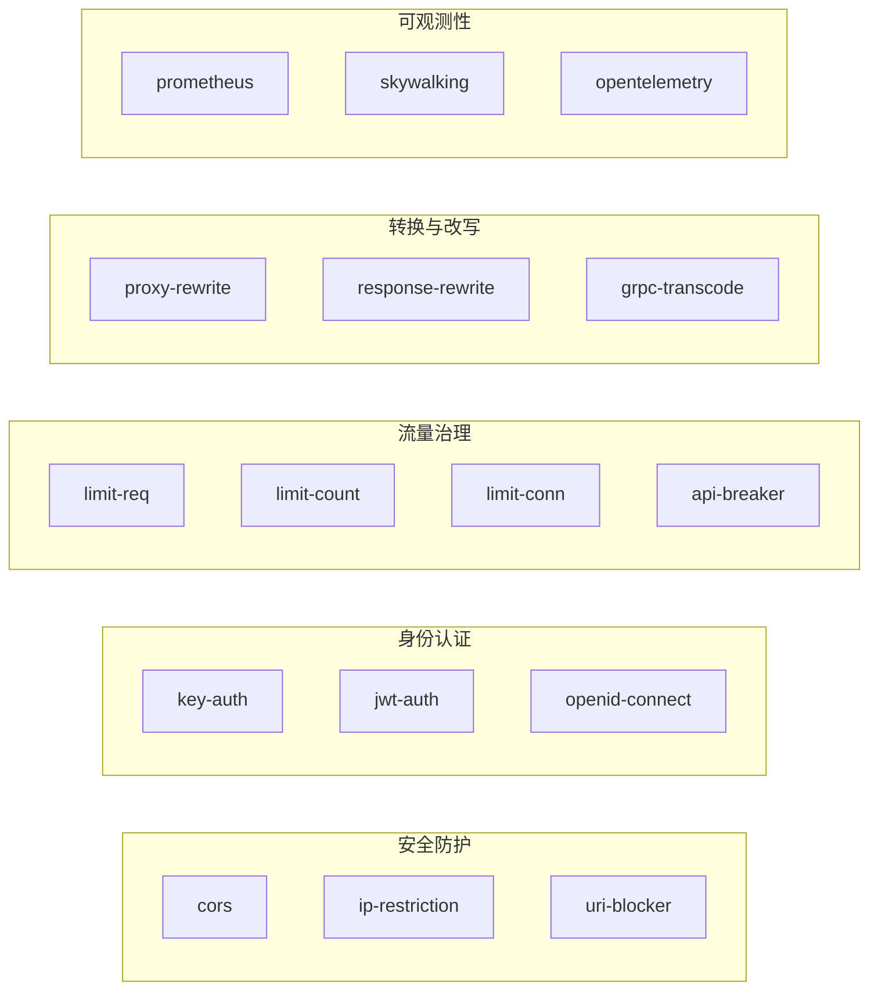

# 03. Apache APISIX 3.15 核心插件与安全防护实战

## 1. 插件生态与执行机制

APISIX 内置了 90+ 款开箱即用的原生插件，涵盖身份认证、安全防御、流量控制、协议转换、可观测性等多个领域。



---

## 2. 身份认证与鉴权实战

### 2.1 Key-Auth（API 密钥认证）
适用于开放平台或微服务间轻量级凭证认证。

1. **创建消费者（Consumer）并分配凭证**：
```bash
curl "http://127.0.0.1:9180/apisix/admin/consumers" -X PUT \
  -H "X-API-KEY: edd1c9f034335f136f87ad84b625c8f1" \
  -d '{
    "username": "developer_alice",
    "plugins": {
      "key-auth": {
        "key": "sec_key_alice_987654321"
      }
    }
  }'
```

2. **在路由上启用 Key-Auth 插件**：
```bash
curl "http://127.0.0.1:9180/apisix/admin/routes/auth_route" -X PUT \
  -H "X-API-KEY: edd1c9f034335f136f87ad84b625c8f1" \
  -d '{
    "uri": "/api/secure/*",
    "plugins": {
      "key-auth": {
        "header": "apikey"
      }
    },
    "upstream": {
      "type": "roundrobin",
      "nodes": { "10.0.1.10:8080": 1 }
    }
  }'
```

3. **客户端调用验证**：
```bash
# 未携带 Header -> 401 Unauthorized
curl -i "http://127.0.0.1:9080/api/secure/user"

# 携带 Header -> 200 OK 正常透传
curl -i "http://127.0.0.1:9080/api/secure/user" -H "apikey: sec_key_alice_987654321"
```

### 2.2 JWT-Auth（JSON Web Token 无状态鉴权）
适用于移动端/前端用户登录态校验，网关层直接解密并验证 JWT 签名，阻断非法请求渗透至后端微服务。

```bash
# 1. 为 Consumer 配置 JWT 签名密钥
curl "http://127.0.0.1:9180/apisix/admin/consumers" -X PUT \
  -H "X-API-KEY: edd1c9f034335f136f87ad84b625c8f1" \
  -d '{
    "username": "jwt_client",
    "plugins": {
      "jwt-auth": {
        "key": "user_issuer",
        "secret": "my_ultra_secure_jwt_secret_key_123"
      }
    }
  }'

# 2. 路由启用 jwt-auth
curl "http://127.0.0.1:9180/apisix/admin/routes/jwt_route" -X PUT \
  -H "X-API-KEY: edd1c9f034335f136f87ad84b625c8f1" \
  -d '{
    "uri": "/api/v1/user/profile",
    "plugins": {
      "jwt-auth": {}
    },
    "upstream": {
      "type": "roundrobin",
      "nodes": { "10.0.1.10:8080": 1 }
    }
  }'
```

---

## 3. 流量控制与高可用防刷

APISIX 提供了三种维度的流量防护插件：

| 插件名称 | 核心算法 / 机制 | 控制维度 | 适用场景 |
| :--- | :--- | :--- | :--- |
| **`limit-req`** | 漏桶算法（Leaky Bucket） | 速率（Rate）平滑限流 | 削峰填谷，保护脆弱的后端数据库 |
| **`limit-count`** | 固定/滑动时间窗口 | 总量（Quota）配额限制 | 计费调用（如 100 次/分钟）、防暴力破解 |
| **`limit-conn`** | 连接并发数追踪 | 最大并发（Concurrency） | 防止高耗时下载/计算请求耗尽网关连接 |

### 3.1 分布式集群限流配置（Redis 驱动）

在集群部署多个 APISIX 节点时，`limit-count` 插件支持使用外部 Redis 集中存储计数器，实现**全局统一限流**：

```bash
curl "http://127.0.0.1:9180/apisix/admin/routes/limit_route" -X PUT \
  -H "X-API-KEY: edd1c9f034335f136f87ad84b625c8f1" \
  -d '{
    "uri": "/api/v1/sms/send",
    "plugins": {
      "limit-count": {
        "count": 5,
        "time_window": 60,
        "rejected_code": 429,
        "rejected_msg": "Too Many Requests. Please wait 1 minute.",
        "key_type": "var_combination",
        "key": "$remote_addr:$http_phone",
        "policy": "redis",
        "redis_host": "10.0.0.50",
        "redis_port": 6379,
        "redis_password": "redis_secure_password"
      }
    },
    "upstream": {
      "type": "roundrobin",
      "nodes": { "10.0.1.10:8080": 1 }
    }
  }'
```

---

## 4. 报文改写与协议转换实战

### 4.1 Proxy-Rewrite（请求路径与标头改写）
将前端统一的 API 路径重写为后端微服务真实的内部路径，并动态追加追踪标头：

```bash
curl "http://127.0.0.1:9180/apisix/admin/routes/rewrite_route" -X PUT \
  -H "X-API-KEY: edd1c9f034335f136f87ad84b625c8f1" \
  -d '{
    "uri": "/gateway/order/*",
    "plugins": {
      "proxy-rewrite": {
        "regex_uri": ["^/gateway/order/(.*)", "/internal/orders/$1"],
        "headers": {
          "set": {
            "X-Gateway-Source": "APISIX-Edge",
            "X-Real-IP": "$remote_addr"
          },
          "remove": ["Authorization"]
        }
      }
    },
    "upstream": {
      "type": "roundrobin",
      "nodes": { "10.0.1.20:8080": 1 }
    }
  }'
```

### 4.2 CORS 跨域安全配置
```json
"plugins": {
  "cors": {
    "allow_origins": "https://frontend.example.com,https://admin.example.com",
    "allow_methods": "GET,POST,PUT,DELETE,OPTIONS",
    "allow_headers": "Authorization,Content-Type,X-Requested-With",
    "allow_credential": true,
    "max_age": 3600
  }
}
```

### 4.3 IP-Restriction 黑白名单防护
```json
"plugins": {
  "ip-restriction": {
    "whitelist": [
      "192.168.0.0/16",
      "10.0.0.0/8"
    ],
    "message": "Access Denied: Your IP is not authorized to access this internal API."
  }
}
```
