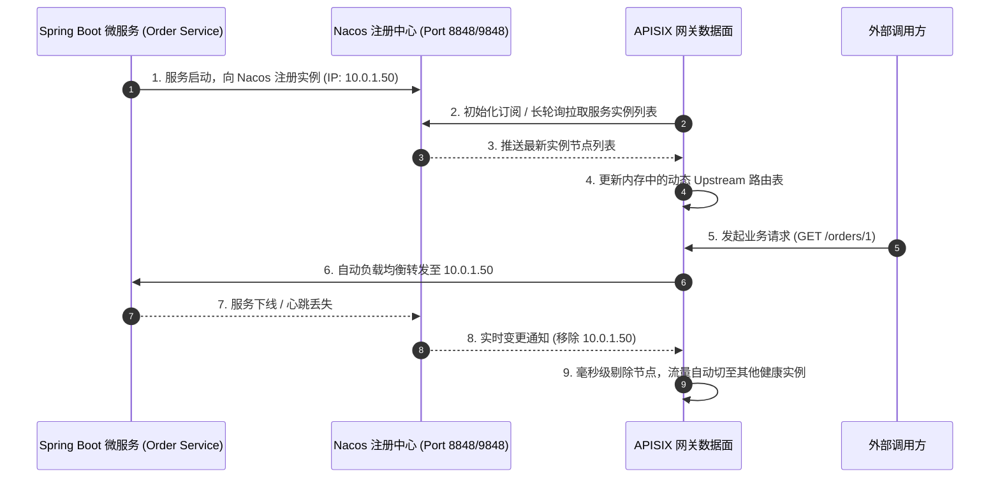
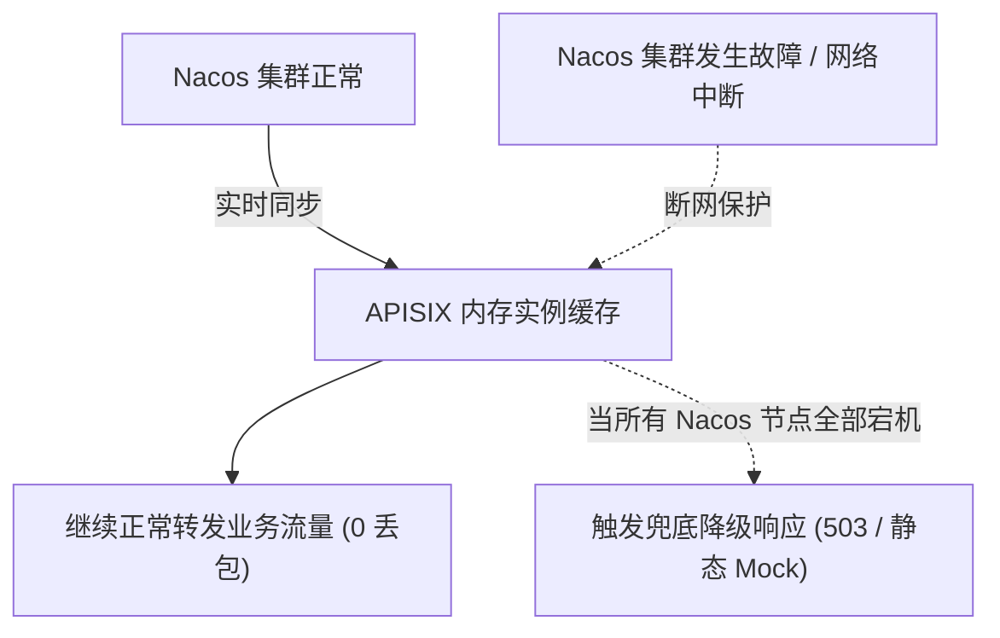

# 04. Apache APISIX 3.15 服务发现与 Nacos 深度集成实战

## 1. 微服务动态注册与服务发现机制

在传统的单体架构中，网关通过硬编码的 IP:Port 转发请求；但在微服务云原生架构下，Spring Cloud / Dubbo / Go-Zero 实例高频弹性扩缩容、滚动更新与宕机重启，IP 处于高度动态变化中。

APISIX 原生支持将微服务注册中心（**Nacos**、**Consul**、**Eureka**、**Kubernetes**、**Zookeeper**）作为数据源，实时感知后端实例列表的上下线，无需人工维护静态节点。



---

## 2. Nacos 注册中心配置实战（config.yaml）

APISIX 支持同时配置多个 Nacos 注册中心实例或集群，支持 Nacos 1.x (HTTP) 与 Nacos 2.x (gRPC/HTTP 混合模式)。

### 2.1 修改 `apisix/conf/config.yaml`
```yaml
discovery:
  nacos:
    host:
      - "http://10.0.0.101:8848"
      - "http://10.0.0.102:8848"
      - "http://10.0.0.103:8848"
    prefix: "/nacos/v1/"
    group_name: "DEFAULT_GROUP"       # 默认分组
    namespace_id: "prod-namespace"    # 默认命名空间 ID
    timeout:
      connect: 2000
      send: 2000
      read: 5000
    fetch_interval: 2                 # 实例刷新间隔（秒），默认 2s 轮询拉取
    weight: 100                       # 默认权重
```

### 2.2 多命名空间与集群多租户支持
若企业内部存在多个隔离环境（如 `dev`、`test`、`prod`），或者不同的业务团队划分在不同的 Nacos Group，APISIX 允许在具体的 Upstream 级别覆盖全局默认配置。

---

## 3. 创建基于 Nacos 服务发现的 Upstream 与 Route

### 3.1 步骤 1：在 Nacos 注册服务（Spring Cloud 示例）
在 Spring Boot 微服务项目的 `application.yml` 中：
```yaml
spring:
  application:
    name: order-service
  cloud:
    nacos:
      discovery:
        server-addr: 10.0.0.101:8848
        namespace: prod-namespace
        group: ORDER_GROUP
        metadata:
          version: v1.0.0
```

### 3.2 步骤 2：在 APISIX 中创建绑定 Nacos 的 Upstream
调用 Admin API，将 `discovery_type` 设置为 `nacos`，并将 `service_name` 指定为微服务名称：

```bash
curl "http://127.0.0.1:9180/apisix/admin/upstreams/nacos_order_ups" -X PUT \
  -H "X-API-KEY: edd1c9f034335f136f87ad84b625c8f1" \
  -d '{
    "name": "Nacos-Order-Service",
    "type": "roundrobin",
    "discovery_type": "nacos",
    "service_name": "order-service",
    "discovery_args": {
      "namespace_id": "prod-namespace",
      "group_name": "ORDER_GROUP"
    },
    "timeout": {
      "connect": 3,
      "send": 5,
      "read": 5
    }
  }'
```

### 3.3 步骤 3：创建路由并绑定该 Upstream
```bash
curl "http://127.0.0.1:9180/apisix/admin/routes/order_api_route" -X PUT \
  -H "X-API-KEY: edd1c9f034335f136f87ad84b625c8f1" \
  -d '{
    "uri": "/api/order/*",
    "plugins": {
      "proxy-rewrite": {
        "regex_uri": ["^/api/order/(.*)", "/$1"]
      }
    },
    "upstream_id": "nacos_order_ups"
  }'
```

---

## 4. 生产级高可用与容灾兜底策略

在微服务生产环境中，注册中心自身可能会遭遇网络分区、不可用或短暂抖动。APISIX 提供了多层容灾机制：



1. **内存级实例快照（Local Memory Cache）**：
   * APISIX Worker 进程在内存中保留最近一次从 Nacos 获取的健康节点列表。
   * 即使 Nacos 集群全崩或网络彻底阻断，APISIX **不会清空已有节点**，依然可以基于内存快照维持正常转发。
2. **多活注册中心与双上游容灾**：
   * 可结合 `traffic-split` 插件，在 Nacos 不可用时将流量平滑引流至备用集群或静态兜底 Upstream。
