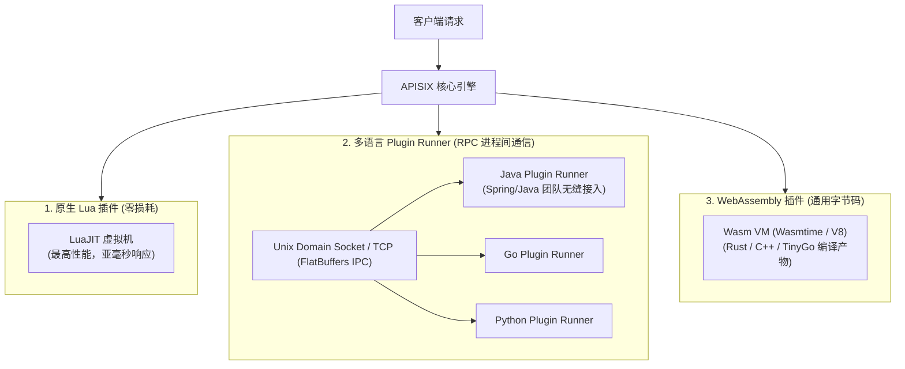

# 05. Apache APISIX 3.15 多语言插件扩展与开发指南

## 1. APISIX 多语言扩展体系全景

为满足不同研发团队的技术栈需求，APISIX 提供了三种层次的插件扩展能力：



---

## 2. 原生 Lua 插件开发实战

原生 Lua 插件具备极致的性能，直接运行在 Nginx Worker 进程内部，单请求额外耗时通常小于 0.05ms。

### 2.1 插件开发规范与生命周期模板
在 `apisix/plugins/custom-header-auth.lua` 中编写：

```lua
local core = require("apisix.core")
local ngx = require("ngx")

local plugin_name = "custom-header-auth"

-- 1. 定义插件 JSON Schema 配置校验规则
local schema = {
    type = "object",
    properties = {
        required_header = { type = "string", default = "X-Internal-Token" },
        expected_value = { type = "string" },
        error_msg = { type = "string", default = "Invalid Custom Token" }
    },
    required = { "expected_value" }
}

local _M = {
    version = 0.1,
    priority = 2500,        -- 插件优先级：数值越大越先执行
    name = plugin_name,
    schema = schema,
}

-- 2. Schema 校验函数
function _M.check_schema(conf)
    return core.schema.check(schema, conf)
end

-- 3. Access 阶段核心拦截逻辑
function _M.access(conf, ctx)
    local token = core.request.header(ctx, conf.required_header)
    
    if not token or token ~= conf.expected_value then
        core.log.warn("Authentication failed: token mismatch")
        return 401, { message = conf.error_msg }
    end
    
    -- 校验通过，向后端上游追加透传追踪头
    core.request.set_header(ctx, "X-Auth-Status", "SUCCESS")
end

return _M
```

### 2.2 注册与启用自定义 Lua 插件
在 `config.yaml` 中追加自定义插件路径与插件名：
```yaml
apisix:
  extra_lua_path: "/usr/local/apisix/custom_plugins/?.lua"
plugins:
  - custom-header-auth       # 加入自定义插件
  - ... # 其他内置插件
```

---

## 3. Java 开发者专属：Java Plugin Runner 深度实践

对于深耕 Java / Spring 生态的开发团队，无需学习 Lua 即可使用纯 Java 代码编写复杂的业务网关插件。

### 3.1 引入依赖（Maven）
```xml
<dependency>
    <groupId>org.apache.apisix</groupId>
    <artifactId>apisix-runner-starter</artifactId>
    <version>0.4.0</version>
</dependency>
```

### 3.2 编写 Java 业务过滤插件
实现 `PluginFilter` 接口：

```java
package org.apache.apisix.plugin.runner.filter;

import com.google.gson.Gson;
import org.apache.apisix.plugin.runner.HttpRequest;
import org.apache.apisix.plugin.runner.HttpResponse;
import org.springframework.stereotype.Component;

import java.util.Map;

@Component
public class UserSignatureCheckFilter implements PluginFilter {

    private final Gson gson = new Gson();

    @Override
    public String name() {
        return "UserSignatureCheck"; // 插件名称，与 Admin API 中保持一致
    }

    @Override
    public void filter(HttpRequest request, HttpResponse response, PluginFilterChain chain) {
        // 1. 获取 Admin API 下发的动态配置
        String configStr = request.getConfig(this);
        Map<String, Object> config = gson.fromJson(configStr, Map.class);
        String secretKey = (String) config.getOrDefault("secretKey", "default-key");

        // 2. 提取 HTTP Header
        String signature = request.getHeader("X-Signature");
        String uid = request.getHeader("X-User-Id");

        // 3. 执行复杂业务校验 (如连接 Redis / 本地验签)
        if (signature == null || !isValidSignature(uid, signature, secretKey)) {
            // 拦截请求并直接返回 403
            response.setStatusCode(403);
            response.setHeader("Content-Type", "application/json");
            response.setBody("{\"code\": 403, \"error\": \"Signature Verification Failed\"}");
            return;
        }

        // 4. 改写请求头并放行至下一个过滤器与上游服务
        request.setHeader("X-Gate-Auth-Uid", uid);
        chain.filter(request, response);
    }

    private boolean isValidSignature(String uid, String sign, String secret) {
        // 模拟复杂签名算法
        return sign.equals("valid-" + uid + "-" + secret);
    }
}
```

### 3.3 在路由中绑定 Java 插件
```bash
curl "http://127.0.0.1:9180/apisix/admin/routes/java_filter_route" -X PUT \
  -H "X-API-KEY: edd1c9f034335f136f87ad84b625c8f1" \
  -d '{
    "uri": "/api/v2/secure/*",
    "plugins": {
      "ext-plugin-pre-req": {
        "conf": [
          {
            "name": "UserSignatureCheck",
            "value": "{\"secretKey\": \"company_secret_2026\"}"
          }
        ]
      }
    },
    "upstream": {
      "type": "roundrobin",
      "nodes": { "10.0.1.30:8080": 1 }
    }
  }'
```

---

## 4. WebAssembly (Wasm) 跨语言插件支持

APISIX 支持遵循 Proxy-Wasm 规范的 Wasm 插件。支持使用 **Rust**、**Go (TinyGo)**、**C++**、**Zig** 编译为标准的 `.wasm` 二进制字节码，具有近乎原生的运行效率与沙箱安全性。
