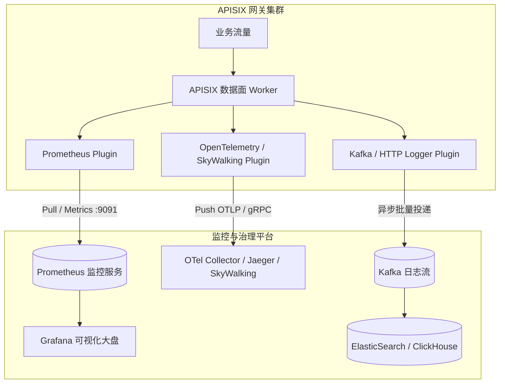
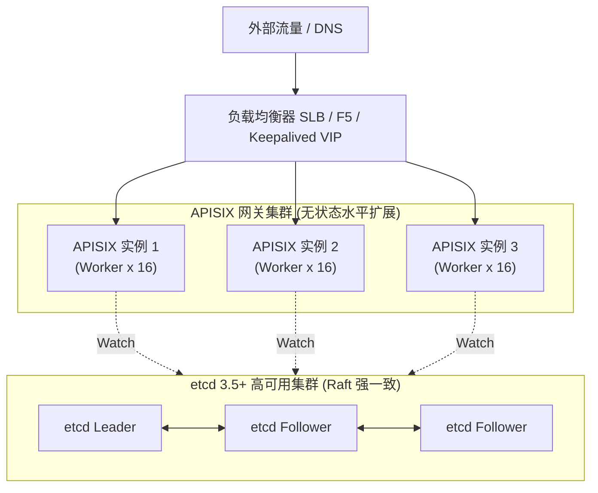

# 06. Apache APISIX 3.15 可观测性与生产运维治理

## 1. 全方位可观测性矩阵

生产级 API 网关是所有微服务流量的咽喉要道，完善的指标监控（Metrics）、链路追踪（Tracing）和日志审计（Logging）是保障系统 SLA 的核心基石。



---

## 2. 监控指标：Prometheus + Grafana 大盘

### 2.1 开启全局 Prometheus 指标采集
利用 `GlobalRule` 全局规则，实现全量流量指标无侵入自动采集：

```bash
curl "http://127.0.0.1:9180/apisix/admin/global_rules/1" -X PUT \
  -H "X-API-KEY: edd1c9f034335f136f87ad84b625c8f1" \
  -d '{
    "plugins": {
      "prometheus": {
        "prefer_name": true
      }
    }
  }'
```

### 2.2 核心监控指标清单

| 指标名称 | 类型 | 含义与监控价值 |
| :--- | :--- | :--- |
| **`apisix_http_requests_total`** | Counter | 全局请求总数（按 route、service、status 维度统计 QPS） |
| **`apisix_http_status`** | Counter | 响应状态码分布（重点监控 4xx、5xx 比例及突刺） |
| **`apisix_http_latency`** | Histogram | 请求耗时分布（包含 APISIX 自身处理延迟与 Upstream 后端响应延迟） |
| **`apisix_bandwidth`** | Counter | 出入网带宽吞吐量（字节数） |
| **`apisix_etcd_reachable`** | Gauge | etcd 集群连通性状态（0 表示失联，核心告警项） |
| **`apisix_node_info`** | Gauge | 网关节点元信息与版本标识 |

---

## 3. 分布式链路追踪：SkyWalking & OpenTelemetry

### 3.1 SkyWalking 插件实战
在 `apisix/conf/config.yaml` 中配置 SkyWalking OAP 服务地址：
```yaml
plugin_attr:
  skywalking:
    service_name: APISIX_GATEWAY
    service_instance_name: APISIX_NODE_01
    endpoint_addr: "http://10.0.0.80:12800"
```

在路由中开启链路注入：
```json
"plugins": {
  "skywalking": {
    "sample_ratio": 1
  }
}
```

### 3.2 OpenTelemetry (OTel) 生产级导出
```yaml
plugin_attr:
  opentelemetry:
    trace_id_source: x-request-id
    resource:
      service.name: APISIX-PROD-CLUSTER
    collector:
      address: "10.0.0.81:4317" # OTel gRPC 端口
```

---

## 4. 生产高可用部署拓扑与性能调优

### 4.1 生产高可用架构图（双活 SLB + 多 APISIX + etcd 集群）



### 4.2 操作系统与 Nginx 生产参数调优（config.yaml）
```yaml
apisix:
  node_listen: 9080
  enable_control: true
  control:
    ip: "127.0.0.1"
    port: 9090

nginx_config:
  worker_processes: auto         # 自动匹配 CPU 核心数
  worker_rlimit_nofile: 1048576  # 最大文件句柄数
  events:
    worker_connections: 106200   # 单 Worker 最大连接数
  http:
    keepalive_timeout: 60s
    client_header_buffer_size: 8k
    large_client_header_buffers: "4 16k"
```
