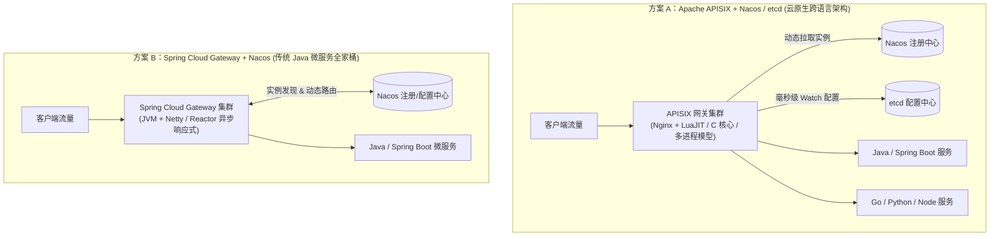
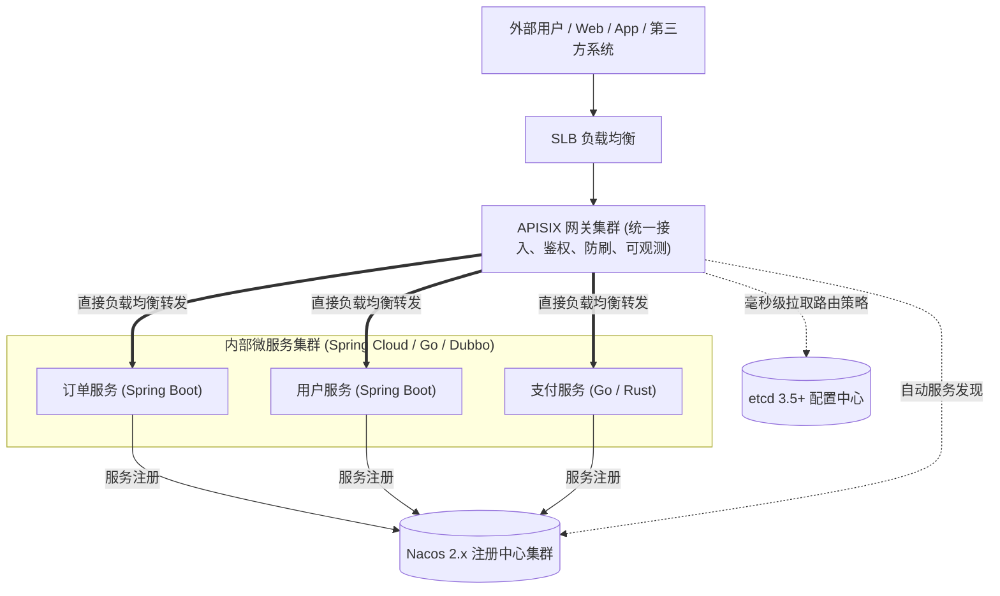
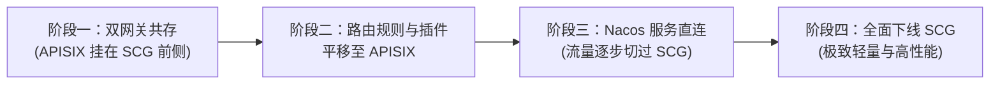

# 07. Apache APISIX vs Spring Cloud Gateway & Nacos 全维度深度对比与演进迁移

## 1. 核心架构与设计哲学全景对比

在微服务技术选型中，**Apache APISIX** 与 **Spring Cloud Gateway（结合 Nacos）** 是目前企业级流量网关中关注度最高的两个技术方案。两者源于不同的技术背景和设计哲学：

---

## 2. 十大核心维度技术对比矩阵

| 对比维度 | Apache APISIX (3.15) | Spring Cloud Gateway (3.x / 4.x) | 核心差异与选型影响 |
| :--- | :--- | :--- | :--- |
| **底层核心与运行环境** | **Nginx + LuaJIT + C 内核** 纯原生运行，无 JVM 开销 | **Java + Netty + Spring WebFlux** 基于 JVM 堆内存与响应式编程 | APISIX 资源占用极低，无 JVM 启动耗时与预热期 |
| **并发与进程模型** | **Multi-Process 单核单 Worker** 无锁设计，CPU 亲和性高 | **Multi-Thread EventLoop** 共享 JVM 堆，受多线程上下文切换影响 | APISIX 充分利用多核 CPU，无线程争抢与锁争用 |
| **性能吞吐 (QPS)** | **单核 18,000 ~ 30,000+ QPS** （业界顶尖吞吐） | **单核 3,000 ~ 8,000 QPS** （受序列化与框架链条开销制约） | APISIX 吞吐量通常为 SCG 的 **3 ~ 5 倍** |
| **响应延迟与抖动** | **亚毫秒级 (P99 < 1ms)** 无 GC 停顿，极低延迟抖动 | **毫秒级 (P99 5~20ms)** 高峰期易受 Young GC / Full GC 停顿抖动 | 金融、交易与高并发核心链路中 APISIX 延迟更稳定 |
| **内存与硬件资源消耗** | **极低（单节点基础内存 < 50MB）** | **较高（JVM 堆建议至少分配 2GB~4GB）** | APISIX 可大幅降低大规模集群的服务器硬件成本 |
| **动态配置与热生效** | **毫秒级全动态热加载（< 10ms）** 基于 etcd Watch，**0 停机、0 Reload** | **较弱 / 依赖外部事件总线** 动态路由需定制监听器刷新 Context，易短时阻塞 | APISIX 原生支持毫秒级配置热更；SCG 动态路由需大量二次开发 |
| **插件与生态扩展** | **90+ 内置原生插件** 支持 Lua、Java、Go、Python、Wasm | **需自行开发 GatewayFilter** 主要依赖 Java 代码与 Spring 生态组件 | APISIX 开箱即用插件极丰富；SCG 定制与业务耦合紧密 |
| **多语言微服务支持** | **天然语言中立** 完美纳管 Java、Go、Python、C++、Node 等 | **强绑定 Java / Spring 生态** 异构语言微服务接入与治理成本高 | 混合多语言微服务团队首选 APISIX |
| **多协议支持能力** | **全协议**：HTTP/1/2/3, gRPC, WebSocket, 四层 TCP/UDP, MQTT, Dubbo | **主要以 HTTP/1.1, HTTP/2, WebSocket 为主** 不支持四层 Stream 代理 | APISIX 可作为全功能综合接入网关 |
| **云原生与 K8s 集成** | **APISIX Ingress Controller** 原生支持 K8s Gateway API 与 CRD | **Spring Cloud Kubernetes** 适配难度较高，配置体系较复杂 | APISIX 在容器化和 Service Mesh 演进中标准化程度更高 |

---

## 3. 为什么 APISIX 性能与稳定性大幅超越 Spring Cloud Gateway？

### 3.1 零 GC 停顿 vs JVM 堆分配开销
* **Spring Cloud Gateway**：每个 HTTP 请求进入网关后，Spring 框架会创建 `ServerWebExchange`、`GatewayFilterChain`、`Route` 等大量临时 Java 对象。在几十万 QPS 的洪峰流量下，年轻代对象迅速堆满，引发频繁的 **Young GC** 甚至 **Full GC**，导致请求 P99/P999 延迟出现数十毫秒的毛刺（Spike）。
* **APISIX**：基于 C 语言结构体和 LuaJIT 的 FFI（Foreign Function Interface）机制，直接在进程内存中操作指针，绝大部分报文处理做到零拷贝，彻底免除了垃圾回收器的停顿威胁。

### 3.2 动态路由热更新机制差异
* **Spring Cloud Gateway**：原生配置大多固化在 `application.yml`。如果结合 Nacos Config 实现动态路由，需要开发者自行编写 `ApplicationEventPublisher` 发布 `RefreshRoutesEvent`，在刷新瞬间会重构整个路由图，存在短时间路由失效或锁等待风险。
* **APISIX**：采用自研 `libradixtree` 路由树，路由增删改只是在共享内存中原子替换树节点，无需重建整棵树，所有 Worker 毫秒级感知，真正做到平滑无感。

---

## 4. 架构组合最佳实践：APISIX + Nacos 黄金搭档

许多企业存在误区，认为选择了 Nacos 就必须绑定 Spring Cloud Gateway。事实上，**APISIX + Nacos** 是现代企业构建高并发微服务架构的更优解法：

### 方案价值：
1. **职责单一，各司其职**：
   * **APISIX** 专精于高性能接入、流量防护、协议转换、安全拦截与全链路追踪；
   * **Nacos** 专精于微服务的生命周期管理、实例健康注册与配置中心；
   * **etcd** 专精于网关自身控制面配置的高可靠强一致分发。
2. **异构系统统一治理**：企业内部新增的 Go/Node.js/Python 服务或 AI 接口，无需适配 Spring Cloud 体系，直接通过 Nacos 注册后由 APISIX 统一对外暴露。

---

## 5. 从 Spring Cloud Gateway 平滑迁移至 APISIX 实战蓝图

对于已有 Spring Cloud Gateway 存量系统的团队，推荐采用 **4 步渐进式迁移法**：

### 5.1 规则映射对照表

| Spring Cloud Gateway 配置 | Apache APISIX (3.15) 对应实现 |
| :--- | :--- |
| `Path=/api/user/**` | Route `uri: "/api/user/*"` |
| `Method=POST,GET` | Route `methods: ["POST", "GET"]` |
| `Header=X-Tenant, tenant_a` | Route `vars: [["http_x_tenant", "==", "tenant_a"]]` |
| `StripPrefix=1` / `RewritePath` | Plugin `proxy-rewrite: { "regex_uri": ["^/api/(.*)", "/$1"] }` |
| `RequestRateLimiter` (Redis) | Plugin `limit-count` 或 `limit-req` |
| `CircuitBreaker` (Resilience4j) | Plugin `api-breaker` |
| `TokenRelay` / OAuth2 Filter | Plugin `jwt-auth` 或 `openid-connect` |
| `lb://user-service` (Nacos) | Upstream `discovery_type: "nacos"`, `service_name: "user-service"` |

### 5.2 自定义业务 Filter 迁移策略
* **对于简单的鉴权、签名校验、Header 增删**：直接使用 APISIX 内置插件或编写原生 Lua 脚本；
* **对于依赖 Spring 容器 Bean、复杂 JDBC/MyBatis 查询的旧 Filter**：
  * 使用 **APISIX Java Plugin Runner**（见 [05. 多语言插件扩展指南](./05_Plugin_Development_and_Extensibility.md)），90% 以上的 Java 业务校验代码可以直接拷贝复用。
