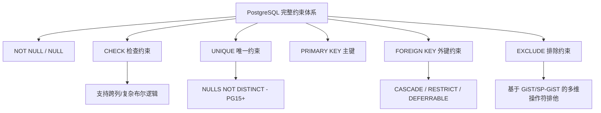
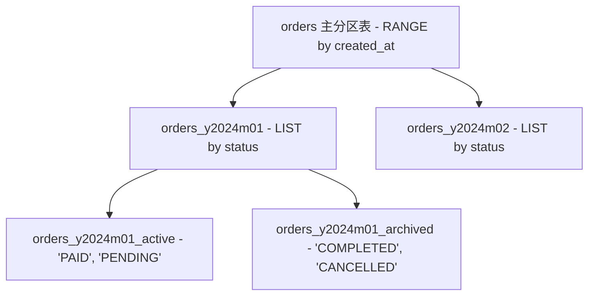

# 第 1 章：SQL 语法规则与 DDL 数据定义

---

## 1. 概述与核心理念

PostgreSQL 17（简称 PG17）作为全球领先的开源关系型对象数据库，其 SQL 实现严格遵循 ANSI SQL:2023 标准，同时提供了极其强大、灵活且安全的数据定义语言（DDL）。

在 PostgreSQL 体系中，DDL 具备与其他主流数据库（如 MySQL、Oracle）显著不同的特性——**原生事务性 DDL（Transactional DDL）**。在 PG 中，创建表、修改表结构、删除索引、修改列类型等操作均可在事务块内执行并支持回滚，为线上灰度发布与数据库版本迁移（Database Migration）提供了极高的工程安全保障。

本章将深入解析 PostgreSQL 17 的 SQL 语法底层规则、DDL 高级特性、约束体系、自增列、生成列、声明式分区表，并在每个核心知识点后立即嵌入与 MySQL (InnoDB) 的底层机制与代码对照，最后辅以三大生产级业务场景实战。

---

## 2. SQL 语法规则与标识符机制（Part II 第 4 章）

### 2.1 标识符（Identifiers）与大小写敏感度规则

在 SQL 标准中，未加引号的标识符大小写处理规则在不同数据库间存在差异：

- **PostgreSQL 规则**：
  - 未加双引号的标识符在词法解析阶段**自动转换为全小写**（Fold to lowercase）。
  - 加双引号（`"`）的标识符将**严格保留大小写**，并允许包含空格、保留字和特殊符号。
  ```sql
  -- 以下三种写法在 PG 中完全等价，均指向同一个表 user_accounts
  CREATE TABLE user_accounts (id int);
  CREATE TABLE USER_ACCOUNTS (id int);
  CREATE TABLE "user_accounts" (id int);

  -- 以下写法指向一个完全独立的表 "User_Accounts"
  CREATE TABLE "User_Accounts" (id int);

  -- 查询时必须用双引号指定大小写，否则默认转为全小写导致报错表不存在
  SELECT * FROM "User_Accounts";
  ```
- **常量与转义机制**：
  - **标准单引号字符串**：反斜杠 `\` 仅代表字面反斜杠（`standard_conforming_strings = on` 默认开启）。
  - **C 风格转义字符串（`E'...'`）**：支持 `\n`, `\t`, `\xHH` 等转义字符（如 `SELECT E'Hello\nWorld';`）。
  - **美元符引用（Dollar Quoting `$$`）**：在编写包含复杂 SQL、单引号或存储过程时，彻底摆脱单引号转义困扰：
    ```sql
    SELECT $$It's a wonderful day in PostgreSQL's world!$$;
    ```
- **元数据注释（`COMMENT ON`）**：
  - PostgreSQL 采用标准的独立 `COMMENT ON` 语句将注释写入系统字典表（如 `pg_description`）。
  ```sql
  CREATE TABLE order_items (
      item_id BIGINT PRIMARY KEY,
      price NUMERIC(12, 2) NOT NULL
  );
  COMMENT ON TABLE order_items IS '订单明细表，存储每笔订单的商品详情';
  COMMENT ON COLUMN order_items.price IS '商品成交单价，单位：元，保留2位小数';
  ```

---

### 2.2 🥊 语法与标识符对比：PG vs MySQL

| 对比维度 | PostgreSQL 17 | MySQL 8.0 / 8.4 (InnoDB) | 架构与工程影响 |
| :--- | :--- | :--- | :--- |
| **未加引号标识符** | **统一折叠为全小写**（`USER` $\to$ `user`）。 | 取决于操作系统与 `lower_case_table_names` 参数。 | PG 跨平台行为 100% 幂等，不会因 OS 差异引发生产事故。 |
| **转义与保留引用** | 使用 **双引号** `"`（如 `"Order"`）。 | 使用 **反引号** `` ` ``（如 `` `Order` ``），双引号由 `ANSI_QUOTES` 模式决定。 | PG 严格符合 ANSI SQL 标准；MySQL 使用私有反引号。 |
| **表名大小写敏感性** | Linux / Windows / macOS **行为绝对一致**。 | Linux 默认敏感（参数=0）；Windows 默认不敏感（参数=1）。8.0+ 初始化后**严禁修改该参数**。 | MySQL 迁移环境（如本地 macOS 开发 $\to$ Linux 生产）极易发生“找不到表”故障。 |
| **字符串字面量** | **只允许单引号** `'...'`，双引号是标识符。支持 `$$` 美元符与 `E'...'` 转义。 | 允许单引号 `'...'` 与双引号 `"..."`。默认使用反斜杠 `\` 自动转义。 | MySQL 混淆字符串与标识符，编写存储过程时单引号嵌套转义极易出错。 |
| **元数据注释** | 标准 `COMMENT ON TABLE/COLUMN IS '...'` 独立语句。 | 嵌入在 `CREATE TABLE` 语句列尾或表尾（`COMMENT '...'`）。 | PG 允许随时独立对列、视图、索引、函数加注释，无需执行昂贵的 `ALTER TABLE` 重构。 |

#### 💻 代码对照：语法与标识符差异

```sql
-- ========================================================
-- PostgreSQL 实现
-- ========================================================
-- 1. 大小写与双引号
CREATE TABLE "Sys_User" (
    user_id BIGINT PRIMARY KEY,
    "userEmail" VARCHAR(100) NOT NULL
);
-- 查询必须严格保留双引号大小写
SELECT "userEmail" FROM "Sys_User";

-- 2. 美元符引用（定义长文本或复杂函数，无需转义单引号）
SELECT $msg$Let's learn "PostgreSQL" in 2026!$msg$;

-- 3. 独立元数据注释
COMMENT ON TABLE "Sys_User" IS '系统用户基础信息表';
COMMENT ON COLUMN "Sys_User"."userEmail" IS '用户唯一电子邮箱';
```

```sql
-- ========================================================
-- MySQL 实现
-- ========================================================
-- 1. 反引号与依赖系统参数的表名
CREATE TABLE `Sys_User` (
    `user_id` BIGINT PRIMARY KEY,
    `userEmail` VARCHAR(100) NOT NULL,
    -- 3. 内嵌式注释
    INDEX `idx_email` (`userEmail`)
) ENGINE=InnoDB COMMENT='系统用户基础信息表';

-- Linux 下若 lower_case_table_names=0，以下语句会直接报错表不存在：
SELECT userEmail FROM sys_user; -- 错误！找不到表 sys_user

-- 2. MySQL 字符串可以用双引号，单引号嵌套需反斜杠转义
SELECT 'Let\'s learn MySQL in 2026!';
```

---

## 3. DDL 数据定义核心与高级特性（Part II 第 5 章）

### 3.1 表的创建与完整约束体系

PostgreSQL 提供了业界最为完备的关系约束体系，包括非空、检查（CHECK）、唯一（UNIQUE）、主键（PRIMARY KEY）、外键（FOREIGN KEY）以及独特的**排除约束（EXCLUDE Constraint）**。



1. **CHECK 约束**：支持任意涉及当前行的布尔表达式，支持跨列比较和复杂算术判断。
2. **UNIQUE 与 NULLS NOT DISTINCT**：
   - ANSI SQL 默认行为中 `NULL != NULL`，传统唯一索引允许多行同时为 `NULL`。
   - **PG15+ 特性**：`UNIQUE NULLS NOT DISTINCT` 强制将所有 `NULL` 视为相同值，整表仅允许一行 `NULL`。
3. **FOREIGN KEY**：保证参照完整性，支持 `ON DELETE CASCADE / SET NULL / RESTRICT / NO ACTION`，并支持 `DEFERRABLE INITIALLY DEFERRED`（延迟到事务提交时检查）。
4. **EXCLUDE 排他约束**：利用 GiST 索引，确保任意两行数据在指定操作符（如 `=`, `&&` 重叠）比较下不能同时满足条件。常用于**时间段防重叠**、**空间区域防碰撞**。

---

### 3.2 🥊 约束体系对比：PG vs MySQL

| 对比维度 | PostgreSQL 17 | MySQL 8.0 / 8.4 (InnoDB) | 架构与工程影响 |
| :--- | :--- | :--- | :--- |
| **CHECK 约束** | **原生高度成熟**。支持跨列复杂条件、内置数学函数与布尔逻辑。 | **8.0.16 之前仅语法解析但完全忽略**；8.0.16+ 开始支持，但对内置函数支持受限。 | PG 可直接在数据库层实现严密业务风控，减少应用层重复校验。 |
| **EXCLUDE 约束** | **原生支持**（基于 GiST 索引）。解决时段重叠、区间重叠等高级排他业务。 | **完全不支持**。 | MySQL 必须依赖应用层分布式锁或高隔离级别事务串行化加锁，极易并发穿透与死锁。 |
| **UNIQUE NULL 行为** | 支持标准多 NULL 并存，**PG15+ 额外支持 `NULLS NOT DISTINCT`**。 | 始终允许多个 `NULL`，**不支持 `NULLS NOT DISTINCT`**。 | MySQL 实现“允许为 NULL 但全表只允许一个 NULL”必须依靠触发器或虚拟生成列黑魔法。 |
| **外键延迟检查** | 支持 **`DEFERRABLE INITIALLY DEFERRED`**，在复杂多表循环引用插入时先入库、事务提交时统一检查。 | **不支持延迟检查**。外键检查始终是语句级（Statement-level）即时执行。 | PG 优雅解决双向/循环外键插入依赖死结，MySQL 只能临时关闭 `foreign_key_checks`。 |

#### 💻 代码对照：约束体系

```sql
-- ========================================================
-- PostgreSQL 实现
-- ========================================================
CREATE EXTENSION IF NOT EXISTS btree_gist;

CREATE TABLE doctor_appointments (
    appointment_id BIGINT GENERATED ALWAYS AS IDENTITY PRIMARY KEY,
    doctor_id INT NOT NULL,
    patient_id INT NOT NULL,
    fee NUMERIC(10, 2) NOT NULL,
    discount_fee NUMERIC(10, 2),
    id_card VARCHAR(18),
    schedule_time TSRANGE NOT NULL,
    
    -- 1. 跨列 CHECK 约束
    CONSTRAINT chk_fee_valid CHECK (
        fee > 0 AND (discount_fee IS NULL OR discount_fee <= fee)
    ),
    -- 2. PG15+ NULLS NOT DISTINCT (身份证号允许为 NULL，但最多只能有 1 条 NULL)
    CONSTRAINT uq_patient_idcard UNIQUE NULLS NOT DISTINCT (id_card),
    -- 3. EXCLUDE 排他约束：同一医生在同一时间段 schedule_time 严禁重叠 (&&)
    CONSTRAINT ex_doctor_no_double_booking 
        EXCLUDE USING gist (doctor_id WITH =, schedule_time WITH &&)
);
```

```sql
-- ========================================================
-- MySQL 实现
-- ========================================================
CREATE TABLE doctor_appointments (
    appointment_id BIGINT AUTO_INCREMENT PRIMARY KEY,
    doctor_id INT NOT NULL,
    patient_id INT NOT NULL,
    fee DECIMAL(10, 2) NOT NULL,
    discount_fee DECIMAL(10, 2),
    id_card VARCHAR(18),
    start_time DATETIME NOT NULL,
    end_time DATETIME NOT NULL,
    
    -- 1. MySQL 8.0.16+ 支持基础 CHECK
    CONSTRAINT chk_fee_valid CHECK (
        fee > 0 AND (discount_fee IS NULL OR discount_fee <= fee)
    ),
    -- 2. 无法声明 NULLS NOT DISTINCT，允许多个 NULL
    UNIQUE KEY uq_patient_idcard (id_card)
    -- 3. 致命缺陷：无法声明 EXCLUDE 约束！
    -- 必须在业务层使用 Redis 分布式锁，或 SELECT ... FOR UPDATE 串行化查询加锁，防并发冲突极度脆弱
) ENGINE=InnoDB;
```

---

### 3.3 自增列机制：Identity Columns vs SERIAL

PostgreSQL 历史版本使用伪类型 `SERIAL`（基于序列 Sequence 封装），从 PostgreSQL 10 开始全面引入符合 SQL 标准的 `IDENTITY` 语法。

| 特性 / 维度 | `GENERATED ALWAYS AS IDENTITY` | `GENERATED BY DEFAULT AS IDENTITY` | 传统 `SERIAL` / `BIGSERIAL` |
| :--- | :--- | :--- | :--- |
| **标准兼容性** | 符合 SQL:2008 / SQL:2023 标准 | 符合 SQL:2008 / SQL:2023 标准 | 非标准（PostgreSQL 专用方言） |
| **手动 INSERT 显式值** | **默认报错**，必须显式指定 `OVERRIDING SYSTEM VALUE` | **允许**插入显式值 | **允许**插入显式值 |
| **底层实现** | 隐式强绑定序列（删除表/列时自动清理） | 隐式强绑定序列（删除表/列时自动清理） | 独立序列，权限控制分散 |
| **COPY / 迁移行为** | 强校验防止意外覆盖自增 ID | 适应数据迁移与导入 | 适应数据迁移与导入 |
| **推荐度** | ★★★★★（推荐度最高，防误写） | ★★★★☆（兼容数据迁移） | ★★☆☆☆（遗留系统兼容） |

---

### 3.4 🥊 自增主键对比：PG vs MySQL

| 对比维度 | PostgreSQL 17 | MySQL 8.0 / 8.4 (InnoDB) | 架构与工程影响 |
| :--- | :--- | :--- | :--- |
| **底层实现架构** | **独立底层 SEQUENCE 对象**。与表解耦，支持步长、缓存（CACHE）、最大值循环等独立配置。 | **表元数据级 `AUTO_INCREMENT`**。强绑定于单张表的主键/索引。 | PG 架构更清晰，支持跨表共享序列（如主子表共享同序 ID 生成器）。 |
| **并发自增锁机制** | 序列基于无锁原子操作（`atomic fetch-and-add`），高并发申请 ID **绝不阻塞数据行锁与事务**。 | 依赖 `innodb_auto_inc_lock_mode`（0=传统表级锁，1=连续锁，2=交叉交错锁）。 | MySQL 在批量插入或大并发下可能产生自增锁竞争或主从复制不一致隐患。 |
| **自增空洞与回滚** | 事务 `ROLLBACK` 时，已消耗的序列号**不退回**（保证极致并发吞吐）。 | 事务 `ROLLBACK` 时同样产生空洞，且服务器重启时 8.0 之前会重置自增计数器。 | 两者均不保证 ID 绝对连续，但 PG 的序列推进完全无锁无副作用。 |
| **显式指定 ID 插入** | `GENERATED ALWAYS` 默认严格拦截，防误操作覆盖；提供 `OVERRIDING SYSTEM VALUE` 控制。 | 允许直接插入显式值，且若插入的值大于当前自增值，**会自动将计数器抬高**。 | MySQL 容易因为开发人员测试插入大 ID（如 `99999999`）导致自增主键提前耗尽溢出。 |

#### 💻 代码对照：自增主键

```sql
-- ========================================================
-- PostgreSQL 实现
-- ========================================================
CREATE TABLE users_pg (
    user_id BIGINT GENERATED ALWAYS AS IDENTITY (START WITH 1000 CACHE 20) PRIMARY KEY,
    username TEXT NOT NULL
);

-- 正常插入，自动生成 1000, 1001...
INSERT INTO users_pg (username) VALUES ('Alice');

-- 误操作显式插入 ID 会被系统直接拦截报错：
-- INSERT INTO users_pg (user_id, username) VALUES (99999, 'Hacker'); 
-- ERROR: cannot insert a non-DEFAULT value into column "user_id"

-- 只有在合法数据同步归档时，显式覆写：
INSERT INTO users_pg (user_id, username) 
OVERRIDING SYSTEM VALUE 
VALUES (99999, 'ArchivedUser');
```

```sql
-- ========================================================
-- MySQL 实现
-- ========================================================
CREATE TABLE users_mysql (
    user_id BIGINT AUTO_INCREMENT PRIMARY KEY,
    username VARCHAR(100) NOT NULL
) ENGINE=InnoDB AUTO_INCREMENT=1000;

-- 插入显式值（无法从 DDL 层面防御误插入超大 ID）
INSERT INTO users_mysql (user_id, username) VALUES (99999, 'DangerousUser');

-- 下一条自增记录将从 100000 开始！原有的 ID 空间永久产生巨大断层
INSERT INTO users_mysql (username) VALUES ('Bob'); -- user_id 变为 100000
```

---

### 3.5 Generated Columns（生成列 / 计算列）

PostgreSQL 支持在定义表时使用表达式声明生成列：
- **STORED（存储生成列）**：数据在 `INSERT` 或 `UPDATE` 时计算并持久化存储在磁盘上，读取性能与普通列相同，且可以直接建立 B-Tree、Hash、GIN 等各类索引。
- **PG17 新特性演进**：PG17 进一步优化了生成列的计算开销与在逻辑复制、分区表路由中的处理效率。

---

### 3.6 🥊 生成列对比：PG vs MySQL

| 对比维度 | PostgreSQL 17 | MySQL 8.0 / 8.4 (InnoDB) | 架构与工程影响 |
| :--- | :--- | :--- | :--- |
| **支持形态** | **原生支持 `STORED`（存储生成列）**。 | 支持 **`VIRTUAL`（虚拟列，默认）** 和 **`STORED`（物理存储）**。 | MySQL 虚拟列不占磁盘空间；PG 存储列读取速度快且支持物理就近存取。 |
| **索引能力** | 存储生成列可建立所有类型索引（B-Tree, GIN, BRIN, GiST, Bloom）。针对不存盘需求，PG 原生提供强大的**表达式索引（Expression Index）**。 | 可在 `VIRTUAL` 虚拟列上直接建立 B+Tree 二级索引（MySQL 内部物化索引项）。 | PG 的“表达式索引”更加灵活，无需修改表结构增加列即可直接建索引。 |
| **表达式能力** | 支持 PG 内部丰富的不可变（IMMUTABLE）函数、类型强转、JSONB 运算符提取。 | 仅支持确定性（Deterministic）内置函数，语法限制较多。 | PG 生成列结合 JSONB 提取操作符 `->>` 极其强大。 |

#### 💻 代码对照：生成列与表达式索引

```sql
-- ========================================================
-- PostgreSQL 实现
-- ========================================================
CREATE TABLE sales_order_pg (
    order_id BIGINT PRIMARY KEY,
    unit_price NUMERIC(10, 2) NOT NULL,
    quantity INT NOT NULL,
    -- 1. STORED 生成列
    total_amount NUMERIC(12, 2) GENERATED ALWAYS AS (unit_price * quantity) STORED,
    raw_payload JSONB
);

-- 2. PG 独有的表达式索引（无需加虚拟列，直接对表达式建索引）
CREATE INDEX idx_order_payload_sku ON sales_order_pg (((raw_payload->>'sku_code')));
```

```sql
-- ========================================================
-- MySQL 实现
-- ========================================================
CREATE TABLE sales_order_mysql (
    order_id BIGINT PRIMARY KEY,
    unit_price DECIMAL(10, 2) NOT NULL,
    quantity INT NOT NULL,
    -- 1. VIRTUAL 虚拟生成列（不占表数据空间，读取时动态计算）
    total_amount DECIMAL(12, 2) AS (unit_price * quantity) VIRTUAL,
    raw_payload JSON,
    -- 2. 在 MySQL 中必须先建生成列，才能对 JSON 字段建 B+Tree 索引
    sku_code VARCHAR(64) AS (raw_payload->>'$.sku_code') STORED,
    INDEX idx_sku (sku_code)
) ENGINE=InnoDB;
```

---

### 3.7 声明式分区表（Declarative Partitioning）

PostgreSQL 提供了强大的声明式分区表机制，支持 **RANGE（范围）**、**LIST（列表）**、**HASH（哈希）** 三种基础策略，并支持任意多级**子分区（Sub-partitioning）**。



#### 分区表的核心规则：
1. **主键与唯一键约束**：主键或唯一索引必须包含分区键（Partition Key），以确保全局唯一性在本地索引级别即可校验。
2. **分区路由与修剪（Partition Pruning）**：PostgreSQL 执行器支持静态编译期修剪（Static Pruning）与执行期动态修剪（Run-time Pruning），大幅加速大表查询。
3. **默认分区（DEFAULT Partition）**：LIST 与 RANGE 分区支持挂载 `DEFAULT` 分区，未命中任何规则的数据将路由至默认分区，防止 INSERT 异常。
4. **秒级解挂归档**：使用 `ALTER TABLE ... ATTACH/DETACH PARTITION CONCURRENTLY` 可以零阻塞将历史分区拆解为独立普通表归档。

---

### 3.8 🥊 分区表能力对比：PG vs MySQL

| 对比维度 | PostgreSQL 17 | MySQL 8.0 / 8.4 (InnoDB) | 架构与工程影响 |
| :--- | :--- | :--- | :--- |
| **多级子分区能力** | **支持任意策略的多层任意嵌套子分区**（如 RANGE 下挂 LIST，LIST 下挂 HASH）。 | **仅支持二级复合子分区**，且子分区**只能使用 HASH 或 KEY 策略**。 | PG 分区维度极其灵活，完美契合“时间区间 + 业务状态”的双重冷热隔离架构。 |
| **外键支持** | **全面支持外键**（分区表可以引用其他表，也可被其他表引用）。 | **完全不支持外键**（官方明确禁止带外键的分区表）。 | MySQL 大表分区往往被迫放弃外键完整性校验。 |
| **动态解挂与维护** | 支持 **`ATTACH / DETACH PARTITION CONCURRENTLY`**，秒级且不锁全表。 | 使用 `ALTER TABLE ... DROP/TRUNCATE/REORGANIZE PARTITION`，大表重组极易引发高负载与锁表。 | PG 在历史冷数据向对象存储或冷库迁移归档时具有压倒性的运维优势。 |
| **分区智能连接** | 支持 **Partition-wise Join** 与 **Partition-wise Aggregate**，两张同规则分区表连接时直接在对应分区并行。 | 不支持 Partition-wise Join 算子优化。 | PG 在海量分库分表聚合分析（OLAP/HTAP）场景下性能高数倍。 |

#### 💻 代码对照：声明式分区表

```sql
-- ========================================================
-- PostgreSQL 实现（RANGE 嵌套 LIST 多级子分区 + DEFAULT 分区）
-- ========================================================
CREATE TABLE orders_pg (
    order_id BIGINT NOT NULL,
    order_status VARCHAR(20) NOT NULL,
    created_at TIMESTAMPTZ NOT NULL,
    amount NUMERIC(12, 2) NOT NULL,
    PRIMARY KEY (order_id, created_at, order_status)
) PARTITION BY RANGE (created_at);

-- 1. 创建 2026年01月 主分区（本身也是按状态 LIST 分区）
CREATE TABLE orders_202601 PARTITION OF orders_pg
    FOR VALUES FROM ('2026-01-01 00:00:00+08') TO ('2026-02-01 00:00:00+08')
    PARTITION BY LIST (order_status);

-- 2. 创建子分区（活跃数据与归档数据分离）
CREATE TABLE orders_202601_active PARTITION OF orders_202601
    FOR VALUES IN ('UNPAID', 'PAID', 'PROCESSING');
CREATE TABLE orders_202601_closed PARTITION OF orders_202601
    FOR VALUES IN ('COMPLETED', 'CANCELLED');

-- 3. 挂载默认兜底分区
CREATE TABLE orders_pg_default PARTITION OF orders_pg DEFAULT;
```

```sql
-- ========================================================
-- MySQL 实现（限制：无法做 RANGE 下嵌套 LIST，且不支持外键）
-- ========================================================
CREATE TABLE orders_mysql (
    order_id BIGINT NOT NULL,
    order_status VARCHAR(20) NOT NULL,
    created_at DATETIME NOT NULL,
    amount DECIMAL(12, 2) NOT NULL,
    PRIMARY KEY (order_id, created_at)
) ENGINE=InnoDB
PARTITION BY RANGE COLUMNS(created_at)
SUBPARTITION BY KEY(order_id) -- MySQL 子分区只能是 HASH/KEY，无法按状态 LIST 拆分！
SUBPARTITIONS 2 (
    PARTITION p202601 VALUES LESS THAN ('2026-02-01'),
    PARTITION p202602 VALUES LESS THAN ('2026-03-01'),
    PARTITION p_max VALUES LESS THAN MAXVALUE
);
```

---

### 3.9 表继承（Table Inheritance）与外键动作机制

- **表继承（INHERIT）**：PostgreSQL 独有的面向对象特性。子表自动继承父表的字段与类型。在现代架构中，**数据水平拆分已全面转向声明式分区表**，表继承现主要用于系统元数据扩展或多租户元结构复用。
- **外键动作生命周期**：外键更新触发器在内部由系统 C 函数驱动，结合 PG17 对外键批量更新（Batch FK Validation）的优化，在大事务级联删除时拥有出色的吞吐量。

---

### 3.10 PostgreSQL 17 事务性 DDL（Transactional DDL）

#### 1. 事务性 DDL 核心机制
PostgreSQL 的几乎所有 DDL 操作（`CREATE TABLE`、`ALTER TABLE ADD/DROP COLUMN`、`DROP TABLE`、`ALTER COLUMN TYPE` 等）都在事务控制之下。如果执行过程中报错或被 `ROLLBACK`，数据字典与物理文件将原子回滚至操作前状态，绝不会产生半完成的“脏元数据”。

```sql
-- 事务性 DDL 演示：支持安全回滚
BEGIN;

-- 1. 创建新表
CREATE TABLE schema_version (
    version INT PRIMARY KEY,
    applied_at TIMESTAMPTZ DEFAULT clock_timestamp()
);

-- 2. 修改业务表结构
ALTER TABLE users ADD COLUMN security_level INT DEFAULT 1;

-- 3. 模拟业务校验失败，触发主动回滚
ROLLBACK;

-- 验证：users 表没有 security_level 列，schema_version 表亦不存在，数据库纤尘不染
```

> **注意：少数不可在常规事务块内执行的操作**：
> - `CREATE INDEX CONCURRENTLY` / `DROP INDEX CONCURRENTLY`（非阻塞并发索引构建）。
> - `VACUUM` / `CLUSTER`。
> - `CREATE DATABASE` / `ALTER SYSTEM`。

#### 2. PostgreSQL 17 DDL 相关重要更新：
- **内存优化与 VACUUM 性能大幅增强**：PG17 重构了内部的死元组跟踪数据结构（使用 Radix Tree 替代传统 Flat Array），使得清理大表及 DDL 重构时的内存占用降低达 90% 以上。
- **逻辑复制对 DDL 与时序分区的原生支持增强**：在故障转移和迁移过程中，增强了对序列复制与生成列变更同步的支持。

---

### 3.11 🥊 事务性 DDL 对比：PG vs MySQL

| 对比维度 | PostgreSQL 17 | MySQL 8.0 / 8.4 (InnoDB) | 架构与工程影响 |
| :--- | :--- | :--- | :--- |
| **事务包裹 DDL** | **完全支持**。可在 `BEGIN...ROLLBACK` 块内执行绝大多数 DDL。 | **完全不支持**。执行任何 DDL 都会触发**隐式自动提交（Implicit Commit）**。 | PG 保证版本变更发布的 100% 原子性，避免发布事故。 |
| **脚本执行失败后果** | 若包含 10 条 ALTER 语句的迁移脚本在第 9 条失败，事务整体回滚，**库结构回退到变更前**。 | 前 8 条已永久落盘提交，第 9 条报错中断，**数据库停留在半迁移半损坏的“脏状态”**。 | MySQL 线上发布一旦脚本出错，必须人工写逆向修复脚本，运维成本与风险极高。 |
| **CI/CD 与 Flyway 集成** | Flyway / Liquibase 可开启单一事务模式，失败自动回滚版本号与元数据。 | 无法原子回滚。迁移失败后 Flyway 会在 `schema_version` 标记为 FAILED，需手动清理脏字段。 | PG 是持续交付（Continuous Delivery）最友好的数据库。 |
| **在线加字段锁开销** | PG 11+ 对带 `DEFAULT` 的新列仅修改元数据（Catalog Update），秒级完成，无全表重写。 | 8.0+ 支持 `ALGORITHM=INSTANT`，但支持的变更类型受限，超出限制需 `INPLACE/COPY` 重写全表。 | 两者在新版均支持 Instant DDL，但 PG 在事务保护下更安全。 |

#### 💻 代码对照：DDL 容灾回滚实战

```sql
-- ========================================================
-- PostgreSQL: 具备事务原子性的发布脚本
-- ========================================================
BEGIN;

-- 步骤 1: 增加积分列
ALTER TABLE user_wallet ADD COLUMN points BIGINT NOT NULL DEFAULT 0;

-- 步骤 2: 增加明细流水表
CREATE TABLE wallet_points_log (
    log_id BIGINT GENERATED ALWAYS AS IDENTITY PRIMARY KEY,
    wallet_id BIGINT NOT NULL REFERENCES user_wallet(id)
);

-- 步骤 3: 模拟发生拼写错误或业务校验失败
ALTER TABLE non_existent_table ADD COLUMN test_col INT; -- 报错！

-- 整个事务失败回滚：
ROLLBACK;
-- 结果：points 列未被添加，wallet_points_log 也未被创建，数据库状态完好如初！
```

```sql
-- ========================================================
-- MySQL: 隐式提交导致的“半完成”灾难
-- ========================================================
START TRANSACTION;

-- 步骤 1: 增加积分列 (此时 MySQL 立即隐式提交上一个事务！)
ALTER TABLE user_wallet ADD COLUMN points BIGINT NOT NULL DEFAULT 0;

-- 步骤 2: 增加流水表 (再次隐式提交！)
CREATE TABLE wallet_points_log (
    log_id BIGINT AUTO_INCREMENT PRIMARY KEY,
    wallet_id BIGINT NOT NULL
) ENGINE=InnoDB;

-- 步骤 3: 报错中断
ALTER TABLE non_existent_table ADD COLUMN test_col INT; -- 报错中断！

-- 此时即便执行 ROLLBACK 也毫无作用！
ROLLBACK;
-- 灾难结果：user_wallet 已经增加了 points，wallet_points_log 已经建表，系统处于半迁移破损状态！
```

---

## 4. 生产级业务实战场景

### 实战场景 1：电商商品与多级品类约束设计

**业务需求**：
- 商品必须归属于叶子品类。
- 原价必须大于 0；库存不能小于 0；售价在有促销时必须合理。
- 级联删除品类时，若存在关联商品则严禁删除（RESTRICT），但允许级联更新品类编码。

```sql
-- 1. 品类表（自引用多级树状结构）
CREATE TABLE categories (
    category_id INT GENERATED ALWAYS AS IDENTITY PRIMARY KEY,
    parent_id INT,
    category_code VARCHAR(32) NOT NULL UNIQUE,
    category_name VARCHAR(100) NOT NULL,
    is_leaf BOOLEAN NOT NULL DEFAULT TRUE,
    
    CONSTRAINT fk_parent_category FOREIGN KEY (parent_id)
        REFERENCES categories (category_id)
        ON UPDATE CASCADE
        ON DELETE RESTRICT
);

-- 2. 电商商品表
CREATE TABLE goods (
    goods_id BIGINT GENERATED ALWAYS AS IDENTITY PRIMARY KEY,
    goods_sn VARCHAR(64) NOT NULL UNIQUE,
    goods_name VARCHAR(255) NOT NULL,
    category_id INT NOT NULL,
    cost_price NUMERIC(12, 2) NOT NULL,
    market_price NUMERIC(12, 2) NOT NULL,
    selling_price NUMERIC(12, 2) NOT NULL,
    stock_quantity INT NOT NULL DEFAULT 0,
    is_on_sale BOOLEAN NOT NULL DEFAULT FALSE,
    created_at TIMESTAMPTZ NOT NULL DEFAULT CURRENT_TIMESTAMP,
    updated_at TIMESTAMPTZ NOT NULL DEFAULT CURRENT_TIMESTAMP,
    
    -- 约束 1：金额与库存校验
    CONSTRAINT chk_positive_cost_price CHECK (cost_price > 0),
    CONSTRAINT chk_positive_market_price CHECK (market_price > 0),
    CONSTRAINT chk_positive_selling_price CHECK (selling_price > 0),
    CONSTRAINT chk_stock_non_negative CHECK (stock_quantity >= 0),
    
    -- 约束 2：售价不能高于市场原价，售价不能低于成本价的 50%（防误设超低价破价）
    CONSTRAINT chk_pricing_logic CHECK (
        selling_price <= market_price AND selling_price >= (cost_price * 0.5)
    ),
    
    -- 外键关联品类表
    CONSTRAINT fk_goods_category FOREIGN KEY (category_id)
        REFERENCES categories (category_id)
        ON UPDATE CASCADE
        ON DELETE RESTRICT
);

-- 索引构建（重要：外键列需手动建立索引）
CREATE INDEX idx_goods_category_sale ON goods (category_id, is_on_sale);
```

---

### 实战场景 2：时序订单按月与状态复合分区实战

**业务需求**：
- 交易流水与订单属于海量时序数据，必须按订单创建时间（按月 RANGE）进行主分区。
- 在每个月的分区内部，根据订单状态（`UNPAID`, `PAID`, `FINISHED`, `CANCELLED`）进行 LIST 子分区，将热点未完成数据与冷数据归档隔离。

```sql
-- 1. 主分区表定义（分区键必须包含在主键中）
CREATE TABLE trade_orders (
    order_id BIGINT NOT NULL,
    user_id BIGINT NOT NULL,
    order_status VARCHAR(20) NOT NULL,
    total_amount NUMERIC(12, 2) NOT NULL,
    created_at TIMESTAMPTZ NOT NULL,
    
    -- 复合主键必须包含 order_id、created_at 与 order_status
    PRIMARY KEY (order_id, created_at, order_status)
) PARTITION BY RANGE (created_at);

-- 2. 2026年01月 主分区（定义为二级 LIST 分区）
CREATE TABLE trade_orders_202601 PARTITION OF trade_orders
    FOR VALUES FROM ('2026-01-01 00:00:00+08') TO ('2026-02-01 00:00:00+08')
    PARTITION BY LIST (order_status);

-- 2.1 2026年01月 子分区：热点待处理/在途数据
CREATE TABLE trade_orders_202601_active PARTITION OF trade_orders_202601
    FOR VALUES IN ('UNPAID', 'PAID', 'SHIPPED');

-- 2.2 2026年01月 子分区：终态冷数据
CREATE TABLE trade_orders_202601_closed PARTITION OF trade_orders_202601
    FOR VALUES IN ('FINISHED', 'CANCELLED', 'REFUNDED');

-- 3. 2026年02月 主分区
CREATE TABLE trade_orders_202602 PARTITION OF trade_orders
    FOR VALUES FROM ('2026-02-01 00:00:00+08') TO ('2026-03-01 00:00:00+08')
    PARTITION BY LIST (order_status);

CREATE TABLE trade_orders_202602_active PARTITION OF trade_orders_202602
    FOR VALUES IN ('UNPAID', 'PAID', 'SHIPPED');

CREATE TABLE trade_orders_202602_closed PARTITION OF trade_orders_202602
    FOR VALUES IN ('FINISHED', 'CANCELLED', 'REFUNDED');

-- 4. 默认分区（防止未知时间范围数据插入失败）
CREATE TABLE trade_orders_default PARTITION OF trade_orders DEFAULT;

-- 测试插入数据并验证自动路由
INSERT INTO trade_orders VALUES
(10001, 8888, 'UNPAID', 299.00, '2026-01-15 10:30:00+08'),
(10002, 9999, 'FINISHED', 599.00, '2026-01-20 14:00:00+08');

-- 执行查询计划验证分区裁剪 (Partition Pruning)
EXPLAIN (COSTS OFF)
SELECT * FROM trade_orders 
WHERE created_at >= '2026-01-01' AND created_at < '2026-01-31'
  AND order_status = 'UNPAID';
```

---

### 实战场景 3：酒店房间/会议室预约系统（EXCLUDE 排除约束防重叠冲突）

**业务痛点**：
传统在 MySQL 中防止同一会议室在相同时间段被重复预约，必须在应用层使用分布式锁（如 Redis Redlock）或通过 `SELECT ... FOR UPDATE` 并在代码中校验时间区间，极易在高并发下产生并发穿透与死锁。

**PostgreSQL 解决方案**：利用原生 `TSRANGE`（时间戳范围）与 `EXCLUDE USING gist` 排除约束，在内核数据库引擎层保证**物理绝对无重叠**。

```sql
-- 启用 btree_gist 插件
CREATE EXTENSION IF NOT EXISTS btree_gist;

CREATE TABLE conference_room_reservations (
    reservation_id BIGINT GENERATED ALWAYS AS IDENTITY PRIMARY KEY,
    room_number VARCHAR(16) NOT NULL,
    organizer_user_id BIGINT NOT NULL,
    reservation_range TSRANGE NOT NULL,
    purpose TEXT,
    created_at TIMESTAMPTZ DEFAULT CURRENT_TIMESTAMP,
    
    -- 排除约束：同一个 room_number 在 reservation_range 时间区间内严禁重叠（&&）
    CONSTRAINT ex_no_room_time_overlap 
        EXCLUDE USING gist (
            room_number WITH =, 
            reservation_range WITH &&
        )
);

-- 1. 成功预订：101 会议室，上午 09:00 - 11:00
INSERT INTO conference_room_reservations (room_number, organizer_user_id, reservation_range, purpose)
VALUES (
    '101', 
    1001, 
    tsrange('2026-08-20 09:00:00', '2026-08-20 11:00:00', '[)'),
    'Q3 架构评审会'
);

-- 2. 成功预订：102 会议室（不同会议室，时间重叠完全允许）
INSERT INTO conference_room_reservations (room_number, organizer_user_id, reservation_range, purpose)
VALUES (
    '102', 
    1002, 
    tsrange('2026-08-20 10:00:00', '2026-08-20 12:00:00', '[)'),
    'HR 招聘初试'
);

-- 3. 冲突测试：尝试预订 101 会议室，时间 10:30 - 11:30（与第一次预订产生 30 分钟重叠）
-- 数据库将立即报错：ERROR: conflicting key value violates exclusion constraint "ex_no_room_time_overlap"
INSERT INTO conference_room_reservations (room_number, organizer_user_id, reservation_range, purpose)
VALUES (
    '101', 
    1003, 
    tsrange('2026-08-20 10:30:00', '2026-08-20 11:30:00', '[)'),
    '前端周会'
);
```

---

## 5. PostgreSQL 17 与 MySQL (InnoDB) 核心特性综合对照矩阵

| 对比维度 | PostgreSQL 17 | MySQL 8.0 / 8.4 (InnoDB) | 架构选型建议 |
| :--- | :--- | :--- | :--- |
| **标识符大小写处理** | 默认全部**转为小写**；双引号 `"` 保留大小写。 | 受 `lower_case_table_names` 参数控制；反引号 `` ` `` 引用。Linux 敏感，Windows 不敏感。 | PG 跨平台行为完全一致，无迁移配置坑；MySQL 需严格固定初始化参数。 |
| **DDL 事务性支持** | **全事务性 DDL**。支持在 `BEGIN...ROLLBACK` 块中执行几乎所有 DDL，失败无残留。 | **隐式自动提交**。执行 DDL 触发隐式提交，自身失败不可回滚。 | PG 极度适合高可靠 CI/CD 自动化流水线和 Flyway/Liquibase 迁移。 |
| **分区表能力** | 支持 RANGE、LIST、HASH、多级子分区，**支持外键**、全局索引、动态无锁解挂。 | 支持 RANGE、LIST、HASH、KEY 分区；**不支持子分区多级嵌套，严禁外键**。 | MySQL 分区表由于缺乏外键和智能全局约束，在大业务系统中限制较多。 |
| **自增列机制** | SQL 标准 `IDENTITY` 语法与底层独立 `SEQUENCE` 对象，支持并发原子递增与无锁分配。 | `AUTO_INCREMENT` 表级属性，依赖自增锁模式（`innodb_auto_inc_lock_mode`）。 | PG 序列管理灵活且解耦，支持跨表共享序列；MySQL 仅绑定单表。 |
| **CHECK 约束** | 原生强力支持，支持复杂多列表达式、条件分支及各类内置函数。 | MySQL 8.0.16 起才正式支持 CHECK（此前仅语法解析但忽略）；函数支持受限。 | PG CHECK 约束成熟度极高，可在数据层构建健壮的数据清洗规则。 |
| **排除约束 (EXCLUDE)** | **原生支持**（基于 GiST 索引），解决时间重叠、空间重叠等排他业务。 | **完全不支持**。必须在应用层使用分布式锁或在存储过程中串行排他。 | PG 在预约、排班、资源争用场景下开发效率和可靠性碾压传统方案。 |
| **生成列与表达式索引** | 支持 `STORED` 生成列，且支持对任意计算表达式直接建**表达式索引**。 | 支持 `VIRTUAL` 与 `STORED` 生成列；需建虚拟列后挂 B+Tree 索引。 | PG 在无需改表结构加列的情况下即可通过表达式索引优化慢查询。 |

---

## 6. 开发者最佳实践与避坑指南

1. **命名统一小写**：严禁在 DDL 中滥用双引号大写驼峰名，统一使用 `snake_case`，避免后续查询与 ORM（如 MyBatis, Hibernate, Prisma, GORM）产生映射冲突。
2. **永远使用 IDENTITY 替代 SERIAL**：新建数据表一律使用 `BIGINT GENERATED ALWAYS AS IDENTITY`（严格防误写）或 `BY DEFAULT AS IDENTITY`（便于数据迁移）。
3. **优先利用事务保护 DDL 脚本**：在线上发布升级脚本时，务必将 DDL 语句包裹在 `BEGIN; ... COMMIT;` 中。
4. **大表分区键选型**：声明式分区表的分区键必须经过严格评估，确保高频查询的过滤条件命中分区键以触发静态或执行期分区裁剪（Partition Pruning）。
5. **为外键列显式建立索引**：虽然 PostgreSQL 会自动为 Primary Key 和 Unique 约束创建索引，但**不会自动为 Foreign Key 字段创建索引**。为避免级联更新/删除时引发全表扫描及父表行级锁阻塞，务必手动为外键列创建 B-Tree 索引！
