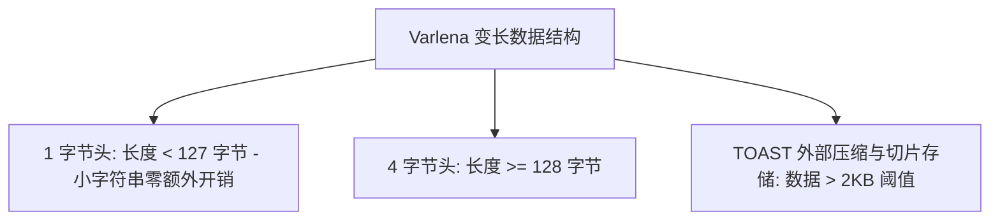
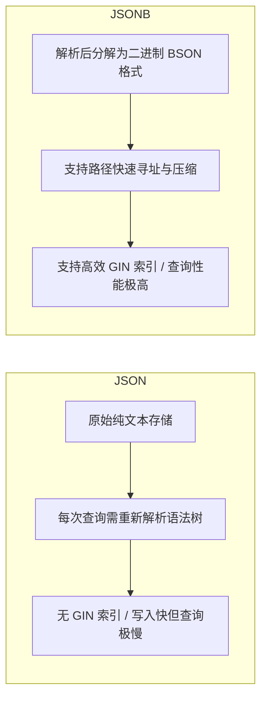

# 第 2 章：PostgreSQL 17 数据类型系统深度解读

---

## 1. 概述与核心理念

PostgreSQL 拥有关系型数据库领域中**最为丰富、扩展性最强、类型最安全**的数据类型体系。与传统数据库将数据视为扁平的标量不同，PostgreSQL 从架构之初就确立了“面向对象与可扩展类型系统”的哲学——支持数组（Array）、半结构化二进制 JSON（JSONB）、时间/数值范围（Range & Multirange）、网络地址（INET/CIDR）、几何对象以及用户自定义复合类型（Composite Types）。

在 PostgreSQL 17 中，类型系统的处理性能、内存分配机制（如 TOAST 优化与向量化转换）、JSONB 解析性能以及多范围类型（Multirange）的查询优化得到了进一步提升。

本章将系统剖析 PG17 数据类型的物理存储机理、核心操作符、隐式转换规则，并在每个核心类型后立即嵌入与 MySQL 的底层机制对比与代码对照，最后辅以三大生产级业务场景实战。

---

## 2. 基础标量数据类型（Part II 第 8 章）

### 2.1 数值类型（Numeric Types）与精度陷阱

PostgreSQL 的数值类型分为**整数**、**定点高精度数**和**浮点数**：

| 类型名称 | 存储空间 | 取值范围 | 推荐应用场景 |
| :--- | :--- | :--- | :--- |
| `SMALLINT` (int2) | 2 字节 | -32,768 到 +32,767 | 枚举状态码、小范围字典 ID |
| `INT` / `INTEGER` (int4) | 4 字节 | -2,147,483,648 到 +2,147,483,647 | 常规实体 ID、计数器 |
| `BIGINT` (int8) | 8 字节 | -9.22 × 10¹⁸ 到 +9.22 × 10¹⁸ | 交易流水号、用户 ID、分布式 Snowflake ID |
| `NUMERIC(p, s)` / `DECIMAL` | 变长（无精度上限） | 最多 131072 位整数，16383 位小数 | **金融金额、汇率、会计核算**（无精度丢失） |
| `REAL` (float4) | 4 字节 | 6 位十进制有效精度 | 科学计算、图形坐标（允许容忍微小精度误差） |
| `DOUBLE PRECISION` (float8)| 8 字节 | 15 位十进制有效精度 | 统计分析、机器学习特征值 |

```sql
-- 生产踩坑点：金额计算切勿使用 REAL 或 DOUBLE PRECISION
SELECT 0.1::float4 + 0.2::float4 = 0.3::float4; -- 返回 FALSE (浮点二进制舍入误差: 0.30000001)
SELECT 0.1::numeric + 0.2::numeric = 0.3::numeric; -- 返回 TRUE (准确无误)
```

---

### 2.2 🥊 数值与精度类型对比：PG vs MySQL

| 对比维度 | PostgreSQL 17 | MySQL 8.0 / 8.4 (InnoDB) | 架构与工程影响 |
| :--- | :--- | :--- | :--- |
| **定点数精度上限** | `NUMERIC` / `DECIMAL` 几乎无限制（最多 **131,072 位** 整数，**16,383 位** 小数）。不声明参数时为**任意精度**。 | `DECIMAL(M, D)` 精度上限严格受限：$M \le 65$，$D \le 30$。不声明参数时默认为 `DECIMAL(10, 0)`。 | PG 在超高精度科学计算、高频量化金融、多币种精密换算中无需担心溢出截断。 |
| **浮点数特殊值支持** | 严格遵循 IEEE 754 标准，原生支持 `'NaN'`（非数值）、`'Infinity'`（正无穷）、`'-Infinity'`（负无穷）。 | 不支持 `'NaN'` 和 `'Infinity'` 常量，数学越界时会报错或截断为最大/最小值。 | PG 适合承载科学计算、数据分析及机器学习特征工程的中间态计算结果。 |
| **除以零行为** | 默认直接抛出异常 `ERROR: division by zero` 严格阻断事务。 | 若未开启严格 SQL 模式，除零会静默返回 `NULL` 并产生 Warning。 | PG 具备更强的数据严谨性，防止产生意外的脏数据流转。 |

#### 💻 代码对照：数值与高精度计算

```sql
-- ========================================================
-- PostgreSQL 实现
-- ========================================================
-- 1. 任意精度 NUMERIC（无需事先固定长度）
CREATE TABLE financial_ledger_pg (
    ledger_id BIGINT PRIMARY KEY,
    exact_rate NUMERIC NOT NULL, -- 任意精度存储
    scientific_val DOUBLE PRECISION NOT NULL
);

INSERT INTO financial_ledger_pg VALUES 
(1, 12345678901234567890.12345678901234567890, 'Infinity');

-- 2. NaN 与无穷大安全运算
SELECT ledger_id, scientific_val > 1000000000 AS is_infinite 
FROM financial_ledger_pg; -- 返回 TRUE
```

```sql
-- ========================================================
-- MySQL 实现
-- ========================================================
CREATE TABLE financial_ledger_mysql (
    ledger_id BIGINT PRIMARY KEY,
    -- 1. MySQL DECIMAL 必须显式指定精度且上限为 M<=65, D<=30
    exact_rate DECIMAL(65, 30) NOT NULL,
    scientific_val DOUBLE NOT NULL
) ENGINE=InnoDB;

-- 2. 尝试插入 'Infinity' 会直接报错：Invalid double value: 'Infinity'
-- INSERT INTO financial_ledger_mysql VALUES (1, 123.45, 'Infinity'); -- ERROR!
```

---

### 2.3 字符类型（TEXT vs VARCHAR vs CHAR）与 TOAST 机制

在 PostgreSQL 底层存储引擎中，`TEXT` 与 `VARCHAR(n)` 均基于变长结构 **`varlena`** 实现，其物理开销和性能表现**完全一致**。



- **`CHAR(n)`（定长字符串）**：当内容不足 $n$ 时会用空格向右填充，占用额外空间，在比较时容易产生尾部空格歧义。**强烈建议在现代项目中废弃使用**。
- **`VARCHAR(n)`**：带长度硬限制检查。每次插入/更新会产生微小的长度截断校验开销。
- **`TEXT` / `VARCHAR`（不带 n）**：无固定长度限制（单字段上限 1GB），性能极佳。推荐作为**默认字符串类型**，并通过 `CHECK (length(col) <= N)` 实现灵活的业务校验。
- **TOAST（The Oversized-Attribute Storage Technique）**：当单行记录超过数据页安全阈值（约 2KB）时，PG 会自动将大文本进行 LZ4/PGLZ 压缩，并在必要时切片存入专用 TOAST 表中，保证主表数据页高度紧凑。

---

### 2.4 🥊 字符串类型对比：PG vs MySQL

| 对比维度 | PostgreSQL 17 | MySQL 8.0 / 8.4 (InnoDB) | 架构与工程影响 |
| :--- | :--- | :--- | :--- |
| **底层存储与性能** | `TEXT` 与 `VARCHAR` 底层完全一致（均为 `varlena`），性能零差异。 | `VARCHAR` 属于行内行记录；`TEXT/BLOB` 属于 LOB 字段，超过长度会导致 **Off-Page 溢出页存储**。 | PG 开发者无需在 `VARCHAR(255)` 还是 `TEXT` 上纠结；MySQL 滥用 TEXT 会导致内存临时表退化为磁盘表。 |
| **单行大小硬限制** | **没有 65,535 字节的单行硬限制**。大字段自动通过 TOAST 机制切片外存。 | **存在严格的 65,535 字节单行长度限制**（`Row size too large` 错误）。 | MySQL 宽表中定义过多 `VARCHAR(5000)` 字段时极易建表失败，被迫改用 TEXT。 |
| **长度扩容 DDL 开销** | 针对未受限 `TEXT` 或 `VARCHAR` 扩容（如 50 扩到 100），仅修改元数据字典，**毫秒级完成**。 | MySQL 8.0 虽然对 0-255 字节内、或 256 以上扩容支持 In-place，但跨 255 边界（1 字节变 2 字节长度头）时**需锁表重写**。 | PG 在进行字符串长度迭代调整时更轻量无感。 |
| **尾部空格比较处理** | 遵循严格字符比较，`'abc'` 与 `'abc '` **不相等**。 | 默认取决于 Collation 的 `PAD SPACE` 特性，`'abc'` 与 `'abc '` **会被判定为相等**（导致唯一索引冲突）。 | MySQL 容易因尾部空格在用户名、密码或 Token 唯一校验时产生安全绕过漏洞。 |

#### 💻 代码对照：字符串与行大小限制

```sql
-- ========================================================
-- PostgreSQL 实现（轻松定义任意大宽表，无单行 65535 限制）
-- ========================================================
CREATE TABLE wide_articles_pg (
    id BIGINT PRIMARY KEY,
    title VARCHAR(500) NOT NULL,
    summary TEXT,           -- 底层也是 varlena，性能与 VARCHAR 无异
    content TEXT NOT NULL,  -- 超长内容自动触发 TOAST 压缩切片
    col1 VARCHAR(10000),
    col2 VARCHAR(10000),
    col3 VARCHAR(10000)     -- 轻松成功建表，主表仍保持极小体积
);
```

```sql
-- ========================================================
-- MySQL 实现（触发单行 65535 字节溢出报错）
-- ========================================================
-- 尝试创建包含多个超长 VARCHAR 的表：
CREATE TABLE wide_articles_mysql (
    id BIGINT PRIMARY KEY,
    title VARCHAR(500) NOT NULL,
    col1 VARCHAR(10000) NOT NULL,
    col2 VARCHAR(10000) NOT NULL,
    col3 VARCHAR(10000) NOT NULL
) ENGINE=InnoDB CHARACTER SET utf8mb4;
-- ERROR 1118 (42000): Row size too large (> 65535). 
-- (因为 utf8mb4 每个字符最多占 4 字节，10000*4*3 = 120000 > 65535，建表失败！)
-- 被迫改用 TEXT，但 TEXT 会导致查询时无法在内存中走高效临时表。
```

---

### 2.5 日期与时间：TIMESTAMP vs TIMESTAMPTZ 及 INTERVAL

#### 1. TIMESTAMP vs TIMESTAMPTZ 的核心区别
- `TIMESTAMP WITHOUT TIME ZONE`（`TIMESTAMP`）：仅记录年、月、日、时、分、秒，**不包含时区信息**。无论客户端处于什么时区，读取到的数字字面量完全相同。
- `TIMESTAMP WITH TIME ZONE`（`TIMESTAMPTZ`）：内部在物理磁盘上**统一转换为 UTC 时间存储（8 字节整数，微秒精度）**。当客户端写入时根据会话时区转为 UTC；当读取时，自动转为当前客户端所在时区呈现。

```sql
-- 生产最佳实践：所有时间字段一律使用 TIMESTAMPTZ！
SET timezone = 'Asia/Shanghai';
CREATE TABLE user_login_logs (
    log_id BIGINT GENERATED ALWAYS AS IDENTITY PRIMARY KEY,
    login_time TIMESTAMPTZ NOT NULL DEFAULT clock_timestamp()
);

INSERT INTO user_login_logs VALUES (DEFAULT);
SELECT login_time FROM user_login_logs; -- 输出: 2026-08-19 11:00:00+08

-- 切换到伦敦时区查询
SET timezone = 'Europe/London';
SELECT login_time FROM user_login_logs; -- 输出: 2026-08-19 04:00:00+01 (自动转换，数据绝对真实)
```

#### 2. INTERVAL（时间间隔运算）
PostgreSQL 提供了极其强大的时间跨度运算支持：
```sql
SELECT 
    now() AS current_time,
    now() + INTERVAL '30 days' AS vip_expire_time,
    now() - INTERVAL '3 hours 15 minutes' AS past_active_time;
```

---

### 2.6 🥊 时间与时区对比：PG vs MySQL

| 对比维度 | PostgreSQL 17 | MySQL 8.0 / 8.4 (InnoDB) | 架构与工程影响 |
| :--- | :--- | :--- | :--- |
| **时区感知类型** | **`TIMESTAMPTZ`**（8 字节）：物理以 **UTC 存储**，读写按会话时区自动双向转换。 | **`DATETIME`**（无时区感知，存裸值）与 **`TIMESTAMP`**（4 字节，有时区感知但有 2038 瓶颈）。 | PG 完美统一了时区安全与超大时间跨度。 |
| **时间范围与 2038 年问题** | `TIMESTAMPTZ` 范围为 **公元前 4713 年 到 公元 294276 年**，精度达微秒（1 微秒 = 10⁻⁶ 秒）。 | MySQL `TIMESTAMP` 采用 32 位整型，**上限为 '2038-01-19 03:14:07'**。超过 2038 年必须迁移为 `DATETIME`。 | MySQL 遗留系统中大量使用 TIMESTAMP 将在 2038 年前迎来系统瘫痪风险。 |
| **时间跨度运算 (INTERVAL)** | 原生标准 `INTERVAL` 类型（可作为列存储或参与加减）：`col + INTERVAL '3 months 2 days'`。 | 无独立 `INTERVAL` 数据类型，必须依靠 `DATE_ADD(col, INTERVAL 3 MONTH)` 函数语法。 | PG 时间算术表达力极强，且支持在表字段中直接存储时间间隔（如任务周期、会员有效时长）。 |

#### 💻 代码对照：时间与时区

```sql
-- ========================================================
-- PostgreSQL 实现
-- ========================================================
CREATE TABLE subscription_pg (
    sub_id BIGINT PRIMARY KEY,
    start_time TIMESTAMPTZ NOT NULL,
    duration INTERVAL NOT NULL DEFAULT '1 month', -- 直接将间隔存为列
    expire_time TIMESTAMPTZ GENERATED ALWAYS AS (start_time + duration) STORED
);

INSERT INTO subscription_pg (sub_id, start_time, duration) 
VALUES (1, '2026-08-19 12:00:00+08', '1 year 15 days');

SELECT sub_id, expire_time FROM subscription_pg;
-- 输出: 2027-09-03 12:00:00+08 (准确处理闰年、跨月与夏令时)
```

```sql
-- ========================================================
-- MySQL 实现
-- ========================================================
CREATE TABLE subscription_mysql (
    sub_id BIGINT PRIMARY KEY,
    start_time DATETIME NOT NULL, -- DATETIME 无法感知时区，跨国部署需应用层处理
    -- MySQL TIMESTAMP 虽感知时区，但在 2038-01-19 后直接溢出报错！
    duration_days INT NOT NULL,  -- 无法原生存储多样化 INTERVAL，只能折算成整型天数
    expire_time DATETIME AS (DATE_ADD(start_time, INTERVAL duration_days DAY)) VIRTUAL
) ENGINE=InnoDB;
```

---

### 2.7 布尔类型与枚举类型（BOOLEAN & ENUM）

- **BOOLEAN**：支持标准 SQL 三值逻辑（`TRUE`, `FALSE`, `UNKNOWN` 即 `NULL`）。支持字面量简写（如 `'t'`, `'f'`, `'yes'`, `'no'`, `'1'`, `'0'`）。
- **ENUM（枚举类型）**：在系统级定义类型，占用 4 字节，比普通字符串节省空间且类型安全。
```sql
CREATE TYPE order_flow_status AS ENUM ('CREATED', 'PAID', 'DELIVERED', 'COMPLETED', 'CANCELLED');

CREATE TABLE orders (
    order_id BIGINT PRIMARY KEY,
    status order_flow_status NOT NULL DEFAULT 'CREATED'
);
```

---

## 3. 高级复合与容器数据类型（Part II 第 8 章）

### 3.1 数组类型（Array Types）

PostgreSQL 允许将任意标量类型定义为其对应的数组形式（如 `INT[]`, `TEXT[]`, `UUID[]`），并提供完整的集合操作符与索引支持。

```sql
CREATE TABLE sys_posts (
    post_id BIGINT PRIMARY KEY,
    title TEXT NOT NULL,
    tags TEXT[] NOT NULL DEFAULT '{}' -- 标签数组
);

-- 插入数组数据
INSERT INTO sys_posts VALUES 
(1, 'PostgreSQL 17 新特性', ARRAY['database', 'postgres', 'backend']),
(2, 'Docker 容器化部署', '{"docker", "devops", "backend"}');

-- 核心数组操作符：
-- 1. 包含操作符 @> (tags 是否包含 'postgres')
SELECT * FROM sys_posts WHERE tags @> ARRAY['postgres'];

-- 2. 重叠操作符 && (tags 是否与指定数组存在交集)
SELECT * FROM sys_posts WHERE tags && ARRAY['devops', 'kubernetes'];

-- 3. 数组追加元素 ||
UPDATE sys_posts SET tags = tags || 'performance' WHERE post_id = 1;

-- 4. 数组元素展开为行 (unnest)
SELECT post_id, unnest(tags) AS single_tag FROM sys_posts;

-- 为数组建立 GIN 倒排索引（加速 @> 和 && 查询）
CREATE INDEX idx_posts_tags_gin ON sys_posts USING gin (tags);
```

---

### 3.2 🥊 Array 数组对比：PG vs MySQL

| 对比维度 | PostgreSQL 17 | MySQL 8.0 / 8.4 (InnoDB) | 架构与工程影响 |
| :--- | :--- | :--- | :--- |
| **原生类型支持** | **原生一等公民类型**。支持任意维度的任意类型数组（如 `INT[]`, `UUID[][]`）。 | **完全无原生 Array 类型**。 | PG 大幅减少关系建模中的中间多对多关联表（Junction Tables）。 |
| **集合检索与索引** | **原生提供 `@>` (包含)、`&&` (重叠) 操作符**，配合 **GIN 倒排索引** 实现毫秒级全文/多标签命中。 | 替代方案：<br>1. 拆多对多子表：导致复杂 JOIN 性能开销。<br>2. 逗号拼接字符串：用 `FIND_IN_SET`，**全表扫描无法走索引**。<br>3. `JSON_ARRAY`：使用 `MEMBER OF()`，索引能力有限。 | PG 在电商打标、内容风控、权限 ACL 过滤场景下开发效率和性能高出数量级。 |

#### 💻 代码对照：标签数组检索

```sql
-- ========================================================
-- PostgreSQL: 原生数组 + GIN 倒排索引（极速检索）
-- ========================================================
CREATE TABLE user_tags_pg (
    user_id BIGINT PRIMARY KEY,
    tags TEXT[] NOT NULL
);
CREATE INDEX idx_user_tags_gin ON user_tags_pg USING gin (tags);

-- 毫秒级检索同时拥有 'vip' 和 'tech' 标签的用户（走 GIN 索引）
SELECT * FROM user_tags_pg WHERE tags @> ARRAY['vip', 'tech'];
```

```sql
-- ========================================================
-- MySQL: 替代方案的尴尬与低效
-- ========================================================
-- 方案 A: 逗号拼接字符串（反模式，全表扫描）
CREATE TABLE user_tags_mysql_str (
    user_id BIGINT PRIMARY KEY,
    tags_str VARCHAR(255) NOT NULL -- 存 'vip,tech,buyer'
) ENGINE=InnoDB;
-- 无法走索引，必须全表逐行函数运算扫描！
SELECT * FROM user_tags_mysql_str 
WHERE FIND_IN_SET('vip', tags_str) AND FIND_IN_SET('tech', tags_str);

-- 方案 B: JSON_ARRAY 方案 (MySQL 8.0.17+)
CREATE TABLE user_tags_mysql_json (
    user_id BIGINT PRIMARY KEY,
    tags_json JSON NOT NULL
) ENGINE=InnoDB;
-- 虽支持多值索引 (Multi-Valued Index)，但语法冗长且维护复杂
```

---

### 3.3 JSON 与 JSONB 深度对比

PostgreSQL 同时提供 `JSON` 和 `JSONB` 两种类型：



| 比较维度 | `JSON` | `JSONB`（强烈推荐） |
| :--- | :--- | :--- |
| **物理存储** | 纯文本格式完整拷贝（保留多余空格、键顺序及重复键） | 解析后的二进制格式（去除空格、键去重并按字典序重排） |
| **写入性能** | 极快（直接写入文本，无需解析转换） | 略慢（需进行语法解析与二进制结构化） |
| **读取与检索** | 每次读取或取属性需重新解析全文 | 纳秒级路径寻址，读取性能高数个数量级 |
| **索引支持** | 仅支持整体函数表达式索引 | **支持 GIN 倒排索引、jsonb_path_ops**，全面支持复杂嵌套检索 |
| **SQL/JSON 路径** | 支持基础函数 | **全面支持 ANSI SQL:2023 JSON 路径（`jsonb_path_query` 等）** |

---

### 3.4 🥊 JSON 体系对比：PG vs MySQL

| 对比维度 | PostgreSQL 17 | MySQL 8.0 / 8.4 (InnoDB) | 架构与工程影响 |
| :--- | :--- | :--- | :--- |
| **通用索引能力** | **支持全量 GIN 倒排索引**（`USING gin (data jsonb_path_ops)`）。一个索引直接覆盖 JSON 内部**所有任意未知 Key 与嵌套结构**。 | **无通用 JSON 倒排索引**。必须提前预知具体 Key，通过生成列（Generated Column）抽取出来，并在生成列上建立 B+Tree 索引。 | PG 是真正具备 Document NoSQL（如 MongoDB）能力的分布式关系型数据库；MySQL 无法应对未知动态属性。 |
| **操作符丰富度** | 提供数十种原生操作符（`->`, `->>`, `#>`, `#>>`, `@>`, `?`, `?|`, `?&`, `#-` 等），语法极度精炼。 | 依赖函数式调用（`JSON_EXTRACT`, `JSON_CONTAINS`, `JSON_SET` 等）及箭头语法 `->`, `->>`。 | PG 在编写复杂 JSON 嵌套提取与修改时表达力完胜。 |
| **SQL:2023 标准路径** | 完整实现 ANSI SQL/JSON 标准（`JSON_QUERY`, `JSON_VALUE`, `jsonb_path_exists`）。 | 部分实现基础 JSON 函数。 | PG 与现代标准 SQL 生态无缝整合。 |

#### 💻 代码对照：动态属性检索与索引

```sql
-- ========================================================
-- PostgreSQL: 一个 GIN 索引索引全 JSON 结构
-- ========================================================
CREATE TABLE device_metrics_pg (
    id BIGINT PRIMARY KEY,
    payload JSONB NOT NULL
);
-- 建立通用 GIN 索引
CREATE INDEX idx_metrics_payload_gin ON device_metrics_pg USING gin (payload jsonb_path_ops);

-- 无论是查 CPU 还是查 嵌套的网络配置，全部自动走 GIN 索引！
SELECT * FROM device_metrics_pg 
WHERE payload @> '{"cpu": "95%", "network": {"status": "ACTIVE"}}';
```

```sql
-- ========================================================
-- MySQL: 必须为每个具体要查的 Key 建立虚拟列与 B+Tree 索引
-- ========================================================
CREATE TABLE device_metrics_mysql (
    id BIGINT PRIMARY KEY,
    payload JSON NOT NULL,
    -- 必须手动提取出 cpu 字段建虚拟列
    cpu_val VARCHAR(10) AS (payload->>'$.cpu') STORED,
    INDEX idx_cpu (cpu_val)
    -- 若业务明天新增了一个 memory 属性，必须执行 ALTER TABLE 加虚拟列并建索引！
) ENGINE=InnoDB;
```

---

### 3.5 Range（范围）与 Multirange（多范围）类型

PostgreSQL 原生内置 6 种范围类型：`int4range`, `int8range`, `numrange`, `tsrange`, `tstzrange`, `daterange`，并在 PG14+ 引入了对应的 `multirange`（如 `tsmultirange`, `datemultirange`）。

#### 常用范围区间与操作符：
- `[a, b]`：闭区间（包含 a 和 b）。
- `[a, b)`：左闭右开区间（包含 a，不包含 b）。
- `&&`：区间是否重叠。
- `@>`：区间是否包含元素或子区间。
- `<<` / `>>`：区间是否严格在左侧/右侧。
- `+` / `-` / `*`：区间的并集、差集、交集。

---

### 3.6 🥊 Range 范围类型对比：PG vs MySQL

| 对比维度 | PostgreSQL 17 | MySQL 8.0 / 8.4 (InnoDB) | 架构与工程影响 |
| :--- | :--- | :--- | :--- |
| **原生范围类型** | **原生一等公民类型**（Range & Multirange），支持离散与连续区间运算。 | **完全不支持**。 | PG 可直接将“起止时间”、“价格区间”、“IP 范围”定义为单字段。 |
| **重叠检测与索引** | 原生提供 **`&&`（重叠）操作符** 与 **GiST 空间索引**，时间复杂度 $O(\log N)$；结合 EXCLUDE 约束物理防止冲突。 | 必须拆分为 `start_time` 与 `end_time` 两列。查询重叠需写 `start_time <= B AND end_time >= A`。复合 B+Tree 索引**无法同时高效优化两个不等式范围**，导致全表扫描。 | PG 在酒店排班、会议室预订、租期管理场景下具备降维打击级的优势。 |

#### 💻 代码对照：区间范围重叠检索

```sql
-- ========================================================
-- PostgreSQL: 原生 TSRANGE + GiST 索引
-- ========================================================
CREATE TABLE room_leases_pg (
    lease_id BIGINT PRIMARY KEY,
    lease_duration TSRANGE NOT NULL
);
CREATE INDEX idx_lease_duration_gist ON room_leases_pg USING gist (lease_duration);

-- 检索在 2026年国庆期间有重叠的租约（走 GiST 索引）
SELECT * FROM room_leases_pg 
WHERE lease_duration && tsrange('2026-10-01 00:00:00', '2026-10-07 23:59:59', '[]');
```

```sql
-- ========================================================
-- MySQL: 拆为双字段，索引失效与笨重 SQL
-- ========================================================
CREATE TABLE room_leases_mysql (
    lease_id BIGINT PRIMARY KEY,
    start_time DATETIME NOT NULL,
    end_time DATETIME NOT NULL,
    INDEX idx_times (start_time, end_time)
) ENGINE=InnoDB;

-- 查询重叠：B+Tree 索引只能使用 start_time 的单边过滤，end_time 无法高效利用索引
SELECT * FROM room_leases_mysql 
WHERE start_time <= '2026-10-07 23:59:59' AND end_time >= '2026-10-01 00:00:00';
```

---

### 3.7 UUID、网络类型与自定义复合类型

#### 1. 原生 UUID 类型
PostgreSQL 原生支持标准的 128 位 `UUID` 类型，占 16 字节空间，比字符串形式（36 字节）节省 55% 存储，且比较和索引效率极高。
```sql
CREATE TABLE devices (
    device_id UUID PRIMARY KEY DEFAULT gen_random_uuid(),
    device_name TEXT NOT NULL
);
```

#### 2. 原生网络地址类型（INET / CIDR / MACADDR）
- `INET`：IPv4/IPv6 主机及子网掩码（支持网络包含操作符 `<<=`）。
- `CIDR`：网络子网规范格式。
- `MACADDR`：网卡物理地址（6 字节 / 8 字节 MAC）。
```sql
CREATE TABLE audit_logs (
    log_id BIGINT GENERATED ALWAYS AS IDENTITY PRIMARY KEY,
    client_ip INET NOT NULL,
    action TEXT NOT NULL
);
INSERT INTO audit_logs (client_ip, action) VALUES 
('192.168.1.105/24', 'USER_LOGIN'),
('2001:db8::ff00:42:8329', 'API_CALL');

-- 查询特定子网内的所有访问
SELECT * FROM audit_logs WHERE client_ip <<= '192.168.1.0/24'::inet;
```

#### 3. 用户自定义复合类型（Composite Types）
```sql
CREATE TYPE address_info AS (
    province VARCHAR(50),
    city VARCHAR(50),
    detail_address TEXT,
    postal_code VARCHAR(10)
);

CREATE TABLE companies (
    company_id BIGINT PRIMARY KEY,
    company_name TEXT NOT NULL,
    registered_address address_info -- 复合类型列
);
```

---

### 3.8 🥊 UUID / 网络类型 / 复合类型对比：PG vs MySQL

| 对比维度 | PostgreSQL 17 | MySQL 8.0 / 8.4 (InnoDB) | 架构与工程影响 |
| :--- | :--- | :--- | :--- |
| **UUID 支持** | **原生 16 字节 `UUID` 类型**，内置 `gen_random_uuid()`，存储紧凑且索引比较极快。 | **无原生 UUID 类型**。通常采用 `VARCHAR(36)`（低效）或 `BINARY(16)`（需在业务层手动做 `HEX/UNHEX` 转换）。 | PG 在分布式唯一 ID 架构中节省一半存储，B-Tree 索引页面容纳更多索引项。 |
| **网络地址类型** | **原生 `INET` / `CIDR` / `MACADDR`**。同时兼容 IPv4 与 IPv6，支持子网包含（`<<=`）与网络运算。 | **无网络类型**。通常存为 `VARCHAR(45)`，或用 `INT UNSIGNED` 配合 `INET_ATON/INET_NTOA`（仅支持 IPv4）。 | PG 是网络安全监控、风控防火墙、IoT 物联网网关系统的首选。 |
| **自定义复合类型** | 支持 **`CREATE TYPE ... AS (...)`**，面向对象式结构体封装。 | **不支持**。只能拆散为扁平单列或使用 JSON 弱类型字符串。 | PG 提升了复杂数据模型的封装性与复用度。 |

#### 💻 代码对照：网络子网匹配

```sql
-- ========================================================
-- PostgreSQL: 原生 INET 包含运算
-- ========================================================
SELECT '192.168.1.55'::inet <<= '192.168.1.0/24'::inet; -- TRUE (属于该子网)
SELECT '2001:db8::1'::inet <<= '2001:db8::/32'::inet;    -- TRUE (IPv6 原生无缝支持)
```

```sql
-- ========================================================
-- MySQL: 繁琐的位运算与 IPv6 困境
-- ========================================================
-- IPv4 必须转为整型做掩码位运算：
SELECT (INET_ATON('192.168.1.55') & 0xFFFFFF00) = INET_ATON('192.168.1.0');
-- 针对 IPv6 则需要调用 INET6_ATON 并处理 16 字节 BINARY 位操作，极其难以维护。
```

---

## 4. 类型转换与类型推断规则（Part II 第 10 章）

PostgreSQL 是**严格的强类型数据库**。在表达式计算和函数调用时，遵循三层类型转换规则：
1. **显式类型转换语法**：
   - SQL 标准语法：`CAST(expression AS target_type)`
   - PostgreSQL 专属高效语法：`expression::target_type`
2. **隐式转换（Implicit Cast）**：仅在系统目录 `pg_cast` 中被标记为 `castcontext = 'i'` 的类型对之间自动发生（如 `int2` 自动转为 `int4`）。
3. **强类型安全保障**：PG 严禁随意跨类型隐式比较（如 `VARCHAR` 与 `INTEGER` 比较默认不会隐式转换，而是直接报错），从而避免了全表扫描与索引失效风险。

```sql
-- 显式转换示例
SELECT '2026-08-19'::date + 7;             -- 2026-08-26
SELECT '12345'::int4 + 100;                 -- 12445
SELECT CAST('{"a": 1}' AS jsonb)->>'a';    -- '1'
```

---

### 4.1 🥊 类型转换对比：PG vs MySQL

| 对比维度 | PostgreSQL 17 | MySQL 8.0 / 8.4 (InnoDB) | 架构与工程影响 |
| :--- | :--- | :--- | :--- |
| **类型安全哲学** | **严格强类型**。类型不兼容时直接报错（如 `WHERE text_col = 123` 立即报错中断）。 | **宽容隐式转换（Permissive Cast）**。会将字符串整列自动转为 Double 浮点数后与数字比较。 | MySQL 宽容转换会导致 **B+Tree 索引彻底失效，引发致命全表扫描事故**；PG 在语法解析期扼杀隐患。 |
| **字符串超长截断** | 严格报错拦截，绝不静默丢失数据。 | 若未开启 `STRICT_TRANS_TABLES`，会静默截断字符串并入库，仅留 Warning。 | PG 保证了数据完整性与合规安全。 |
| **类型转换语法** | 支持标准 `CAST(a AS type)` 及极简高效的 `a::type` 语法。 | 仅支持标准 `CAST(a AS type)` 与 `CONVERT(a, type)`，不支持 `::` 快捷操作符。 | PG 编写复杂多层类型转换 SQL 时更加清晰优雅。 |

#### 💻 代码对照：隐式转换与全表扫描陷阱

```sql
-- ========================================================
-- PostgreSQL: 严格强类型拦截（防御慢查询事故）
-- ========================================================
CREATE TABLE customer_pg (
    id BIGINT PRIMARY KEY,
    mobile VARCHAR(20) NOT NULL
);
CREATE INDEX idx_pg_mobile ON customer_pg (mobile);

-- 开发者疏忽，传了数字参数：
-- SELECT * FROM customer_pg WHERE mobile = 13800000000;
-- 报错：ERROR: operator does not exist: character varying = bigint
-- 强制要求开发者显式转换，确保百分之百走索引：
SELECT * FROM customer_pg WHERE mobile = '13800000000';
```

```sql
-- ========================================================
-- MySQL: 宽容转换引发的线上全表扫描事故
-- ========================================================
CREATE TABLE customer_mysql (
    id BIGINT PRIMARY KEY,
    mobile VARCHAR(20) NOT NULL,
    INDEX idx_mysql_mobile (mobile)
) ENGINE=InnoDB;

-- 开发者传了数字参数，MySQL 不报错，但在底层将每一行的 mobile 列转为 double 比较：
EXPLAIN SELECT * FROM customer_mysql WHERE mobile = 13800000000;
-- 执行计划显示：type=ALL, key=NULL！索引完全失效，直接引发千万级大表全表扫描 CPU 100% 宕机！
```

---

## 5. 生产级业务实战场景

### 实战场景 1：商品动态多规格属性系统（JSONB 存储与 GIN 索引）

**业务背景**：
在电商系统中，不同品类商品具有完全不同的动态规格属性（如手机有“内存、颜色、CPU”，服装有“尺码、面料、版型”）。采用传统 EAV（Entity-Attribute-Value）表会导致多表 JOIN 性能低下，采用宽表则列爆炸。

**解决方案**：使用 `JSONB` 存储规格，配合 **GIN jsonb_path_ops** 索引实现毫秒级多条件过滤。

```sql
CREATE TABLE product_spus (
    spu_id BIGINT GENERATED ALWAYS AS IDENTITY PRIMARY KEY,
    title TEXT NOT NULL,
    brand_id INT NOT NULL,
    -- JSONB 存储动态属性：{"color": "星空灰", "ram": "16GB", "storage": "512GB", "tags": ["5G", "OLED"]}
    attributes JSONB NOT NULL,
    created_at TIMESTAMPTZ DEFAULT CURRENT_TIMESTAMP
);

-- 建立高吞吐专用 GIN 路径索引
CREATE INDEX idx_spus_attributes_gin ON product_spus USING gin (attributes jsonb_path_ops);

-- 插入测试数据
INSERT INTO product_spus (title, brand_id, attributes) VALUES
('旗舰手机 X1', 101, '{"color": "星空灰", "ram": "16GB", "storage": "512GB", "screen": "6.78寸", "features": ["5G", "NFC", "无线充电"]}'),
('轻薄笔记本 Pro', 102, '{"color": "银色", "ram": "32GB", "storage": "1TB", "cpu": "Ultra7"}'),
('旗舰手机 X2', 101, '{"color": "雅川青", "ram": "16GB", "storage": "512GB", "screen": "6.82寸", "features": ["5G", "卫星通信"]}');

-- 检索 1：精准匹配内存为 16GB 且存储为 512GB 的手机（走 GIN 索引）
EXPLAIN (COSTS OFF)
SELECT * FROM product_spus 
WHERE attributes @> '{"ram": "16GB", "storage": "512GB"}';

-- 检索 2：利用 SQL/JSON Path 查询特性包含 5G 且颜色为星空灰的商品
SELECT title, attributes->>'color' AS color
FROM product_spus
WHERE jsonb_path_exists(attributes, '$.features[*] ? (@ == "5G")')
  AND attributes->>'color' = '星空灰';
```

---

### 实战场景 2：用户标签画像系统（Array 数组与重叠检索）

**业务背景**：
用户画像系统中，每个用户打上了数十上百个标签（如 `80后`, `数码控`, `母婴高潜`, `高净值`）。需要快速圈选满足“任意包含某些标签”或“全部命中某些标签”的人群。

**解决方案**：采用原生 `TEXT[]` 数组存储标签，结合 GIN 倒排索引实现单表亿级数据圈选。

```sql
CREATE TABLE user_profiles (
    user_id BIGINT PRIMARY KEY,
    username VARCHAR(50) NOT NULL,
    tag_list TEXT[] NOT NULL DEFAULT '{}'
);

-- 为数组列创建 GIN 倒排索引
CREATE INDEX idx_user_tag_list_gin ON user_profiles USING gin (tag_list);

-- 模拟插入用户数据
INSERT INTO user_profiles VALUES
(1001, '张三', ARRAY['80后', '数码控', '高净值', '车主']),
(1002, '李四', ARRAY['90后', '母婴高潜', '居家']),
(1003, '王五', ARRAY['80后', '数码控', '游戏达人', '高净值']);

-- 业务场景 A：圈选【高净值】且为【数码控】的用户（完全包含）
SELECT user_id, username FROM user_profiles 
WHERE tag_list @> ARRAY['高净值', '数码控'];

-- 业务场景 B：圈选【母婴高潜】或【游戏达人】的潜在营销人群（交集重叠）
SELECT user_id, username FROM user_profiles 
WHERE tag_list && ARRAY['母婴高潜', '游戏达人'];
```

---

### 实战场景 3：促销活动有效期与排他性校验（Range 范围实战）

**业务背景**：
平台发布营销活动，同一店铺在同一活动类型下，活动时间区间不允许产生交叉重叠；同时需快速查询当前正在生效的促销活动。

**解决方案**：使用 `TSTZRANGE` 范围类型及排他约束。

```sql
CREATE EXTENSION IF NOT EXISTS btree_gist;

CREATE TABLE promotion_campaigns (
    campaign_id BIGINT GENERATED ALWAYS AS IDENTITY PRIMARY KEY,
    shop_id BIGINT NOT NULL,
    campaign_name TEXT NOT NULL,
    discount_type VARCHAR(32) NOT NULL,
    active_period TSTZRANGE NOT NULL, -- 活动起止时间范围
    
    -- 排他约束：同一店铺同类折扣活动严禁在时间区间上产生重叠
    CONSTRAINT ex_shop_campaign_no_overlap 
        EXCLUDE USING gist (
            shop_id WITH =, 
            discount_type WITH =, 
            active_period WITH &&
        )
);

-- 1. 创建 618 大促活动：2026-06-01 至 2026-06-20
INSERT INTO promotion_campaigns (shop_id, campaign_name, discount_type, active_period)
VALUES (
    888, 
    '618 店庆满减', 
    'FULL_REDUCTION', 
    tstzrange('2026-06-01 00:00:00+08', '2026-06-20 23:59:59+08', '[]')
);

-- 2. 尝试创建重叠活动：2026-06-15 至 2026-06-25（将直接被数据库拒绝拦截）
-- ERROR: conflicting key value violates exclusion constraint "ex_shop_campaign_no_overlap"
INSERT INTO promotion_campaigns (shop_id, campaign_name, discount_type, active_period)
VALUES (
    888, 
    '618 狂欢加码满减', 
    'FULL_REDUCTION', 
    tstzrange('2026-06-15 00:00:00+08', '2026-06-25 23:59:59+08', '[]')
);

-- 3. 毫秒级查询当前时刻处于激活状态的所有活动（走 GiST 索引）
SELECT campaign_name, active_period 
FROM promotion_campaigns
WHERE active_period @> CURRENT_TIMESTAMP;
```

---

## 6. PostgreSQL 17 与 MySQL (InnoDB) 数据类型综合对照矩阵

| 数据分类 | PostgreSQL 17 推荐类型 | MySQL 8.0 / 8.4 对应类型 | 架构与选型差异 |
| :--- | :--- | :--- | :--- |
| **自增主键** | `BIGINT GENERATED ALWAYS AS IDENTITY` | `BIGINT AUTO_INCREMENT` | PG 符合 SQL 标准且防误写，MySQL 易受大值污染。 |
| **定点金融数值** | `NUMERIC(p, s)` / `DECIMAL` | `DECIMAL(p, s)` | PG 支持任意精度（无 65 位上限），浮点数严格遵循 IEEE 754。 |
| **常规长短文本** | `TEXT` / `VARCHAR` | `VARCHAR(n)` / `LONGTEXT` | PG 底层统一为 `varlena` + TOAST，单行无 65535 字节限制。 |
| **时区敏感时间** | `TIMESTAMPTZ` | `DATETIME` / `TIMESTAMP` | PG 统一 UTC 存储微秒精度且无 2038 瓶颈；MySQL TIMESTAMP 存在 2038 风险。 |
| **半结构化对象** | `JSONB`（二进制存储 + GIN 索引） | `JSON` | PG 支持全量通用 GIN 倒排索引；MySQL 必须为具体属性建虚拟列索引。 |
| **集合与多值** | `Array` (如 `TEXT[]`, `INT[]`) | 拆中间多对多表 / `JSON_ARRAY` | PG 支持原生集合操作符（`@>`, `&&`）与 GIN 倒排索引。 |
| **区间与范围** | `Range` (如 `TSTZRANGE`, `DATERANGE`) | 拆分 `start_time` + `end_time` | PG 支持原生范围重叠计算与 GiST 索引排他。 |
| **全局唯一 ID** | 原生 `UUID` (16 字节) | `VARCHAR(36)` / `BINARY(16)` | PG 存储紧凑、无额外开销，内置生成函数。 |
| **网络地址** | `INET` / `CIDR` / `MACADDR` | `VARCHAR` / `INT UNSIGNED` | PG 原生支持 IPv4/IPv6 子网包含匹配。 |

---

## 7. 开发者最佳实践与避坑指南

1. **统一选用 TIMESTAMPTZ**：永远不要使用 `TIMESTAMP WITHOUT TIME ZONE`，避免跨国业务、夏令时与服务器时区变动时的灾难。
2. **默认使用 TEXT 或未受限 VARCHAR**：无需在 `VARCHAR(255)` 上纠结。PG 底层统一为 `varlena` 存储，如果需要业务长度限制，使用 CHECK 约束更为规范。
3. **优先选择 JSONB 而非 JSON**：除非是单纯的日志归档且绝不查询内部属性，否则一律使用 `JSONB`，并为高频检索字段或全局路径建立 GIN 倒排索引。
4. **金融领域严禁使用浮点数**：涉及金额、积分、费率一律采用 `NUMERIC(precision, scale)`。
5. **合理利用 GIN 与 GiST 索引**：
   - 针对 `Array` 与 `JSONB`，使用 `GIN` 倒排索引（如 `jsonb_path_ops`）。
   - 针对 `Range` 范围类型与排除约束，使用 `GiST` 索引。
6. **注意强类型转换**：ORM 或 SQL 查询时必须保证参数类型与列定义严格一致，禁止依赖隐式转换，养成使用 `::type` 或标准参数绑定的好习惯。
