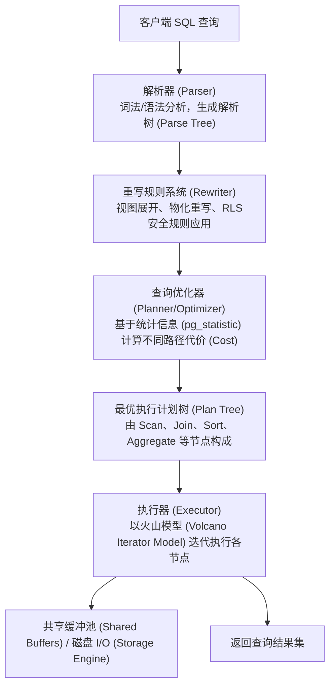
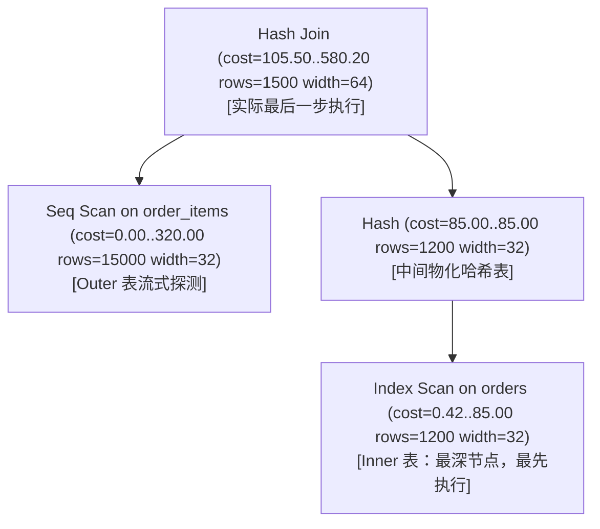
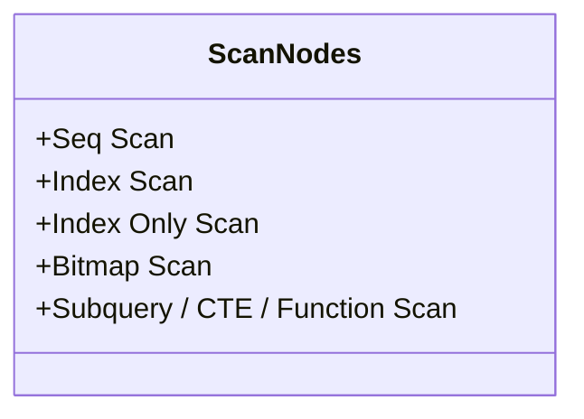
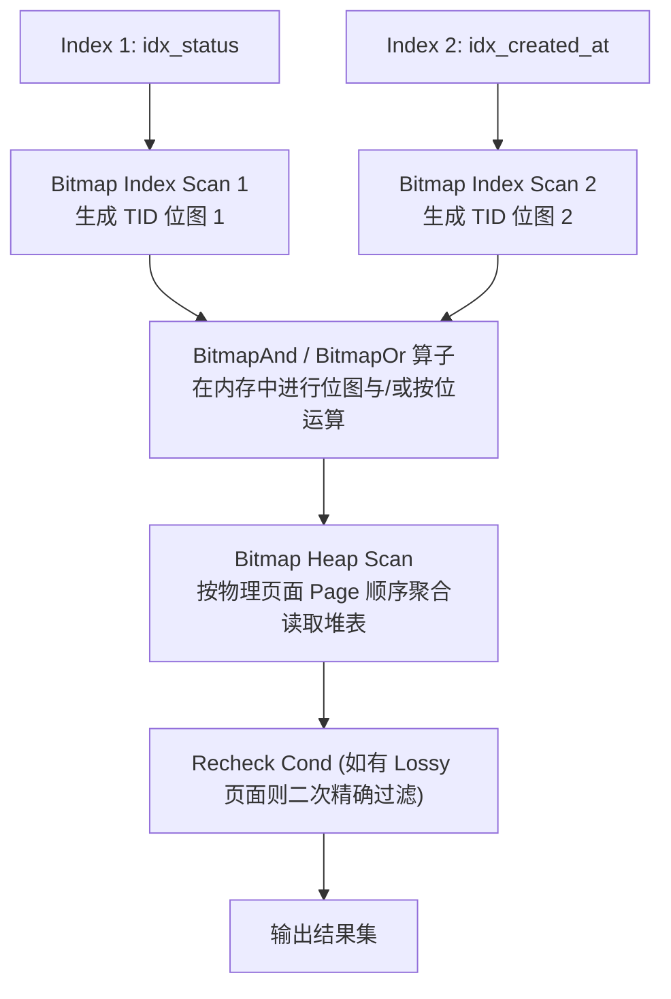
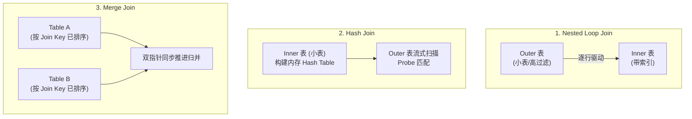
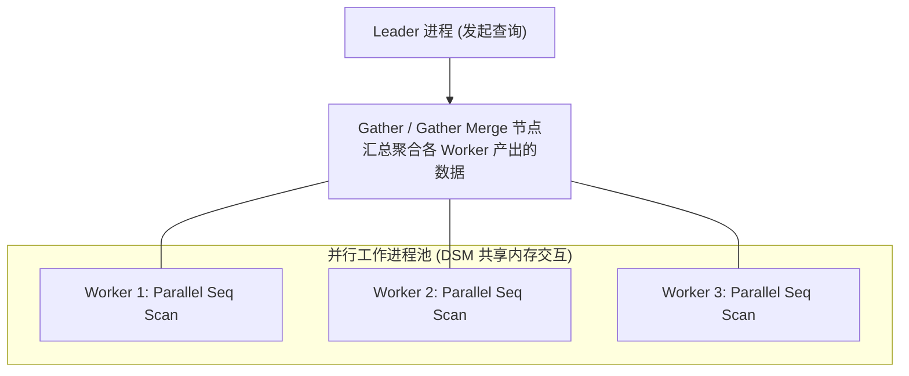

# 第 7 章 性能优化与执行计划深度解析

> **适用版本**：PostgreSQL 17 及以上  
> **官方文档参考**：Part II Chapter 14 (*Performance Tips*), Chapter 15 (*Using EXPLAIN*)  
> **主要目标**：深入理解 PostgreSQL 基于代价的优化器（CBO）运行机制，掌握 `EXPLAIN` 各类参数分析、计划树扫描与连接算子、统计信息管理、多列扩展统计信息、并行查询调优，并在每个核心知识点后嵌入与 MySQL 的深度架构对比与代码对照，精通慢查询排查闭环。

---

## 7.1 PostgreSQL 查询优化器与执行引擎架构

PostgreSQL 采用**基于代价的优化器（Cost-Based Optimizer, CBO）**。SQL 查询进入数据库后，历经解析（Parser）、重写（Rewriter）、计划生成（Planner/Optimizer）以及执行（Executor）四个核心阶段。



### 7.1.1 火山模型（Volcano Iterator Model）
PostgreSQL 执行器采用经典的**火山迭代模型（Demand-Driven Iterator Model）**。
- 每个计划节点都实现三个核心接口：`ExecInitNode`（初始化节点）、`ExecProcNode`（获取下一条 Tuple）、`ExecEndNode`（销毁与清理）。
- 顶层节点向子节点拉取（Pull）元组，子节点按需向上返回，直到没有更多元组。
- 这种机制实现了低内存占用和流式处理，但对于排序（Sort）、物化哈希表（Hash Join 构建阶段）等阻塞型算子（Materializing Operators），必须等待下层节点完全产出后方可继续。

---

## 7.2 EXPLAIN 命令深度解析

`EXPLAIN` 是性能调优中最核心的诊断工具。在 PostgreSQL 中，`EXPLAIN` 支持多种诊断选项和输出格式。

### 7.2.1 EXPLAIN 核心参数详解

| 参数名 | 类型 | 默认值 | 作用与生产建议 |
| :--- | :--- | :--- | :--- |
| **`ANALYZE`** | Boolean | `false` | **真正执行查询**并捕获实际运行耗时（Actual Time）、实际行数（Actual Rows）及循环次数（Loops）。注意：若查询涉及 DML（`INSERT/UPDATE/DELETE`），会真正修改数据（调优 DML 时应配合事务回滚使用）。 |
| **`BUFFERS`** | Boolean | `false` | **必须与 ANALYZE 配合使用**。输出共享缓冲池（Shared）、本地缓冲（Local）及临时缓冲（Temp）的命中文档块数与磁盘读取块数。是判断 I/O 瓶颈的最关键指标。 |
| **`COSTS`** | Boolean | `true` | 显示计划节点的启动代价与总代价（基于代价模型的相对评估值）。 |
| **`TIMING`** | Boolean | `true` | 显示各节点的实际启动时间与总耗时。在节点极多且重复执行成千上万次的循环中，系统调用计时可能带来轻微开销（可通过设为 `false` 消除计时器开销）。 |
| **`SUMMARY`** | Boolean | 随 ANALYZE | 打印计划生成耗时（Planning Time）与实际执行耗时（Execution Time）。 |
| **`SETTINGS`** | Boolean | `false` | 输出当前影响执行计划生成的非默认 GUC 参数（如 `work_mem`、`random_page_cost` 等），极利于定位环境配置差异导致的计划异常。 |
| **`WAL`** | Boolean | `false` | **PG 13+ 引入**，与 ANALYZE 配合显示 DML 或临时表生成的 WAL 记录数、WAL 字节数（Bytes）及全页镜像（FPI）。 |
| **`GENERIC_PLAN`**| Boolean | `false` | **PG 16+ 引入**，用于输出带参数占位符（如 `$1, $2`）的通用预备语句计划，无需实际绑定参数。 |
| **`FORMAT`** | Enum | `TEXT` | 输出格式：`TEXT`（易读文本）、`JSON`（适合程序解析与自动化分析）、`YAML`、`XML`。 |

#### 生产标准调优诊断命令模板
```sql
-- 推荐的完整分析命令
EXPLAIN (ANALYZE, BUFFERS, SETTINGS, WAL, TIMING, SUMMARY)
SELECT * 
FROM orders o 
JOIN order_items i ON o.id = i.order_id 
WHERE o.created_at >= '2026-01-01' 
  AND o.status = 'COMPLETED';
```

---

### 7.2.2 深入理解 BUFFERS 输出指标

`BUFFERS` 输出是衡量 SQL 执行健康度的黄金指标。PostgreSQL 内存以 **8KB 页面（Page/Block）** 为单位进行管理。

```text
Buffers: shared hit=4210 read=152 dirtied=12 written=0, temp read=2100 written=2100
```

1. **`shared hit`（共享内存命中）**：
   - 数据直接在 PostgreSQL 的 `shared_buffers` 内存中命中，无需发起物理 I/O，速度最快（纳秒/微秒级）。
2. **`shared read`（共享磁盘读取）**：
   - 共享内存未命中，向操作系统发起 `read()` 系统调用读取磁盘块（可能命中 OS Page Cache 或真正触发磁盘 NVMe/SSD 物理读）。该值过大意味着严重的 I/O 开销。
3. **`shared dirtied`（共享页面变脏）**：
   - 本次查询（通常是写操作或读取时更新 Hint Bits/冻结位）修改了内存块，待后台 Checkpointer/Writer 刷盘。
4. **`shared written`（共享页面主动写入）**：
   - 执行器自身为了腾出缓冲块而主动将脏块刷入磁盘。若该值很高，说明 `shared_buffers` 极度紧张。
5. **`temp read / written`（临时磁盘读取/写入）**：
   - 排序（Sort）或哈希表（Hash Join）超过了 `work_mem` 分配的内存上限，数据溢出写到了临时磁盘文件（Temp Files）。**出现此项通常表明应针对性调大 `work_mem`**。

---

### 7.2.3 🥊 深度对比与代码对照：执行计划诊断体系（PostgreSQL vs MySQL）

| 诊断维度 | PostgreSQL (17) | MySQL (8.0+) | 核心差异与调优影响 |
| :--- | :--- | :--- | :--- |
| **内存与 I/O 诊断粒度** | **精确到 8KB 数据块**：<br/>输出 `shared hit` (内存命中块)、`shared read` (物理读块)、`dirtied` (脏块)、`temp read/written` (磁盘临时文件)。 | **缺乏 Buffer 级统计**：<br/>`EXPLAIN` 与 `EXPLAIN ANALYZE` 均无法直接输出 InnoDB Buffer Pool 命中块数或磁盘物理 I/O 读写块数。 | PG 可直接凭 `BUFFERS` 确认是纯内存计算慢还是物理 I/O 拖慢；MySQL 必须结合全局状态参数或 Performance Schema 间接推断。 |
| **执行计划诊断命令** | `EXPLAIN (ANALYZE, BUFFERS, WAL, SETTINGS)` 一键获取执行耗时、I/O 块数、WAL 开销与非默认参数。 | `EXPLAIN` (表格形式) 或 `EXPLAIN ANALYZE` (8.0+ 树状迭代输出)。 | PG 诊断信息维度极全，MySQL 8.0 `EXPLAIN ANALYZE` 虽提供实际耗时与行数，但仍缺少 I/O 与 WAL/Redo 维度的细粒度剖析。 |
| **WAL / Redo 资源消耗诊断** | **原生支持 `WAL` 选项**：<br/>直接输出查询产生的 WAL records 数、WAL 字节数（bytes）和全页镜像（FPI）。 | **不支持**：<br/>执行计划无法统计单个 DML 产生的 Redo Log / Undo Log 字节量。 | PG 调优批量写、分批归档时能精准评估 WAL 膨胀风险。 |

#### 执行计划诊断代码与输出对照

##### PostgreSQL 17 执行计划诊断
```sql
-- PostgreSQL 诊断命令
EXPLAIN (ANALYZE, BUFFERS, WAL)
UPDATE accounts 
SET balance = balance - 100 
WHERE id = 42;
```
```text
-- PostgreSQL 输出结果（详尽展示耗时、Buffer 块数及 WAL 生成量）
Update on accounts  (cost=0.28..8.30 rows=1 width=40) (actual time=0.045..0.046 rows=0 loops=1)
  Buffers: shared hit=3 dirtied=1 written=0
  WAL: records=1 bytes=128
  ->  Index Scan using accounts_pkey on accounts  (cost=0.28..8.30 rows=1 width=40) (actual time=0.015..0.016 rows=1 loops=1)
        Index Cond: (id = 42)
        Buffers: shared hit=2
Planning Time: 0.082 ms
Execution Time: 0.089 ms
```

##### MySQL 8.0 执行计划诊断
```sql
-- MySQL 8.0 诊断命令
EXPLAIN ANALYZE
SELECT o.id, c.name 
FROM orders o 
JOIN customers c ON o.customer_id = c.id 
WHERE o.order_date >= '2026-01-01';
```
```text
-- MySQL 8.0 输出结果（仅输出时间与行数，无 Buffer Pool 命中与 I/O 统计）
-> Nested loop inner join  (cost=1.10 rows=1) (actual time=0.045..0.052 rows=2 loops=1)
    -> Filter: (o.order_date >= TIMESTAMP'2026-01-01 00:00:00')  (cost=0.75 rows=1) (actual time=0.030..0.034 rows=2 loops=1)
        -> Table scan on o  (cost=0.75 rows=5) (actual time=0.026..0.030 rows=5 loops=1)
    -> Single-row index lookup on c using PRIMARY (id=o.customer_id)  (cost=0.35 rows=1) (actual time=0.007..0.007 rows=1 loops=2)
```

---

### 7.2.4 计划树阅读核心技巧与代价模型

#### 1. 代价指标：`cost=start_cost..total_cost rows=N width=W`
- **`start_cost`（启动代价）**：在节点输出第一条数据之前所需的准备代价。例如：
  - `Seq Scan` 启动代价通常为 `0.00`。
  - `Index Scan` 需要遍历 B-Tree 索引页定位首个叶子节点，启动代价一般为 `0.29 ~ 8.00`。
  - `Sort` / `Hash Join` 构建哈希表需要先读取所有行，启动代价非常高。
- **`total_cost`（总代价）**：节点输出所有数据所需的估计总代价。
- **`rows`**：优化器估计当前节点返回的**总行数**（行数估算，Cardinality Estimation）。
- **`width`**：估计该节点每行输出的平均字节数。

#### 2. 实际执行指标：`actual time=start..total rows=N loops=L`
- **`loops`（循环次数）**：该节点被上层节点调用的次数（常见于 Nested Loop 的内表扫描节点）。
- **`actual time`**：**单次循环（Per Loop）** 的实际启动时间与总耗时（毫秒）。
  $$\text{该节点总实际耗时} = \text{total actual time} \times \text{loops}$$
- **`actual rows`**：**单次循环（Per Loop）** 实际返回的平均行数。
  $$\text{该节点总实际产生行数} = \text{actual rows} \times \text{loops}$$

#### 3. 计划树阅读三原则
1. **缩进层次最深的最先执行**（自底向上阅读）。
2. **同级并列节点，从上往下执行**（如 Hash Join 先执行下方的 Inner 节点构建 Hash 表，再执行上方的 Outer 节点探测）。
3. **重点排查 `Estimated Rows` 与 `Actual Rows * loops` 的数量级偏差**。如果偏差达到 $10\times$ 甚至 $1000\times$ 以上，必然导致优化器选错 Join 算法或扫描路径，需重点收集统计信息或排查关联性。



---

## 7.3 常见数据扫描算子（Scan Nodes）

PostgreSQL 提供了针对不同数据分布、过滤选择率及 I/O 特性的多种扫描算子：



### 7.3.1 Seq Scan（全表顺序扫描）
- **工作机制**：从磁盘块的起始位置连续读取所有数据页（Data Pages），检查每条元组是否满足 `Filter` 条件。
- **适用场景**：
  1. 表体积较小（几个数据页，甚至小于索引树高度）。
  2. 查询选择率极低（例如返回全表 30%~100% 的数据）。此时顺序 I/O 的吞吐远高于索引反复随机 I/O。
- **特征标识**：`Seq Scan on table_name`，伴随 `Filter: (condition)` 和 `Rows Removed by Filter: N`。

### 7.3.2 Index Scan（普通索引扫描）
- **工作机制**：
  1. 遍历 B-Tree 索引树，根据 `Index Cond` 定位匹配的物理指针元组（`ItemPointer` / `TID`：包含 `BlockNumber` 与 `OffsetNumber`）。
  2. **每次定位到一条 TID，立刻通过随机 I/O 回表读取数据页（Heap Table Block）**，获取完整行数据并进行 MVCC 可见性判断。
- **适用场景**：高选择性过滤（返回行数占全表 $0.1\% \sim 5\%$ 之间），且通过索引能够快速过滤。
- **性能瓶颈**：当返回数据行数较多且物理分布离散时，大量的单页随机回表 I/O 会成为性能杀手。

### 7.3.3 Index Only Scan（仅索引覆盖扫描）
- **工作机制**：查询所需的所有列均已包含在索引中（包括通过 `INCLUDE` 子句添加的非键列），执行器直接从索引叶子节点获取数据，**无需回表读取堆表（Heap Table）**。
- **可见性映射表（Visibility Map, VM）的关键作用**：
  - PostgreSQL 索引中**不包含 MVCC 事务可见性信息（`xmin` / `xmax`）**。
  - 为了避免每次仍需回表验证可见性，PG 引入了 **Visibility Map (VM)**。VM 记录每个数据块上的所有元组是否对当前所有活动事务均完全可见。
  - 如果 VM 标记该 Block 为 All-Visible，则 Index Only Scan **真正无需回表**；若未标记，仍会发生回表（执行计划中体现为 `Heap Fetches: > 0`）。
- **优化要点**：
  - 确保经常执行 `VACUUM` 更新 VM 标记。
  - 合理利用 PG 11+ 的 `CREATE INDEX ... INCLUDE (col2, col3)` 覆盖索引语法。

```sql
-- 覆盖索引示例：快速按 user_id 检索最新登录时间及状态，免去回表
CREATE INDEX idx_users_login ON users (user_id) INCLUDE (last_login_at, status);

-- 执行计划将走 Index Only Scan
EXPLAIN (ANALYZE, BUFFERS)
SELECT user_id, last_login_at, status 
FROM users 
WHERE user_id = 10086;
```

---

### 7.3.4 Bitmap Index Scan + Bitmap Heap Scan（位图索引扫描）

这是 PostgreSQL 区别于许多传统数据库的最强特性之一。



- **工作机制**：
  1. **Phase 1: `Bitmap Index Scan`**：扫描索引，不立即回表，而是在内存中构建一个以物理块号（Block ID）和偏移量（Offset）为维度的 **TID 位图（Bitmap）**。
  2. **Phase 2: 逻辑运算**：如果有多个独立单列索引的条件，可分别生成位图，通过 `BitmapAnd` 或 `BitmapOr` 在内存中以极快速度进行位运算。
  3. **Phase 3: `Bitmap Heap Scan`**：**按照磁盘物理块由前向后的顺序**，批量、连续地读取堆表数据页。
- **精确位图（Exact） vs 有损位图（Lossy）**：
  - 若匹配的行数极多，超出 `work_mem` 容纳精确位图的上限，位图将降级为**有损位图（Lossy Bitmap）**（仅记录哪些 Block 包含目标数据，不记录具体 Offset）。
  - 执行器在 `Bitmap Heap Scan` 阶段读取整个 Block 并重新执行过滤条件（在计划中表现为 `Rows Removed by Index Recheck`）。
- **核心优势**：
  - 将离散的随机回表 I/O 转化为**物理局部有序的批量 I/O**。
  - 自动组合多个单列独立索引，极大减少了对复杂组合复合索引的维护成本。

---

### 7.3.5 派生与特殊扫描算子
- **`Subquery Scan`**：对子查询产生的非扁平化数据集进行扫描。
- **`CTE Scan`**：对公用表表达式（`WITH` 语句）进行扫描。
  - PG 12+ 默认支持根据外部条件**内联（Inlining）CTE**。
  - 可通过 `WITH cte_name AS MATERIALIZED (...)` 强制物化生成 `CTE Scan` 节点，或 `NOT MATERIALIZED` 强制展开。
- **`Function Scan`**：对表值函数（如 `unnest()`, `generate_series()`）的返回集进行扫描。
- **`Values Scan`**：对字面量集合（`VALUES (...), (...)`）进行常量扫描。

---

### 7.3.6 🥊 深度对比与代码对照：多索引组合与扫描机制（PG Bitmap Scan vs MySQL Index Merge）

| 扫描维度 | PostgreSQL (Bitmap Scan) | MySQL (Index Merge) | 生产影响与架构差异 |
| :--- | :--- | :--- | :--- |
| **多索引自动合并机制** | **极其成熟稳定（BitmapAnd / BitmapOr）**：<br/>为每个匹配索引在内存生成 TID 位图，随后按位进行快速逻辑运算，并按物理 Page 块顺序扫描堆表。 | **条件苛刻（Index Merge）**：<br/>包含 `Using intersect`、`Using union`、`Using sort_union`。对复合条件或范围查询极难触发，极易退化。 | PG 对多维度动态筛选天然友好，单列索引即可自由组合；MySQL 遇到多条件组合常被迫建立繁重的复合索引。 |
| **范围查询（Range Query）合并** | **完全支持**：<br/>`col1 > 100 AND col2 BETWEEN 'A' AND 'C'` 可轻松对两个单列索引走 `BitmapAnd`。 | **极难触发交集（Intersection）**：<br/>MySQL 的 Index Merge Intersect 仅支持等值条件；若含范围查询通常只能选单列索引或走全表扫描。 | PG 在电商、日志多维度组合检索中极具优势。 |
| **回表 I/O 特性** | **物理顺序批量读取**：<br/>Bitmap 将无序 TID 转化为按 Page 物理地址排序，顺序读取，显著减少磁盘寻道时间。 | **依赖主键回表**：<br/>二级索引匹配主键后，需在聚簇索引树上再次执行多次 B+Tree 检索回表。 | PG 批量 I/O 效率高，且支持有损位图降级保护内存。 |

#### 多索引合并场景代码对照

##### PostgreSQL 17 多单列索引自动合并（BitmapAnd）
```sql
-- PostgreSQL: 3 个独立的单列普通索引
CREATE INDEX idx_products_cat ON products (category_id);
CREATE INDEX idx_products_brand ON products (brand_id);
CREATE INDEX idx_products_price ON products (price);

-- 多条件动态范围查询
EXPLAIN (ANALYZE, BUFFERS)
SELECT id, name, price 
FROM products 
WHERE category_id = 5 
  AND brand_id = 12 
  AND price BETWEEN 100 AND 500;
```
```text
-- PostgreSQL 执行计划：自动将 3 个单列索引生成 Bitmap 并进行 BitmapAnd 运算
->  Bitmap Heap Scan on products  (cost=12.50..85.20 rows=15 width=32) (actual time=0.45..1.20 rows=12 loops=1)
      Recheck Cond: ((category_id = 5) AND (brand_id = 12) AND (price >= 100) AND (price <= 500))
      Buffers: shared hit=18
      ->  BitmapAnd  (cost=12.50..12.50 rows=15 width=0)
            ->  Bitmap Index Scan on idx_products_cat  (cost=0.00..3.50 rows=300 width=0)
                  Index Cond: (category_id = 5)
            ->  Bitmap Index Scan on idx_products_brand  (cost=0.00..4.10 rows=400 width=0)
                  Index Cond: (brand_id = 12)
            ->  Bitmap Index Scan on idx_products_price  (cost=0.00..4.80 rows=500 width=0)
                  Index Cond: ((price >= 100) AND (price <= 500))
```

##### MySQL 8.0 相同场景的执行表现
```sql
-- MySQL 8.0: 相同的 3 个独立单列索引
ALTER TABLE products ADD INDEX idx_cat (category_id);
ALTER TABLE products ADD INDEX idx_brand (brand_id);
ALTER TABLE products ADD INDEX idx_price (price);

-- 相同的查询语句
EXPLAIN
SELECT id, name, price 
FROM products 
WHERE category_id = 5 
  AND brand_id = 12 
  AND price BETWEEN 100 AND 500;
```
```text
-- MySQL 执行计划：由于 price 包含范围查询，MySQL 无法做 Index Merge Intersect，
-- 只能单选 idx_cat 或 idx_brand，其余条件在引擎层或 Server 层回表后 Filter
+----+-------------+----------+-------+-----------------------------+---------+---------+-------+------+----------+------------------------------------+
| id | select_type | table    | type  | possible_keys               | key     | key_len | ref   | rows | filtered | Extra                              |
+----+-------------+----------+-------+-----------------------------+---------+---------+-------+------+----------+------------------------------------+
|  1 | SIMPLE      | products | ref   | idx_cat,idx_brand,idx_price | idx_cat | 5       | const |  300 |     5.00 | Using index condition; Using where |
+----+-------------+----------+-------+-----------------------------+---------+---------+-------+------+----------+------------------------------------+
```

---

## 7.4 常见 Join 连接算法深度解析

PostgreSQL 提供了完整且强大的三大主流物理 Join 连接算法：



### 7.4.1 三大 Join 算法对比矩阵

| Join 算法 | 核心原理 | 内存/资源需求 | 适用场景 | 关键优化参数 |
| :--- | :--- | :--- | :--- | :--- |
| **Nested Loop Join** | 外表作为驱动表循环迭代，内表通过索引或常量进行逐行查找。PG 13+ 支持 `Memoize` 缓存已查结果。 | 极低（流式处理，仅 Memoize 占用少许内存） | **OLTP 高频点查、驱动表极小（几十~几百行）且内表有高选择性索引**。 | `enable_nestloop` |
| **Hash Join** | 先读取 Inner 表并在内存构建 Hash Table；再扫描 Outer 表逐行计算 Hash 值探测匹配。若超 `work_mem` 则分批切分至 Batches。 | 中~高（取决于 Inner 表大小与 `work_mem`） | **两张较大表关联，无序且内表无可用索引，且连接条件为等值连接（`=`）**。 | `work_mem`<br/>`enable_hashjoin` |
| **Merge Join** | 两张关联表均需按 Join 键预先排好序（通过索引有序扫描或显式 `Sort`），随后以双指针同步扫描合并。 | 低~中（若依赖索引则零额外内存；若需显式排序则消耗 `work_mem`） | **海量大表等值/不等值连接，且双方均已建立按 Join 键排序的索引，或后续有 GROUP BY/ORDER BY 相同键**。 | `work_mem`<br/>`enable_mergejoin` |

---

### 7.4.2 Nested Loop 与 PG 13+ Memoize 算子
当 Nested Loop 的内表参数存在大量重复值时，PG 13+ 会在内表上方插入 `Memoize` 节点，将输入参数与内表执行结果缓存在内存中。
```text
->  Nested Loop (cost=0.56..1250.30 rows=500 width=64)
      ->  Seq Scan on small_types (cost=0.00..12.50 rows=10 width=4)
      ->  Memoize (cost=0.57..120.50 rows=50 width=60)
            Cache Key: small_types.type_id
            Cache Hits: 4800  Misses: 200  Evictions: 0  Overflows: 0  Memory Usage: 32kB
            ->  Index Scan on big_orders (cost=0.56..120.40 rows=50 width=60)
                  Index Cond: (type_id = small_types.type_id)
```
- **`Cache Hits`**：直接命中缓存，免去下层 Index Scan 的反复 I/O。

---

### 7.4.3 Hash Join 内存与分批（Batches）机制
Hash Join 的性能完全取决于 Inner 表构建的哈希表能否完整放入内存：
- **`Batches = 1`**：哈希表完全容纳在 `work_mem` 内存中，单次内存直接比对完成，效率极高。
- **`Batches > 1`（如 2, 4, 8...）**：内存不足，执行器将 Inner 表与 Outer 表按照 Hash 值的特定高位划分为多个批次文件（写入临时磁盘 Temp Files），逐个批次加载进内存计算。
- **调优策略**：当在 `EXPLAIN (ANALYZE, BUFFERS)` 中观察到 `Batches: 4 (or more) Memory Usage: 4096kB` 且伴随大量 `temp read/written` 时，应增大 `work_mem`。

---

### 7.4.4 Merge Join 归并连接机制
Merge Join 是针对已排序数据集最高效的连接算法。当两个表在 Join Key 上都具备索引时，优化器无需额外排序（Sort），直接利用两个单向递增游标进行一次线性扫描即可完成全量连接，时间复杂度为 $O(N + M)$，且几乎不需要额外内存空间。

---

### 7.4.5 🥊 深度对比与代码对照：Join 算法体系与实现支持（PG vs MySQL）

| Join 特性维度 | PostgreSQL (17) | MySQL (8.0+) | 架构差异与生产影响 |
| :--- | :--- | :--- | :--- |
| **支持的 Join 物理算法** | **全面原生支持**：<br/>1. Nested Loop (带 Memoize 缓存)<br/>2. Hash Join (支持多批次磁盘溢出)<br/>3. Merge Join (双指针快速归并) | **支持有限**：<br/>1. Index Nested Loop / Block Nested Loop (8.0.20 废弃)<br/>2. Hash Join (8.0.18+ 引入)<br/>**3. 完全不支持 Merge Join** | PG 对分析型大查询、有序大表归并具备降维打击优势；MySQL 缺少 Merge Join，海量有序表关联只能强制走 Hash Join 或 Nested Loop。 |
| **Hash Join 成熟度与磁盘分批** | **极度成熟**：<br/>支持多批次（Batches）动态内存切分与 Temp 文件溢出，支持并行 Hash 构建。 | **相对年轻**：<br/>8.0.18 开始支持内存 Hash Join，8.0.20 替代 BNL；初期版本对不等值连接或复杂外连接支持有限。 | PG 的 Hash Join 历经数十年迭代，在大内存与磁盘溢出之间自适应极佳。 |
| **Nested Loop 缓存优化** | **PG 13+ 内建 `Memoize` 算子**：<br/>对外表重复驱动键自动在内存缓存内表结果，大幅消除高频重复回表。 | **无独立 Memoize 算子**：<br/>内表无索引时仅依赖 `join_buffer_size` 进行分块批处理（BNL）。 | PG 针对有重复外键的多表关联性能优化更智能。 |

#### Merge Join 场景代码对照（PG 毫秒级归并 vs MySQL 强制 Hash/NL）

##### PostgreSQL 17 Merge Join（利用索引天然有序，零额外内存消耗）
```sql
-- 两表已分别在关联键建立 B-Tree 索引
CREATE INDEX idx_orders_cust ON orders (customer_id);
CREATE INDEX idx_cust_id ON customers (id);

EXPLAIN (ANALYZE, BUFFERS)
SELECT c.name, o.amount, o.order_date
FROM customers c 
JOIN orders o ON c.id = o.customer_id
ORDER BY c.id;
```
```text
-- PostgreSQL 执行计划：直接走 Merge Join，无额外 Sort，双指针流式归并
->  Merge Join  (cost=0.56..8920.00 rows=50000 width=48) (actual time=0.035..25.400 rows=50000 loops=1)
      Merge Cond: (c.id = o.customer_id)
      Buffers: shared hit=4200
      ->  Index Scan using customers_pkey on customers c  (cost=0.28..1500.00 rows=10000 width=32) (actual time=0.015..4.100 rows=10000 loops=1)
      ->  Index Scan using idx_orders_cust on orders o  (cost=0.28..6500.00 rows=50000 width=24) (actual time=0.012..12.300 rows=50000 loops=1)
```

##### MySQL 8.0 相同查询执行表现
```sql
-- MySQL 8.0: 相同表与索引结构
EXPLAIN ANALYZE
SELECT c.name, o.amount, o.order_date
FROM customers c 
JOIN orders o ON c.id = o.customer_id
ORDER BY c.id;
```
```text
-- MySQL 执行计划：由于不支持 Merge Join，MySQL 必须采用 Nested Loop 或 Hash Join
-> Nested loop inner join  (cost=17520.00 rows=50000) (actual time=0.040..85.200 rows=50000 loops=1)
    -> Index scan on c using PRIMARY  (cost=1050.00 rows=10000) (actual time=0.025..5.100 rows=10000 loops=1)
    -> Index lookup on o using idx_orders_cust (customer_id=c.id)  (cost=1.20 rows=5) (actual time=0.005..0.007 rows=5 loops=10000)
```

---

## 7.5 统计信息与代价优化器（CBO）

优化器做出一切决策的前提是**准确的统计信息**。

### 7.5.1 系统统计视图 `pg_stats` 核心字段
PostgreSQL 在后台通过 `ANALYZE` 采样收集统计信息并保存在 `pg_statistic` 中，对外暴露为 `pg_stats` 视图：

```sql
SELECT tablename, attname, null_frac, avg_width, n_distinct, correlation
FROM pg_stats
WHERE tablename = 'orders' AND attname = 'customer_id';
```

- **`null_frac`**：该列 NULL 值的比例（$0.0 \sim 1.0$）。
- **`avg_width`**：该列平均存储字节宽度。
- **`n_distinct`**：唯一值数量。
  - 若 $> 0$：表示该列大约有固定数量的独立值（如状态字段 `3`）。
  - 若 $< 0$：表示独立值比例随总行数线性增长（如 `-1.0` 表示每一行都不重复的主键/唯一列，`-0.2` 表示大约为总行数的 20%）。
- **`most_common_vals (MCV)` 与 `most_common_freqs (MCF)`**：高频值数组及其出现的频次数组。
- **`histogram_bounds`**：除 MCV 外其余值的等频直方图边界，用于估算范围查询（`>`、`<`、`BETWEEN`）。
- **`correlation`（物理存储相关性）**：取值范围 $-1.0 \sim +1.0$。
  - 衡量数据列的值逻辑大小与磁盘物理存储顺序（`ctid`）之间的相关度。
  - 若 `correlation` 接近 `1.0`，执行 `Index Scan` 将以顺序 I/O 连续命中同一磁盘块，代价极低。
  - 若 `correlation` 接近 `0.0`，说明数据物理离散分布，`Index Scan` 会产生严重随机 I/O，优化器倾向于转用 `Bitmap Heap Scan` 或 `Seq Scan`。

---

### 7.5.2 多列扩展统计信息（Extended Statistics）

#### 经典痛点：列间相关性导致行数预估严重失真
默认情况下，优化器假设**各个查询条件列之间是相互独立的**。
当查询涉及多列条件时，其预估选择率采用相乘规则：
$$P(A \land B) = P(A) \times P(B)$$

**现实灾难案例**：
某汽车数据表包含 `make`（汽车品牌，如 'Audi'）和 `model`（车型，如 'A6'）。
- 假设 `P(make = 'Audi') = 1%`，`P(model = 'A6') = 0.5%`。
- 优化器相乘预估：$P(A \land B) = 0.01 \times 0.005 = 0.00005$（5 万分之一，预估返回 2 行）。
- 但现实中 'A6' **100% 必然是 'Audi'**，真实返回行数为 50,000 行。
- **后果**：优化器因误判只有 2 行，选择了外层 Nested Loop Join，导致内表反复循环 50,000 次，产生数百秒严重慢查询！

#### 解决方案：`CREATE STATISTICS`
PostgreSQL 支持创建扩展统计信息对象，收集列之间的多元依赖性与多元高频值：

```sql
-- 1. 创建包含依赖性 (dependencies)、多列 MCV (mcv)、多元唯一值 (ndistinct) 的统计信息
CREATE STATISTICS stats_cars_make_model (dependencies, mcv, ndistinct)
ON make, model FROM cars;

-- 2. 重新收集统计信息
ANALYZE cars;

-- 3. 查看收集到的扩展统计信息
SELECT stxname, stxdndistinct, stxddependencies
FROM pg_statistic_ext
JOIN pg_statistic_ext_data ON pg_statistic_ext.oid = pg_statistic_ext_data.stxoid
WHERE stxname = 'stats_cars_make_model';
```

---

### 7.5.3 🥊 深度对比与代码对照：统计信息与多列相关性建模（PG Extended Statistics vs MySQL Histograms）

| 统计信息维度 | PostgreSQL (17) | MySQL (8.0+) | 架构差异与生产影响 |
| :--- | :--- | :--- | :--- |
| **多列相关性建模** | **原生支持 `CREATE STATISTICS`**：<br/>支持 Functional Dependencies (多元依赖)、MCV (多元高频值组合)、ndistinct (多元基数)。从数学模型上消除独立性假设偏差。 | **不支持多列联合统计信息**：<br/>仅支持单列直方图（Histograms）。多列过滤时只能粗暴相乘各个单列的选择率。 | 当业务存在强相关列（如省/市、品牌/型号、类目/子类目）时，MySQL 极易发生行数误估数千倍并选错驱动表。 |
| **单列直方图支持** | 默认全自动采样生成直方图与 MCV，支持针对关键列调大采样目标（`SET STATISTICS 500`）。 | 支持 `ANALYZE TABLE tbl UPDATE HISTOGRAM ON col` 手动创建单列直方图（等宽/等高桶）。 | PG 采样机制完全融入 Autovacuum 后台自动化闭环；MySQL 直方图需运维显式手动触发生成。 |
| **表达式/函数统计信息** | 支持在表达式上创建统计信息：<br/>`CREATE STATISTICS stats_expr ON (lower(email)) FROM users;`。 | 仅能通过创建虚拟生成列（Generated Column）再收集统计信息。 | PG 对复杂表达式与函数查询的估算精度更高。 |

#### 多列统计信息代码对照

##### PostgreSQL 17 创建扩展统计信息
```sql
-- PostgreSQL 17: 创建多列多元依赖与高频值统计
CREATE STATISTICS stats_orders_status_date (dependencies, mcv) 
ON status, order_date FROM orders;

ANALYZE orders;

-- 查询时优化器直接调用 stats_orders_status_date 获得精确估算行数
EXPLAIN (ANALYZE, BUFFERS)
SELECT * FROM orders 
WHERE status = 'CANCELLED' AND order_date >= '2026-01-01';
```

##### MySQL 8.0 仅支持单列直方图
```sql
-- MySQL 8.0: 无法创建跨 status 与 order_date 的多列联合统计，只能分别建单列直方图
ANALYZE TABLE orders UPDATE HISTOGRAM ON status, order_date WITH 64 BUCKETS;

-- 查询时优化器对 status 与 order_date 进行独立性相乘估算，若两列存在相关性则必然失真
EXPLAIN ANALYZE
SELECT * FROM orders 
WHERE status = 'CANCELLED' AND order_date >= '2026-01-01';
```

---

### 7.5.4 核心调优 GUC 参数清单

| 参数名 | 默认值 | 推荐调优值与生产指导 |
| :--- | :--- | :--- |
| **`work_mem`** | `4MB` | 每个排序、哈希操作可用的私有内存。并发复杂报表建议设为 `32MB ~ 256MB`（可在 Session 级针对单个复杂 SQL 单独 `SET work_mem = '512MB'`）。 |
| **`random_page_cost`** | `4.0` | 机械硬盘建议 `4.0`；**在全 NVMe / SSD 云盘环境下强烈建议修改为 `1.1 ~ 1.25`**（接近 `seq_page_cost=1.0`），促使优化器更积极地选用 Index Scan。 |
| **`effective_cache_size`**| `4GB` | 告知优化器操作系统文件缓存（OS Page Cache）和 PG 共享缓冲池总和估计值。建议设为机器物理内存的 **50% ~ 75%**。 |
| **`default_statistics_target`**| `100` | 控制直方图采样桶数量（范围 1~10000）。对超大表或倾斜严重列，可单独提高单列目标：`ALTER TABLE tbl ALTER col SET STATISTICS 500;`。 |
| **`jit`** | `on` (PG 12+) | 针对 OLAP 复杂聚合开启 JIT 编译可提速；但**对于高并发低延迟 OLTP，JIT 编译开销（数十毫秒）可能远大于查询本身，建议在 OLTP 系统中关闭（`jit = off`）**。 |
| **`plan_cache_mode`** | `auto` | 控制预备语句（Prepared Statements）使用自定义计划（Custom Plan）还是通用计划（Generic Plan）。出现参数嗅探偏差时可强制 `force_custom_plan`。 |

---

## 7.6 并行查询（Parallel Query）

PostgreSQL 支持通过多进程在共享内存（Dynamic Shared Memory, DSM）中协同执行查询。



### 7.6.1 并行节点类型
1. **`Gather`**：Leader 进程启动多个 Worker 进程分别计算，Leader 仅负责无序拉取所有 Worker 的数据。
2. **`Gather Merge`**：各 Worker 内部已完成局部排序，Leader 采用归并排序合并各 Worker 的有序结果流。
3. **`Parallel Seq / Index / Bitmap Scan`**：多个 Worker 瓜分表中的 Page 块进行并行数据读取。
4. **`Partial Aggregate -> Finalize Aggregate`**：两阶段并行聚合。每个 Worker 先计算局部结果（`Partial HashAggregate`），Leader 接收后做最终汇总（`Finalize`）。

### 7.6.2 并行查询限制与调优
- **无法并行的常见限制**：
  - 查询包含修改数据的 DML（PG 17 暂不支持对写操作本身的并行写，但支持并行的 `SELECT` 部分写入）。
  - 函数带有 `VOLATILE` 或未声明为 `PARALLEL SAFE`。
  - 显式声明游标（`DECLARE CURSOR`）。
  - 查询处于可串行化（`SERIALIZABLE`）事务隔离级别中。
- **关键并行参数**：
  - `max_parallel_workers_per_gather = 4`（单次查询最多 Worker 数）
  - `max_parallel_workers = 16`（系统并行 Worker 总数）
  - `max_worker_processes = 32`

---

## 7.7 业务性能优化实战场景

### 场景 1：复杂报表关联行数误估，利用扩展统计信息提速 100 倍

#### 业务背景
金融交易系统有一张 1000 万行的凭证流水明细表 `financial_records`，业务需要按 `branch_id`（机构编码）和 `business_type`（业务大类）联合查询结算流水并关联账户表 `accounts`。

#### 诊断过程
```sql
-- 执行慢查询分析
EXPLAIN (ANALYZE, BUFFERS)
SELECT a.account_name, r.amount, r.trans_date
FROM financial_records r
JOIN accounts a ON r.account_id = a.id
WHERE r.branch_id = 'BRANCH_SH_01' 
  AND r.business_type = 'CROSS_BORDER';
```

**原始问题执行计划输出**：
```text
Nested Loop  (cost=0.42..15420.00 rows=3 actual time=0.085..4250.310 rows=45000 loops=1)
  Buffers: shared hit=8520 read=38400
  ->  Seq Scan on financial_records r  (cost=0.00..8500.00 rows=3 actual time=0.045..150.210 rows=45000 loops=1)
        Filter: ((branch_id = 'BRANCH_SH_01') AND (business_type = 'CROSS_BORDER'))
        Rows Removed by Filter: 9955000
        Buffers: shared hit=4500 read=4000
  ->  Index Scan using accounts_pkey on accounts a  (cost=0.42..1.53 rows=1 actual time=0.090..0.090 rows=1 loops=45000)
        Index Cond: (id = r.account_id)
        Buffers: shared hit=4020 read=34400
Planning Time: 0.320 ms
Execution Time: 4250.850 ms
```

#### 根因分析
1. 优化器假设 `branch_id` 和 `business_type` 独立，相乘后**预估返回仅 3 行（`rows=3`）**。
2. 真实数据中该机构专营跨境业务，**实际返回 45,000 行（`actual rows=45000`）**，估算偏差超 15,000 倍！
3. 优化器基于 3 行的错误预期，选择了外层循环 3 次的 `Nested Loop`；结果导致内表 `accounts` 实际执行了 45,000 次 Index Scan，引发 34,400 次磁盘随机读，总耗时超过 **4.2 秒**！

#### 实施优化：创建 Extended Statistics
```sql
-- 1. 创建多列相关性扩展统计信息
CREATE STATISTICS stats_fin_branch_btype (dependencies, mcv) 
ON branch_id, business_type FROM financial_records;

-- 2. 重新分析表
ANALYZE financial_records;

-- 3. 再次执行相同查询
EXPLAIN (ANALYZE, BUFFERS)
SELECT a.account_name, r.amount, r.trans_date
FROM financial_records r
JOIN accounts a ON r.account_id = a.id
WHERE r.branch_id = 'BRANCH_SH_01' 
  AND r.business_type = 'CROSS_BORDER';
```

**优化后执行计划**：
```text
Hash Join  (cost=1250.00..9850.00 rows=44800 actual time=12.150..41.200 rows=45000 loops=1)
  Hash Cond: (r.account_id = a.id)
  Buffers: shared hit=12500 read=120
  ->  Seq Scan on financial_records r  (cost=0.00..8500.00 rows=44800 actual time=0.035..18.500 rows=45000 loops=1)
        Filter: ((branch_id = 'BRANCH_SH_01') AND (business_type = 'CROSS_BORDER'))
  ->  Hash  (cost=800.00..800.00 rows=30000 width=36) (actual time=11.500..11.500 rows=30000 loops=1)
        Buckets: 32768  Batches: 1  Memory Usage: 2150kB
        ->  Seq Scan on accounts a  (cost=0.00..800.00 rows=30000 width=36) (actual time=0.010..5.200 rows=30000 loops=1)
Planning Time: 0.450 ms
Execution Time: 43.120 ms
```
- **优化效果**：优化器正确估算出约 4.5 万行，自动放弃高代价的 Nested Loop 切换为内存 `Hash Join`。执行时间由 **4250ms 降至 43ms，性能提升近 100 倍**，物理 I/O 读取大幅骤降。

---

### 场景 2：大分页深翻页性能优化

#### 传统 OFFSET 翻页的瓶颈
```sql
-- 传统深分页：读取前 1000020 行，仅取最后 20 行，丢弃前 100 万行
-- 产生极高回表与计算开销（耗时 1200ms）
SELECT id, title, content, created_at
FROM articles
ORDER BY id ASC
LIMIT 20 OFFSET 1000000;
```

#### 优化方案 A：基于 Seek 游标的 Keyserver 分页（性能最优，毫秒级）
利用上一页最后一条记录的唯一排序键（如 `id`），消除 `OFFSET` 机制：
```sql
-- 业务前端传递上一页最后一条的 id = 1000000
-- 执行计划直接通过 B-Tree 索引快速定点向后扫描 20 行
EXPLAIN (ANALYZE, BUFFERS)
SELECT id, title, content, created_at
FROM articles
WHERE id > 1000000
ORDER BY id ASC
LIMIT 20;
-- 耗时 < 0.1ms，全内存 hit
```

#### 优化方案 B：延迟关联（Late Row Lookups）子查询优化
若业务强制需要按页码直接跳转，可先通过覆盖索引在子查询中只翻页提取主键 ID，再回表获取宽列字段：
```sql
EXPLAIN (ANALYZE, BUFFERS)
SELECT a.id, a.title, a.content, a.created_at
FROM articles a
JOIN (
    -- 子查询仅在主键索引上进行快速仅索引扫描，避免宽字段反复读取
    SELECT id
    FROM articles
    ORDER BY id ASC
    LIMIT 20 OFFSET 1000000
) sub ON a.id = sub.id;
```

---

### 场景 3：多条件动态筛选，发挥 Bitmap Scan 组合威力

#### 业务背景
电商商品检索支持多种筛选维度：`category_id`, `brand_id`, `price_range`, `city_id`。如果为每种组合建联合索引，索引数量将呈指数爆炸。

```sql
-- 分别建立独立的单列索引
CREATE INDEX idx_products_category ON products (category_id);
CREATE INDEX idx_products_brand ON products (brand_id);
CREATE INDEX idx_products_price ON products (price);

-- 多条件动态筛选
EXPLAIN (ANALYZE, BUFFERS)
SELECT id, name, price 
FROM products 
WHERE category_id = 5 
  AND brand_id IN (12, 18, 25) 
  AND price BETWEEN 100 AND 500;
```

**执行计划展示**：
```text
Bitmap Heap Scan on products  (cost=45.20..1250.30 rows=320 width=32) (actual time=1.200..3.450 rows=280 loops=1)
  Recheck Cond: ((category_id = 5) AND (brand_id = ANY ('{12,18,25}'::integer[])) AND (price >= 100) AND (price <= 500))
  Buffers: shared hit=185
  ->  BitmapAnd  (cost=45.20..45.20 rows=320 width=0)
        ->  Bitmap Index Scan on idx_products_category  (cost=0.00..12.50 rows=2500 width=0)
              Index Cond: (category_id = 5)
        ->  Bitmap Index Scan on idx_products_brand  (cost=0.00..18.20 rows=3800 width=0)
              Index Cond: (brand_id = ANY ('{12,18,25}'::integer[]))
        ->  Bitmap Index Scan on idx_products_price  (cost=0.00..14.10 rows=4000 width=0)
              Index Cond: ((price >= 100) AND (price <= 500))
```
- **核心价值**：PostgreSQL 自动将 3 个单列索引的匹配结果在内存中做 `BitmapAnd` 逻辑交集运算，随后按页面顺序只回表访问最终匹配的 185 个数据页，避免维护冗余复杂的复合索引。

---

## 7.8 与 MySQL 深度对比

| 优化与执行维度 | PostgreSQL 17 | MySQL 8.0+ | 架构差异与生产影响 |
| :--- | :--- | :--- | :--- |
| **EXPLAIN 诊断详细度** | **极其强大**。<br/>`EXPLAIN (ANALYZE, BUFFERS, WAL, SETTINGS)` 输出精确的内存 Hit/Read、磁盘临时文件、WAL 字节数、单节点每次循环耗时与行数。 | **相对简略**。<br/>普通 `EXPLAIN` 仅输出表级别抽象信息；`EXPLAIN ANALYZE` 采用树状结构输出实际耗时，但**无法查看 Buffer 命中、磁盘 I/O 块数或写操作 WAL 开销**。 | PG 可直接凭借 BUFFERS 指标精准定位 I/O 瓶颈，排查排他性更强。 |
| **Join 连接算法支持** | **全面原生支持**：<br/>1. Nested Loop Join (含 Memoize 缓存)<br/>2. Hash Join (支持多批次动态内存溢出)<br/>3. Merge Join (双指针快速有序合并) | **支持受限**：<br/>8.0 之前仅支持 Nested Loop / Block Nested Loop (BNL)；8.0.18+ 引入 Hash Join；**至今不支持 Merge Join**。 | 对于海量有序数据关联或无索引复杂多表 JOIN，PG 的执行效率和灵活性大幅领先。 |
| **多列扩展统计信息** | **原生支持 `CREATE STATISTICS`**。<br/>支持自定义多元依赖（Dependencies）、多列 MCV、多元唯一值统计（ndistinct）。 | **功能较为有限**。<br/>8.0 仅支持单列直方图（Histograms），**无法定义多列之间的相关性扩展统计**。 | 当出现多列联合查询时，MySQL 极易因独立性假设导致行数严重误估。 |
| **位图索引扫描机制** | **极其成熟强悍（Bitmap Scan）**。<br/>可在内存中自动对任意多个独立单列索引的 TID 进行 `AND` / `OR` 运算，并按磁盘物理块聚合回表。 | **Index Merge（索引合并）**。<br/>触发条件苛刻（通常要求等值或严格单主键交集），多条件或范围查询极易失效退化。 | PG 无需为了组合查询创建大量冗余复合索引，维护成本更低。 |
| **并行查询能力** | **深度并行支持**：<br/>支持 Parallel Seq Scan, Parallel Index Scan, Parallel Hash Join, 并行聚合，支持自定义并行进程数。 | **支持场景有限**。<br/>8.0 仅在 InnoDB 主键扫描等少数只读聚合场景支持简单并行扫描，复杂查询与多表 Join 无法全面并行化。 | 在分析型（OLAP / HTAP）与复杂长查询场景下，PG 的多核利用率远超 MySQL。 |
| **覆盖索引与回表机制** | 支持 `INCLUDE` 覆盖非键列。因堆表与 MVCC 架构，依赖 **Visibility Map (VM)** 判定是否真正免回表。 | 采用 InnoDB 聚簇索引架构。二级索引包含主键值，覆盖索引（Covering Index）直接在二级索引 B+Tree 提取，天然免回表。 | MySQL 二级索引无需 VM 即可完全免回表；PG 则需确保常规 `VACUUM` 维持 VM 更新以保障 Index Only Scan 达到最高效能。 |

---

## 7.9 本章小结与开发调优检查清单

```mermaid
checklist
    title PostgreSQL 慢 SQL 优化标准闭环
    1. EXPLAIN (ANALYZE, BUFFERS) 抓取基线
    2. 对比 Estimated Rows 与 Actual Rows * Loops 偏差
    3. 检查 Buffers 中的 read 块数与 temp 磁盘溢出
    4. 评估扫描路径 (Seq Scan -> Index Scan / Bitmap Scan / Index Only Scan)
    5. 评估 Join 算法与驱动表选择
    6. 检查是否存在多列关联导致误估 (创建 CREATE STATISTICS)
    7. 调整会话级 work_mem 或系统 random_page_cost 参数
    8. 建立覆盖索引并执行 VACUUM 刷新 Visibility Map
```

1. **遇慢必查 `BUFFERS`**：分析慢 SQL 时，永远优先运行 `EXPLAIN (ANALYZE, BUFFERS)`，重点观察 `shared read` 与 `temp read/written`。
2. **警惕行数估算数量级偏差**：一旦发现 `rows=...` 与 `actual rows=...` 相差十倍以上，立即检查表统计信息是否陈旧，或是否存在多列相关性（使用 `CREATE STATISTICS` 修复）。
3. **固态硬盘调小 `random_page_cost`**：现代云服务器与 SSD 环境务必将 `random_page_cost` 调整至 `1.1 ~ 1.25`，避免优化器因高估随机 I/O 代价而拒绝走索引。
4. **深分页改用 Seek 游标**：杜绝大 `OFFSET` 慢查询，使用 `WHERE id > last_seen_id LIMIT N` 或延迟关联子查询。
5. **善用 Bitmap Index Scan**：灵活组合单列索引应对多维度动态筛选，降低复合索引写放大开销。
