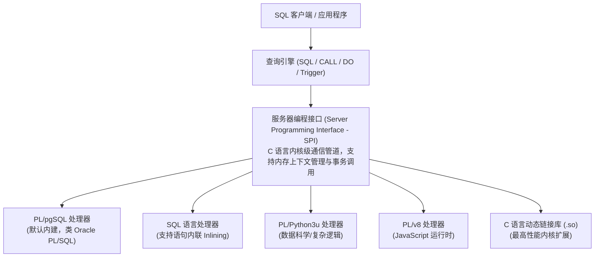
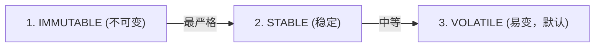
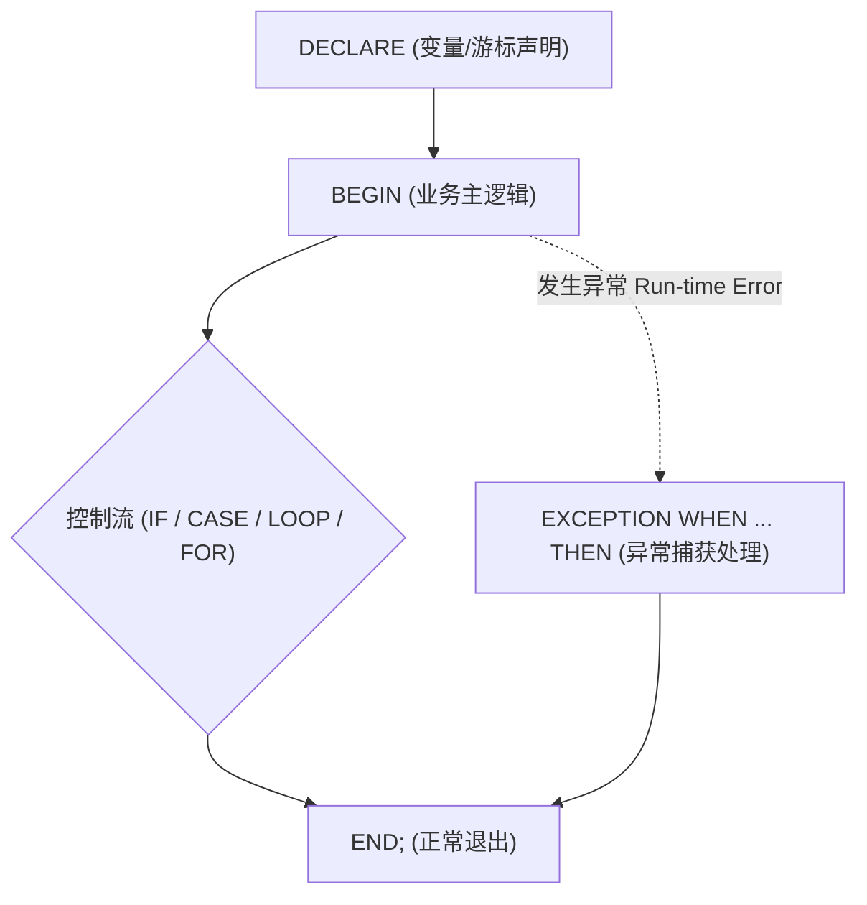
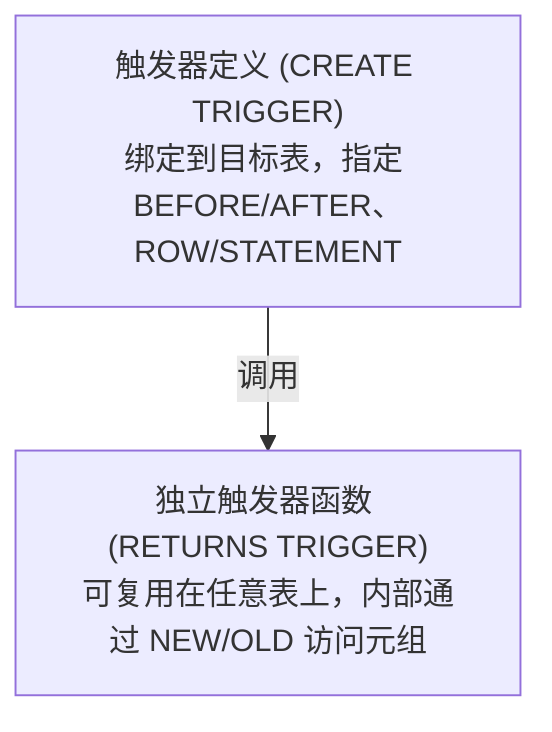

# 第 8 章 服务器端编程：PL/pgSQL 与高级触发器开发

> **适用版本**：PostgreSQL 17 及以上  
> **官方文档参考**：Part V Chapter 36 (*Server Programming Interface*), Chapter 37 (*PL/pgSQL*), Chapter 38 (*Triggers*), Chapter 39 (*Event Triggers*)  
> **主要目标**：全面掌握 PostgreSQL 服务端编程范式，深度解析自定义函数（Function）与存储过程（Procedure）的核心差异、函数易变性（Volatility）对执行计划的影响、PL/pgSQL 语法与异常安全陷阱、行级/语句级/DDL 事件触发器实战，并在每个核心知识点后嵌入与 MySQL 的深度架构对比与代码对照。

---

## 8.1 PostgreSQL 服务端编程体系架构

PostgreSQL 拥有关系型数据库中最强大且最开放的服务端可扩展编程框架。与许多将过程语言深度硬编码在内核的数据库不同，PostgreSQL 采用**可插拔调用处理器（Call Handler Architecture）**。



---

## 8.2 函数（Function）vs 存储过程（Procedure）

PostgreSQL 11 正式引入了符合 SQL 标准的存储过程（`CREATE PROCEDURE`），将“计算返回结果”的函数与“控制事务流程”的过程做了清晰的职责解耦。

### 8.2.1 核心差异对比

| 维度 | 用户自定义函数（Function） | 存储过程（Procedure） |
| :--- | :--- | :--- |
| **创建语法** | `CREATE FUNCTION name(...) RETURNS type` | `CREATE PROCEDURE name(...)` |
| **调用方式** | 作为表达式的一部分调用：<br/>`SELECT func()`, `WHERE func() > 0` | 显式独立调用：<br/>`CALL proc(arg1, arg2);` |
| **返回值** | **必须有返回值**（标量类型、复合类型、`SETOF` 或 `VOID`）。 | **无直接标量返回值**（可通过 `INOUT` 参数返回数据）。 |
| **事务控制能力** | **绝对不能内嵌 `COMMIT` 或 `ROLLBACK`**。<br/>函数始终运行在外部调用的单一事务上下文中。 | **支持内部独立自主事务控制**。<br/>可以在循环体内自由调用 `COMMIT` / `ROLLBACK`，支持大批量分批事务。 |
| **优化器内联支持** | 符合条件的 SQL 函数支持被优化器**内联展开（Inlining）**，直接合并进主查询优化。 | 独立执行，不支持查询优化器内联展开。 |

---

### 8.2.2 函数易变性分类（Volatility Categories）与优化器行为

PostgreSQL 优化器根据函数的易变性级别决定**何时求值、是否缓存计算结果以及能否用于表达式索引**。这是 PG 开发中至关重要的概念。



#### 1. `IMMUTABLE`（不可变）
- **定义**：对于相同的输入参数，**永远返回相同的计算结果**；不能修改数据库，且**绝对不能依赖任何数据库状态（不能读取任何表）或外部环境变量**。
- **优化器优化**：
  - **常量折叠（Constant Folding）**：若参数为常量，优化器在生成计划阶段直接将函数调用预先计算替换为常量值（例如 `my_upper('abc')` 直接替换为 `'ABC'`）。
  - **表达式索引支持**：**只有声明为 `IMMUTABLE` 的函数才能用于创建函数索引 / 表达式索引**（如 `CREATE INDEX ON tbl (lower(email))`）。
- **典型示例**：纯数学计算（`sin(x)`）、字符串处理、数据类型格式化转换。

#### 2. `STABLE`（事务内稳定）
- **定义**：在**同一个事务（或单一查询扫描）内**，只要输入参数相同，返回值保证不变；不能修改数据库，**可以读取数据库表或系统状态**。
- **优化器优化**：
  - 在单次查询扫描期间，相同参数只求值一次，不会随扫描行数重复执行。
  - 允许在索引扫描条件中作为查找键（`Index Cond`）。
- **典型示例**：`now()` / `current_timestamp`（事务启动时确定）、读取配置字典表。

#### 3. `VOLATILE`（易变 - 默认级别）
- **定义**：任何时刻调用都可能返回不同结果，或者存在修改数据库状态等副作用（Side Effects）。
- **优化器行为**：
  - 优化器不做任何假设，**每处理一行数据就必须重新调用执行一次函数**，不能进行常量折叠，不能用于表达式索引。
- **典型示例**：`random()`、`nextval('seq')`、包含 `INSERT/UPDATE` 的函数。

> [!CAUTION]
> **易变性误标陷阱**：若将一个读取表的函数误标为 `IMMUTABLE`，由于其跳过了优化器评估甚至在计划缓存中被固化为常量，当底层表数据更新时，函数将返回陈旧甚至错误的计算结果！

---

### 8.2.3 函数安全性与属性

```sql
CREATE OR REPLACE FUNCTION calculate_tax(amount numeric)
RETURNS numeric
LANGUAGE plpgsql
IMMUTABLE              -- 易变性级别
STRICT                 -- 若入参有 NULL，直接返回 NULL，不进入函数体
SECURITY DEFINER       -- 以函数所有者(Definer)权限运行，而非调用者(Invoker)
SET search_path = pg_catalog, public -- 避免恶意模式注入的安全加固
AS $$
BEGIN
    RETURN amount * 0.08;
END;
$$;
```

- **`STRICT` (`RETURNS NULL ON NULL INPUT`)**：只要任意入参包含 `NULL`，引擎直接返回 `NULL`，免去函数体内的 `IF arg IS NULL` 检查，效率更高。
- **`SECURITY DEFINER` vs `SECURITY INVOKER`（默认）**：
  - `SECURITY DEFINER` 类似于 Unix 的 `setuid`，允许普通用户以超级用户权限执行封装好的安全受限操作。
  - **安全硬化准则**：使用 `SECURITY DEFINER` 时，**必须显式指定 `SET search_path`**，防止恶意用户在自定义同名模式中植入危险对象实现提权劫持。

---

### 8.2.4 🥊 深度对比与代码对照：函数与过程体系（PostgreSQL vs MySQL）

| 特性维度 | PostgreSQL (17) | MySQL (8.0+) | 核心差异与架构考量 |
| :--- | :--- | :--- | :--- |
| **函数与过程职责边界** | **严格解耦**：<br/>`FUNCTION` 专职计算与数据返回，禁止内嵌事务控制；`PROCEDURE` 专职批处理与业务流程，支持自主 `COMMIT`/`ROLLBACK`。 | **界限相对模糊**：<br/>`FUNCTION` 限制严格（不可执行事务，许多 DDL/DML 受限）；`PROCEDURE` 支持 `START TRANSACTION` / `COMMIT`，但缺乏细粒度子事务保存点保护。 | PG 职责划分更符合 SQL 标准，规范性更强。 |
| **函数易变性与索引支持** | **三级易变性（IMMUTABLE / STABLE / VOLATILE）**：<br/>`IMMUTABLE` 纯函数原生支持直接创建**函数索引/表达式索引**，优化器自动执行常量折叠。 | **粗粒度标记（DETERMINISTIC）**：<br/>仅支持声明 `DETERMINISTIC`；**无法直接在自定义函数上建立函数索引**（必须先创建虚拟生成列 Generated Column，再在生成列上建索引）。 | PG 表达式索引与函数计算深度融合，无需增加表结构冗余列。 |
| **事务控制与分批提交** | **完美支持分批事务**：<br/>`PROCEDURE` 中可在一个 `LOOP` 内每隔 N 条执行一次 `COMMIT`，彻底释放锁与内存。 | **支持但易受限制**：<br/>存储过程中可以执行 `COMMIT`，但在主从复制环境下长事务或大批处理容易导致从库延迟放大，且错误处理语法繁琐。 | PG 的存储过程在海量数据清洗与归档场景表现极其健壮。 |

#### 函数与过程定义语法代码对照

##### PostgreSQL 17 自定义函数与存储过程
```sql
-- 1. 自定义计算函数 (IMMUTABLE 可用于创建表达式索引)
CREATE OR REPLACE FUNCTION pg_calc_discount(p_price numeric, p_rate numeric)
RETURNS numeric
LANGUAGE plpgsql
IMMUTABLE STRICT
AS $$
BEGIN
    RETURN round(p_price * (1.0 - p_rate), 2);
END;
$$;

-- 直接使用 IMMUTABLE 函数创建表达式索引
CREATE INDEX idx_orders_discount_price ON orders (pg_calc_discount(amount, 0.1));

-- 2. 存储过程 (独立事务控制，分批 COMMIT)
CREATE OR REPLACE PROCEDURE pg_batch_archive(p_days integer)
LANGUAGE plpgsql
AS $$
DECLARE
    v_rows integer;
BEGIN
    LOOP
        DELETE FROM audit_logs 
        WHERE created_at < current_date - p_days 
          AND id IN (SELECT id FROM audit_logs WHERE created_at < current_date - p_days LIMIT 1000);
        
        GET DIAGNOSTICS v_rows = ROW_COUNT;
        COMMIT; -- 独立事务提交，释放行锁与 WAL
        
        EXIT WHEN v_rows = 0;
    END LOOP;
END;
$$;

CALL pg_batch_archive(90);
```

##### MySQL 8.0 自定义函数与存储过程
```sql
-- 1. MySQL 自定义函数 (DETERMINISTIC 无法直接建函数索引，需借助生成列)
DELIMITER $$
CREATE FUNCTION mysql_calc_discount(p_price DECIMAL(10,2), p_rate DECIMAL(4,2))
RETURNS DECIMAL(10,2)
DETERMINISTIC
CONTAINS SQL
BEGIN
    RETURN ROUND(p_price * (1.0 - p_rate), 2);
END$$
DELIMITER ;

-- MySQL 无法直接 CREATE INDEX ON orders (mysql_calc_discount(amount, 0.1))
-- 必须先建虚拟生成列，再在生成列上建索引：
ALTER TABLE orders ADD COLUMN discount_amount DECIMAL(10,2) 
    GENERATED ALWAYS AS (ROUND(amount * 0.9, 2)) VIRTUAL;
CREATE INDEX idx_orders_discount ON orders (discount_amount);

-- 2. MySQL 存储过程 (分批事务提交)
DELIMITER $$
CREATE PROCEDURE mysql_batch_archive(IN p_days INT)
BEGIN
    DECLARE v_rows INT DEFAULT 1;
    WHILE v_rows > 0 DO
        DELETE FROM audit_logs 
        WHERE created_at < DATE_SUB(CURDATE(), INTERVAL p_days DAY) 
        LIMIT 1000;
        
        SET v_rows = ROW_COUNT();
        COMMIT; -- 提交事务
    END WHILE;
END$$
DELIMITER ;

CALL mysql_batch_archive(90);
```

---

### 8.2.5 匿名代码块：`DO $$ BEGIN ... END $$;`
PostgreSQL 支持通过 `DO` 语句直接在客户端执行临时、匿名的过程代码块，无需预先创建数据库对象：

```sql
-- 生产环境数据迁移与初始化运维脚本
DO $$
DECLARE
    v_count integer;
    v_tbl   record;
BEGIN
    FOR v_tbl IN (SELECT tablename FROM pg_tables WHERE schemaname = 'public') LOOP
        EXECUTE format('ANALYZE public.%I', v_tbl.tablename);
        RAISE NOTICE 'Table % analyzed successfully.', v_tbl.tablename;
    END LOOP;
END $$;
```

---

### 8.2.6 🥊 深度对比与代码对照：匿名代码块执行机制（PG `DO` vs MySQL 临时过程变通）

| 特性维度 | PostgreSQL (17) | MySQL (8.0+) | 架构与运维影响 |
| :--- | :--- | :--- | :--- |
| **原生匿名代码块** | **原生支持 `DO $$ ... $$`**：<br/>可在 SQL 脚本、CI/CD 部署管道或客户端直接执行带变量、循环和动态 SQL 的匿名逻辑。 | **无原生匿名代码块**：<br/>不支持直接执行 `BEGIN ... END` 块。任何过程逻辑必须先创建持久化 Procedure，调用后再删除。 | PG 在数据库版本升级、补丁脚本、一次性数据迁移中体验极佳，无对象残留。 |
| **命名污染与并发安全** | **零元数据残留**：<br/>执行完毕后在系统目录（Catalog）不留下任何持久化对象，天然无并发命名冲突。 | **存在元数据污染与冲突**：<br/>自动化脚本若使用临时存储过程，若未清理或命名冲突（如 `tmp_proc`）会导致其他部署流程报错。 | PG 更适合现代声明式迁移工具（Flyway、Liquibase、Ansible）。 |

#### 自动化发版脚本代码对照

##### PostgreSQL 17 使用 `DO` 块优雅执行幂等列添加
```sql
-- PostgreSQL: 检查列是否存在，若不存在则动态添加（一次性执行，无残留）
DO $$
BEGIN
    IF NOT EXISTS (
        SELECT 1 FROM information_schema.columns 
        WHERE table_schema = 'public' 
          AND table_name = 'orders' 
          AND column_name = 'tax_rate'
    ) THEN
        ALTER TABLE public.orders ADD COLUMN tax_rate numeric(4,2) DEFAULT 0.05 NOT NULL;
        RAISE NOTICE 'Column tax_rate added to public.orders.';
    ELSE
        RAISE NOTICE 'Column tax_rate already exists, skipping.';
    END IF;
END $$;
```

##### MySQL 8.0 必须创建临时存储过程并在调用后删除
```sql
-- MySQL: 缺乏 DO 块，必须显式定义临时过程 -> 执行 -> 删除过程
DELIMITER $$
DROP PROCEDURE IF EXISTS tmp_add_column_if_not_exists$$
CREATE PROCEDURE tmp_add_column_if_not_exists()
BEGIN
    IF NOT EXISTS (
        SELECT 1 FROM information_schema.columns 
        WHERE table_schema = DATABASE() 
          AND table_name = 'orders' 
          AND column_name = 'tax_rate'
    ) THEN
        ALTER TABLE orders ADD COLUMN tax_rate DECIMAL(4,2) DEFAULT 0.05 NOT NULL;
    END IF;
END$$
DELIMITER ;

-- 调用临时过程
CALL tmp_add_column_if_not_exists();

-- 手动清理临时过程，避免污染系统元数据
DROP PROCEDURE IF EXISTS tmp_add_column_if_not_exists;
```

---

## 8.3 PL/pgSQL 语法核心与控制结构

PL/pgSQL 是 PostgreSQL 官方内建的过程化编程语言，支持丰富的结构化控制流、游标与动态执行。



### 8.3.1 变量声明与类型绑定
```sql
DECLARE
    -- 基础标量类型
    v_user_id   bigint := 10001;
    v_status    text DEFAULT 'ACTIVE';
    
    -- 动态类型绑定 (%TYPE): 随表字段类型自动联动变更
    v_balance   accounts.balance%TYPE;
    
    -- 整行记录类型 (%ROWTYPE): 绑定整行元组结构
    v_user_row  users%ROWTYPE;
    
    -- 通用动态记录类型 (RECORD): 在运行时动态决定列结构
    v_rec       RECORD;
```

---

### 8.3.2 控制流结构

#### 1. 条件分支（`IF-THEN-ELSIF-ELSE` 与 `CASE`）
```sql
IF v_score >= 90 THEN
    v_grade := 'A';
ELSIF v_score >= 80 THEN
    v_grade := 'B';
ELSE
    v_grade := 'C';
END IF;
```

#### 2. 循环遍历（`LOOP`, `WHILE`, `FOR in SELECT`）
```sql
-- 1. 数值区间循环 (带 REVERSE 逆序)
FOR i IN REVERSE 10..1 LOOP
    RAISE NOTICE 'Countdown: %', i;
END LOOP;

-- 2. 游标查询遍历循环 (自动隐式管理游标打开与关闭)
FOR v_rec IN
    SELECT id, user_name, email 
    FROM users 
    WHERE created_at < current_date - interval '1 year'
LOOP
    -- 针对每一行数据进行业务处理
    PERFORM send_archive_notification(v_rec.id, v_rec.email);
END LOOP;
```

---

### 8.3.3 动态 SQL 执行与安全防注入（`EXECUTE ... USING`）

> [!IMPORTANT]
> 绝不能使用纯字符串拼接拼接用户输入的查询参数！必须使用 `format()` 配合 `%I`（处理表名/列名等标识符）和 `%L`（处理字面量），或使用 `USING` 参数绑定。

```sql
CREATE OR REPLACE FUNCTION dynamic_query_users(
    p_schema_name text,
    p_table_name  text,
    p_min_age     integer
)
RETURNS SETOF users
LANGUAGE plpgsql
AS $$
DECLARE
    v_sql text;
BEGIN
    -- %I: 安全转义 SQL 标识符 (Identifier)
    -- $1: 预编译参数占位符，通过 USING 安全传入
    v_sql := format('SELECT * FROM %I.%I WHERE age >= $1', p_schema_name, p_table_name);
    
    RETURN QUERY EXECUTE v_sql USING p_min_age;
END;
$$;
```

---

### 8.3.4 异常处理机制与子事务（Subtransaction）性能陷阱

PL/pgSQL 提供了强大的异常拦截能力，但其底层实现机制包含重大的性能隐患。

```sql
CREATE OR REPLACE FUNCTION transfer_funds_safe(
    p_from_id bigint, 
    p_to_id   bigint, 
    p_amount  numeric
)
RETURNS boolean
LANGUAGE plpgsql
AS $$
DECLARE
    v_state   text;
    v_msg     text;
    v_detail  text;
BEGIN
    UPDATE accounts SET balance = balance - p_amount WHERE id = p_from_id AND balance >= p_amount;
    IF NOT FOUND THEN
        RAISE EXCEPTION 'Insufficient funds in source account %', p_from_id
            USING ERRCODE = 'check_violation';
    END IF;
    
    UPDATE accounts SET balance = balance + p_amount WHERE id = p_to_id;
    RETURN true;

EXCEPTION
    WHEN check_violation THEN
        RAISE WARNING 'Business check violation caught.';
        RETURN false;
    WHEN OTHERS THEN
        -- 捕获详细堆栈与 SQLSTATE 错误码
        GET STACKED DIAGNOSTICS 
            v_state  = RETURNED_SQLSTATE,
            v_msg    = MESSAGE_TEXT,
            v_detail = PG_EXCEPTION_DETAIL;
        RAISE LOG 'Transfer failed: State=%, Message=%, Detail=%', v_state, v_msg, v_detail;
        RETURN false;
END;
$$;
```

> [!WARNING]
> **异常处理的底层代价（Subtransaction Overhead）**：
> 在 PL/pgSQL 中，**每个包含 `EXCEPTION` 块的代码段，在进入时都会在内核中隐式创建一个内部子事务保存点（Savepoint / Subtransaction）**。
>
> - 在高并发高频调用（如每秒几万次）的场景下，频繁创建/销毁 Subtransaction 会造成巨大的 WAL 记录开销与 `pg_subtrans` 锁竞争。
> - **生产建议**：仅在真正需要捕获无法预判的异常时才使用 `EXCEPTION`；常规业务逻辑应优先使用 `IF FOUND`、`IF EXISTS` 等条件判断进行逻辑分流。

---

### 8.3.5 🥊 深度对比与代码对照：语法、控制流与错误捕获（PL/pgSQL vs MySQL Stored Programs）

| 语法特性 | PostgreSQL (PL/pgSQL) | MySQL (Stored Programs) | 差异与代码体验 |
| :--- | :--- | :--- | :--- |
| **变量声明与类型绑定** | 支持 `v_id accounts.id%TYPE` 与 `v_row accounts%ROWTYPE` 强类型自动绑定表定义；支持在声明时直接赋初始值 `:=`。 | 仅支持固定类型声明 `DECLARE v_id BIGINT;`；不支持 `%TYPE` 与 `%ROWTYPE`；表字段类型变更时容易产生隐式截断或类型报错。 | PG 在数据库重构、字段类型升级时具备极高的代码健壮性。 |
| **查询结果集循环** | **极简优雅**：<br/>`FOR rec IN SELECT ... LOOP`，系统自动隐式管理游标生命周期。 | **繁琐冗长**：<br/>必须显式 `DECLARE CURSOR FOR ...`，显式 `DECLARE CONTINUE HANDLER FOR NOT FOUND`，手动 `OPEN`、`FETCH`、`CLOSE`。 | PG 开发效率与代码简洁度显著优于 MySQL。 |
| **错误与异常捕获** | **结构化块级捕获**：<br/>`BEGIN ... EXCEPTION WHEN ... THEN`，支持精准 SQLSTATE 捕获与 `GET STACKED DIAGNOSTICS` 获取完整堆栈与上下文。 | **句柄驱动捕获**：<br/>`DECLARE EXIT/CONTINUE HANDLER FOR SQLEXCEPTION`，属于无局部作用域的平铺式句柄，多层嵌套逻辑控制极易失控。 | PG 异常捕获机制与 Java/Python 的 `try-catch` 理念一致，易于编写和排错。 |

#### 查询遍历与异常捕获代码对照

##### PostgreSQL 17 循环与异常捕获
```sql
-- PostgreSQL: 隐式游标遍历 + 结构化异常拦截
CREATE OR REPLACE PROCEDURE pg_process_invoices()
LANGUAGE plpgsql
AS $$
DECLARE
    v_inv record;
BEGIN
    -- 自动打开、遍历并关闭游标
    FOR v_inv IN SELECT id, amount FROM invoices WHERE status = 'PENDING' LOOP
        BEGIN
            -- 内部块级异常隔离
            PERFORM process_single_payment(v_inv.id, v_inv.amount);
            UPDATE invoices SET status = 'PROCESSED' WHERE id = v_inv.id;
        EXCEPTION
            WHEN OTHERS THEN
                -- 仅隔离当前行异常，外层循环继续推进
                UPDATE invoices SET status = 'FAILED' WHERE id = v_inv.id;
                RAISE WARNING 'Invoice % failed to process.', v_inv.id;
        END;
    END LOOP;
END;
$$;
```

##### MySQL 8.0 游标与异常处理
```sql
-- MySQL: 显式声明游标、标志位与 Handler
DELIMITER $$
CREATE PROCEDURE mysql_process_invoices()
BEGIN
    DECLARE done INT DEFAULT FALSE;
    DECLARE v_id BIGINT;
    DECLARE v_amount DECIMAL(10,2);
    
    -- 1. 显式游标定义
    DECLARE cur_inv CURSOR FOR SELECT id, amount FROM invoices WHERE status = 'PENDING';
    -- 2. 必须声明 NOT FOUND 处理器
    DECLARE CONTINUE HANDLER FOR NOT FOUND SET done = TRUE;
    
    OPEN cur_inv;
    
    read_loop: LOOP
        FETCH cur_inv INTO v_id, v_amount;
        IF done THEN
            LEAVE read_loop;
        END IF;
        
        -- 模拟局部错误捕获（必须通过嵌套 BEGIN...END 与 Handler）
        BEGIN
            DECLARE CONTINUE HANDLER FOR SQLEXCEPTION 
            BEGIN
                UPDATE invoices SET status = 'FAILED' WHERE id = v_id;
            END;
            
            CALL process_single_payment(v_id, v_amount);
            UPDATE invoices SET status = 'PROCESSED' WHERE id = v_id;
        END;
    END LOOP;
    
    CLOSE cur_inv;
END$$
DELIMITER ;
```

---

## 8.4 触发器（Triggers）深度解析

触发器是数据库在特定表发生 DML（`INSERT/UPDATE/DELETE/TRUNCATE`）或系统发生 DDL 事件时自动触发执行的机制。

PostgreSQL 的触发器设计采用**触发器函数（Trigger Function）与触发器声明（Trigger Definition）解耦**的架构。



### 8.4.1 触发时机与级别对比

| 触发维度 | `BEFORE` | `AFTER` | `INSTEAD OF` |
| :--- | :--- | :--- | :--- |
| **行级（FOR EACH ROW）** | 在每行数据真正写入堆表前执行。**可以直接修改 `NEW` 行的内容**，或通过 `RETURN NULL` 静默阻断该行的写入。 | 在每行数据已经写入堆表后执行。**无法修改 `NEW` 内容**。适合记录跨表审计日志、触发外部消息队列通知。 | **专门用于视图（VIEW）**。<br/>将对不可更新视图的写操作拦截并转换为对底层多张物理基表的更新。 |
| **语句级（FOR EACH STATEMENT）** | 在整条 SQL 语句执行前触发一次（即使影响 0 行也会触发）。 | 在整条 SQL 语句执行完毕后触发一次。**支持过渡表（Transition Tables）批量获取变更集**。 | 不支持视图。 |

---

### 8.4.2 触发器预定义特殊变量清单

在触发器函数（`RETURNS trigger`）内部，PostgreSQL 自动注入了丰富的上下文变量：

| 变量名 | 类型 | 含义与使用场景 |
| :--- | :--- | :--- |
| **`NEW`** | `RECORD` | 新数据行。在 `INSERT` 和 `UPDATE`（行级）触发器中可用；在 `DELETE` 中为 `NULL`。 |
| **`OLD`** | `RECORD` | 旧数据行。在 `UPDATE` 和 `DELETE`（行级）触发器中可用；在 `INSERT` 中为 `NULL`。 |
| **`TG_OP`** | `text` | 触发操作类型：`'INSERT'`, `'UPDATE'`, `'DELETE'`, `'TRUNCATE'`。 |
| **`TG_WHEN`** | `text` | 触发时机：`'BEFORE'`, `'AFTER'`, `'INSTEAD OF'`。 |
| **`TG_LEVEL`**| `text` | 触发级别：`'ROW'`, `'STATEMENT'`。 |
| **`TG_TABLE_NAME`** | `name` | 当前触发的表名。 |
| **`TG_TABLE_SCHEMA`**| `name` | 当前触发的模式名。 |
| **`TG_NARGS` / `TG_ARGV[]`** | `integer / text[]` | `CREATE TRIGGER` 时传入该触发器的自定义参数个数与参数数组。 |

---

### 8.4.3 🥊 深度对比与代码对照：触发器架构与代码复用（PG 独立触发器函数 vs MySQL 表级内嵌触发器）

| 触发器维度 | PostgreSQL (17) | MySQL (8.0+) | 架构与工程化差异 |
| :--- | :--- | :--- | :--- |
| **代码复用能力** | **高度模块化解耦**：<br/>触发器函数（`RETURNS TRIGGER`）是独立数据库对象。一个通用的时间戳刷新函数或审计函数可挂载到系统内数百张业务表。 | **强耦合单表编写**：<br/>触发器代码必须内联在单张表的 `CREATE TRIGGER` 中。相同业务逻辑必须在所有表内全量复制粘贴，修改时必须逐表重建。 | PG 在企业级工程化维护中具有极高效率，无代码冗余。 |
| **视图支持（INSTEAD OF）** | **原生支持视图 `INSTEAD OF` 触发器**：<br/>可对多表关联视图、聚合视图实现透明的 `INSERT/UPDATE/DELETE` 重写与分流。 | **不支持视图触发器**：<br/>触发器只能创建在物理基表上，无法为多表复杂视图定义写入拦截。 | PG 能够以不可更新视图对外暴露统一接口，底层透明路由。 |
| **语句级触发器与过渡表** | **原生支持**：<br/>支持 `FOR EACH STATEMENT`，支持通过 `REFERENCING NEW TABLE AS new_tbl` 获取整条 SQL 产生的批量数据集。 | **不支持语句级触发器**：<br/>仅支持 `FOR EACH ROW` 行级触发器，无法在单条语句执行前后进行批量操作与批审计。 | PG 批量处理与批审计性能更优。 |

#### 触发器代码复用对照

##### PostgreSQL 17 编写一次通用触发器函数，复用挂载到任意多张表
```sql
-- 1. 定义一次通用的 updated_at 维护函数
CREATE OR REPLACE FUNCTION trg_set_updated_at()
RETURNS TRIGGER
LANGUAGE plpgsql
AS $$
BEGIN
    IF NEW IS DISTINCT FROM OLD THEN
        NEW.updated_at = clock_timestamp();
    END IF;
    RETURN NEW;
END;
$$;

-- 2. 挂载到 orders 表
CREATE TRIGGER trg_orders_u_at BEFORE UPDATE ON orders
FOR EACH ROW EXECUTE FUNCTION trg_set_updated_at();

-- 3. 一键复用到 users 表（无需重写函数体）
CREATE TRIGGER trg_users_u_at BEFORE UPDATE ON users
FOR EACH ROW EXECUTE FUNCTION trg_set_updated_at();
```

##### MySQL 8.0 相同逻辑必须在每张表重复写一遍触发器体
```sql
-- MySQL: 无法定义独立函数复用，必须为 orders 表单独写逻辑
DELIMITER $$
CREATE TRIGGER trg_orders_updated_at
BEFORE UPDATE ON orders
FOR EACH ROW
BEGIN
    SET NEW.updated_at = NOW();
END$$
DELIMITER ;

-- MySQL: 必须为 users 表再次复制粘贴完全相同的逻辑
DELIMITER $$
CREATE TRIGGER trg_users_updated_at
BEFORE UPDATE ON users
FOR EACH ROW
BEGIN
    SET NEW.updated_at = NOW();
END$$
DELIMITER ;
```

---

### 8.4.4 PG 17 事件触发器（Event Triggers）
与绑定在单表上的普通触发器不同，**事件触发器（Event Triggers）是全局的，用于捕获 DDL 语句的生命周期**。

#### 支持的全局事件类型：
1. **`ddl_command_start`**：任何 DDL 执行前触发（可用于拦截阻止未经授权的 DDL）。
2. **`ddl_command_end`**：DDL 执行成功后触发（可用于 DDL 变更全量审计）。
3. **`sql_drop`**：任何数据库对象被 `DROP` 时触发。
4. **`table_rewrite`**：表被 `ALTER TABLE` 重写物理文件前触发。

#### DDL 安全拦截与审计实战：
```sql
-- 1. 创建事件触发器函数 (返回 event_trigger 类型)
CREATE OR REPLACE FUNCTION audit_ddl_changes()
RETURNS event_trigger
LANGUAGE plpgsql
AS $$
DECLARE
    v_obj record;
BEGIN
    FOR v_obj IN SELECT * FROM pg_event_trigger_ddl_commands() LOOP
        -- 记录所有 DDL 操作到审计表
        INSERT INTO ddl_audit_log (
            username, 
            command_tag, 
            object_type, 
            object_identity, 
            executed_at
        ) VALUES (
            session_user, 
            v_obj.command_tag, 
            v_obj.object_type, 
            v_obj.object_identity, 
            clock_timestamp()
        );
    END LOOP;
END;
$$;

-- 2. 创建全局事件触发器
CREATE EVENT TRIGGER trg_audit_ddl
ON ddl_command_end
EXECUTE FUNCTION audit_ddl_changes();
```

---

### 8.4.5 🥊 深度对比与代码对照：DDL 事件审计与安全拦截（PG Event Triggers vs MySQL 无原生 DDL 触发器）

| DDL 审计与防护维度 | PostgreSQL (17) | MySQL (8.0+) | 架构与安全防护差异 |
| :--- | :--- | :--- | :--- |
| **原生 DDL 事件监听** | **原生内建 Event Triggers**：<br/>支持 `ddl_command_start`, `ddl_command_end`, `sql_drop`, `table_rewrite`，支持在事务内直接 `RAISE EXCEPTION` 阻断危险 DDL。 | **缺乏原生 DDL 触发器**：<br/>无法在数据库引擎内部捕获 DDL 生命周期，无法通过 SQL/存储过程阻止非法 `DROP TABLE` 或 `ALTER TABLE`。 | PG 可原生实现高合规场景下的数据库防删表、防篡改机制。 |
| **变更明细与对象捕获** | 通过系统函数 `pg_event_trigger_ddl_commands()` 与 `pg_event_trigger_dropped_objects()` 获取被修改/删除的对象类型、模式与 OID。 | 只能通过事后解析 Binlog，或安装商业版 Enterprise Audit 插件间接记录审计日志。 | PG 审计与事务深度绑定，DDL 回滚时审计操作同步回滚或捕获。 |

#### DDL 生产安全防护拦截代码对照

##### PostgreSQL 17 生产环境禁止非超级用户 `DROP TABLE`
```sql
-- PostgreSQL: 在 DDL 执行前（ddl_command_start）拦截危险操作
CREATE OR REPLACE FUNCTION prevent_accidental_drop_table()
RETURNS event_trigger
LANGUAGE plpgsql
AS $$
BEGIN
    -- 检查当前执行的 DDL 标签
    IF tg_tag = 'DROP TABLE' AND session_user NOT IN ('dba_admin', 'postgres') THEN
        RAISE EXCEPTION 'Safety Guard: DROP TABLE operation is blocked in production for user %!', session_user;
    END IF;
END;
$$;

CREATE EVENT TRIGGER trg_block_drop_table
ON ddl_command_start
WHEN TAG IN ('DROP TABLE')
EXECUTE FUNCTION prevent_accidental_drop_table();
```

##### MySQL 8.0 无法原生实现，只能依赖外部权限或事后日志
```sql
-- MySQL 无法在 SQL 层面定义 DDL 拦截触发器！
-- 唯一的内置防护手段是粗粒度的静态权限管理（撤销 DROP 权限），无法动态识别环境或执行复杂拦截逻辑：
REVOKE DROP ON production_db.* FROM 'app_user'@'%';
```

---

## 8.5 业务实战场景

### 场景 1：自动维护 `updated_at` 时间戳（通用无损复用设计）

#### 业务目标
企业级数据建模要求所有业务表均包含 `updated_at` 字段，且在数据发生真实变更时自动刷新为当前时间；若更新的内容与原内容完全一致，则避免重复刷新。

```sql
-- 1. 创建全局通用的更新时间戳触发器函数
CREATE OR REPLACE FUNCTION trigger_set_updated_at()
RETURNS TRIGGER 
LANGUAGE plpgsql
AS $$
BEGIN
    -- 优化：仅在数据行实际内容发生改变时才更新 updated_at
    -- 利用行级别 IS DISTINCT FROM 进行全字段无空值陷阱的比对
    IF NEW IS DISTINCT FROM OLD THEN
        NEW.updated_at = clock_timestamp();
    END IF;
    RETURN NEW;
END;
$$;

-- 2. 挂载到业务表 (如 orders, users, products)
CREATE TABLE orders (
    id          bigserial PRIMARY KEY,
    order_no    varchar(64) NOT NULL,
    amount      numeric(12, 2) NOT NULL,
    created_at  timestamptz NOT NULL DEFAULT clock_timestamp(),
    updated_at  timestamptz NOT NULL DEFAULT clock_timestamp()
);

CREATE TRIGGER trg_orders_updated_at
BEFORE UPDATE ON orders
FOR EACH ROW
EXECUTE FUNCTION trigger_set_updated_at();
```

---

### 场景 2：核心账户变动全量 JSONB 差异审计触发器

#### 业务目标
金融账户表 `accounts` 发生任何 `INSERT`, `UPDATE`, `DELETE` 时，系统必须无侵入地将变更前后的完整字段转为 JSONB 差量（Diff），并记录客户端 IP 与操作人员。

```sql
-- 1. 创建审计日志流水表
CREATE TABLE account_audit_log (
    audit_id    bigserial PRIMARY KEY,
    account_id  bigint NOT NULL,
    operation   text NOT NULL,
    old_data    jsonb,
    new_data    jsonb,
    changed_by  text NOT NULL,
    client_addr inet,
    created_at  timestamptz NOT NULL DEFAULT clock_timestamp()
);

-- 2. 创建通用审计行级 AFTER 触发器函数
CREATE OR REPLACE FUNCTION process_account_audit()
RETURNS TRIGGER
LANGUAGE plpgsql
AS $$
BEGIN
    IF (TG_OP = 'INSERT') THEN
        INSERT INTO account_audit_log (account_id, operation, old_data, new_data, changed_by, client_addr)
        VALUES (NEW.id, TG_OP, NULL, to_jsonb(NEW), session_user, inet_client_addr());
        RETURN NEW;
    ELSIF (TG_OP = 'UPDATE') THEN
        INSERT INTO account_audit_log (account_id, operation, old_data, new_data, changed_by, client_addr)
        VALUES (NEW.id, TG_OP, to_jsonb(OLD), to_jsonb(NEW), session_user, inet_client_addr());
        RETURN NEW;
    ELSIF (TG_OP = 'DELETE') THEN
        INSERT INTO account_audit_log (account_id, operation, old_data, new_data, changed_by, client_addr)
        VALUES (OLD.id, TG_OP, to_jsonb(OLD), NULL, session_user, inet_client_addr());
        RETURN OLD;
    END IF;
    RETURN NULL;
END;
$$;

-- 3. 挂载触发器
CREATE TRIGGER trg_audit_accounts
AFTER INSERT OR UPDATE OR DELETE ON accounts
FOR EACH ROW
EXECUTE FUNCTION process_account_audit();
```

---

### 场景 3：海量历史数据分批清理存储过程（PROCEDURE + COMMIT）

#### 业务目标
归档清理 5000 万行历史过期日志表 `system_logs`。若直接执行单个 `DELETE FROM system_logs WHERE log_time < '2024-01-01'`，将引发长时间排他锁、WAL 爆发式膨胀以及内存耗尽。

```sql
-- 利用 PostgreSQL 存储过程内的自主事务 COMMIT 进行分批小事务拆分
CREATE OR REPLACE PROCEDURE batch_purge_expired_logs(
    p_cutoff_time timestamptz,
    p_batch_size  integer DEFAULT 5000
)
LANGUAGE plpgsql
AS $$
DECLARE
    v_deleted_count integer := 0;
    v_total_deleted bigint  := 0;
    v_start_time    timestamptz;
BEGIN
    RAISE NOTICE 'Starting batch log purge before % with batch size %...', p_cutoff_time, p_batch_size;
    
    LOOP
        v_start_time := clock_timestamp();
        
        -- 利用 ctid 或主键子查询快速限制单批删除条数
        DELETE FROM system_logs
        WHERE id IN (
            SELECT id 
            FROM system_logs 
            WHERE log_time < p_cutoff_time 
            ORDER BY id ASC
            LIMIT p_batch_size
        );
        
        GET DIAGNOSTICS v_deleted_count = ROW_COUNT;
        v_total_deleted := v_total_deleted + v_deleted_count;
        
        -- 核心步骤：每批次执行完成后，显式提交独立事务并释放行锁与 WAL 缓存
        COMMIT;
        
        RAISE NOTICE 'Batch purged % rows (Total: %), took % ms', 
            v_deleted_count, 
            v_total_deleted, 
            EXTRACT(MILLISECONDS FROM (clock_timestamp() - v_start_time));
        
        -- 当没有更多匹配行时退出循环
        EXIT WHEN v_deleted_count < p_batch_size;
        
        -- 短暂休眠 50 毫秒，让出 I/O 资源给前台业务
        PERFORM pg_sleep(0.05);
    END LOOP;

    RAISE NOTICE 'Log purge completed successfully. Total rows deleted: %', v_total_deleted;
END;
$$;

-- 执行分批存储过程
CALL batch_purge_expired_logs('2024-01-01 00:00:00+08', 5000);
```

---

## 8.6 与 MySQL 深度对比

| 维度 | PostgreSQL 17 | MySQL 8.0+ | 架构差异与生产影响 |
| :--- | :--- | :--- | :--- |
| **服务端多语言生态** | **极其丰富且开放**：<br/>原生支持 PL/pgSQL、SQL，官方扩展支持 PL/Python、PL/v8 (JS)、PL/Perl、PL/R 以及 C 语言动态库。 | **单一闭锁**：<br/>仅支持 MySQL 自身的存储过程语法，无法接入 Python/JS 等现代脚本语言生态。 | PG 可直接在数据库内进行复杂的数据科学计算、模式识别与地理信息处理。 |
| **函数易变性与表达式索引** | **完备的易变性体系**：<br/>明确划分 `IMMUTABLE` / `STABLE` / `VOLATILE`。`IMMUTABLE` 函数可直接用于创建函数索引与优化器常量折叠。 | **无细粒度易变性标记**：<br/>仅有 `DETERMINISTIC` 粗粒度声明，对优化器常量折叠支持弱；不支持直接使用自定义函数建立函数索引（需创建虚拟生成列再建索引）。 | PG 表达式索引与函数计算深度融合，执行路径更加高效。 |
| **触发器架构与代码复用** | **函数与触发器定义解耦**：<br/>编写一个通用的触发器函数（如 `trigger_set_updated_at()`），可一键挂载复用到成百上千张表。支持语句级过渡表（Transition Tables）。 | **触发器与表强绑定**：<br/>每个触发器必须在单表上内联编写所有业务逻辑，相同逻辑必须在所有表中复制粘贴，维护成本高；不支持批量过渡表。 | PG 的触发器设计具备极佳的工程化模块抽象与复用能力。 |
| **DDL 事件触发器** | **原生支持全局 Event Triggers**：<br/>可深度监听 `ddl_command_start/end`、`sql_drop`，实现 DDL 权限拦截、企业级架构防篡改与变更审计。 | **无原生 DDL 触发器**：<br/>无法在数据库内拦截 DDL，只能事后依赖 Binlog 解析或外部审计插件。 | PG 原生满足金融级合规审计与生产防误删拦截要求。 |
| **匿名代码块** | **原生支持 `DO $$ ... $$`**：<br/>可随时在 SQL 客户端或脚本中执行带变量、循环、动态 SQL 的复杂运维与迁移逻辑。 | **不支持匿名代码块**：<br/>必须先 `CREATE PROCEDURE`，然后 `CALL`，最后再手动 `DROP PROCEDURE`。 | PG 的运维自动化脚本与数据迁移流程更加轻量便捷。 |
| **事务控制能力** | `PROCEDURE` 支持在循环中任意 `COMMIT` / `ROLLBACK`；`FUNCTION` 严格禁止事务控制，职责界限分明。 | `PROCEDURE` 虽支持 `START TRANSACTION`/`COMMIT`，但缺少细粒度的 Savepoint 异常捕获机制。 | PG 架构清晰，分批归档与大事务拆分能力更健壮。 |

---

## 8.7 本章小结与开发避坑指南

```mermaid
checklist
    title 服务端编程与触发器开发核心军规
    1. 职责划分: 需要控制事务/分批用 PROCEDURE; 计算返回值用 FUNCTION
    2. 正确标记易变性: 纯函数务必标 IMMUTABLE 以便建索引与常量折叠
    3. 安全加固: SECURITY DEFINER 函数必须显式 SET search_path
    4. 动态 SQL 防注入: 严禁纯拼接，使用 format(%I, %L) 与 USING
    5. 谨慎使用 EXCEPTION 块: 避免在超高频调用中滥用导致 Subtransaction 开销
    6. 触发器复用: 将通用逻辑抽象为 Trigger Function 复用到多张表
    7. 变更审计与防篡改: 生产核心库建立 DDL Event Trigger 全局监控
```

1. **过程（Procedure）做批处理，函数（Function）做计算**：海量数据清洗、分批归档必须使用带有 `COMMIT` 的 `PROCEDURE`，防止单事务撑爆 WAL 和锁资源。
2. **正确声明易变性（Volatility）**：表达式索引必须依托 `IMMUTABLE`，但绝不要将读表函数误标为 `IMMUTABLE`。
3. **警惕 `EXCEPTION` 性能损耗**：PL/pgSQL 的 `BEGIN ... EXCEPTION` 底层会创建 Savepoint 子事务，避免在高并发高频小函数中滥用异常捕获。
4. **动态 SQL 必须参数化**：拼接 SQL 必须使用 `format('%I', col)` 转义对象名，使用 `USING` 传递数据参数，坚决杜绝 SQL 注入。
5. **触发器优先考虑行级与无实质更新过滤**：在 `BEFORE UPDATE` 触发器中比对 `NEW IS DISTINCT FROM OLD`，避免产生无意义的脏行更新。
