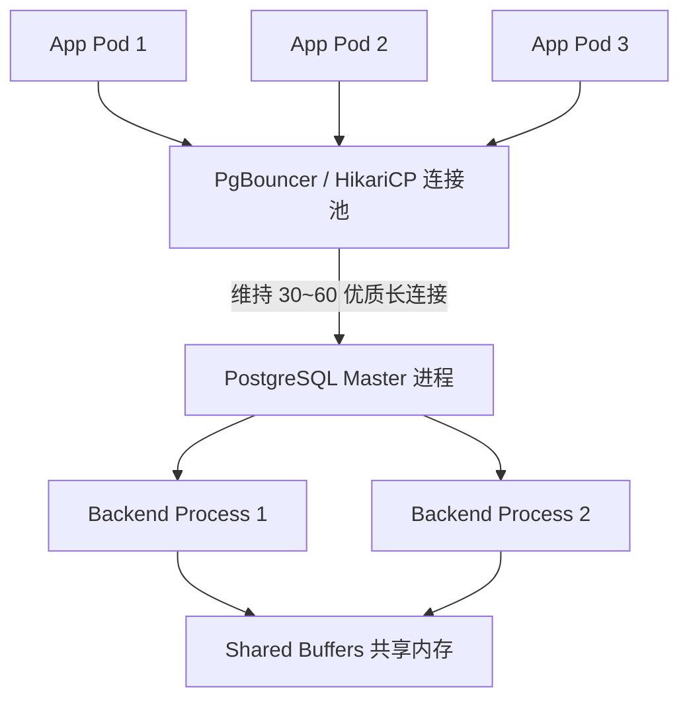
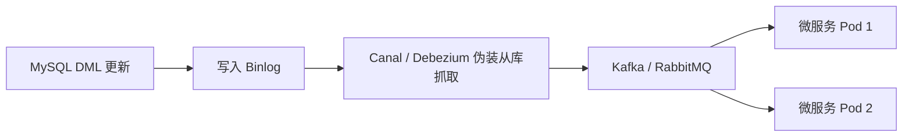
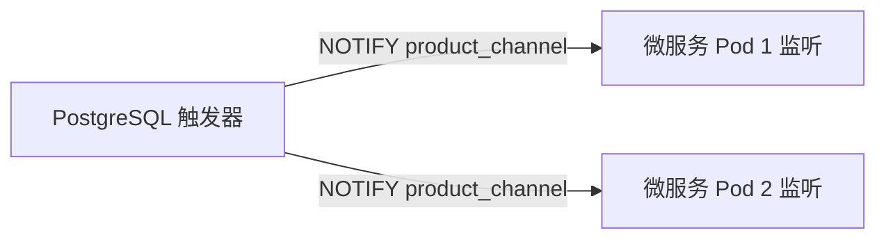

# 09. 客户端接口与高级开发特性

## 1. 章节定位与开发者关注点

在应用架构中，数据库不仅是数据存储引擎，更是与后端应用紧密协作的系统组件。
本章解读官方文档 **Part IV（客户端接口）** 与 **Part III（服务器管理中的开发相关特性）**，重点聚焦：
1. **连接池设计与多进程模型适配**（PgBouncer / HikariCP）
2. **PostgreSQL 原生发布/订阅消息通知：`LISTEN / NOTIFY`**
3. **逻辑复制（Logical Replication）与变更数据捕获（CDC）微服务架构**
4. **大对象（Large Objects / BLOB）与二进制流处理**
5. **元数据查询与 Information Schema**

每个技术模块在解读完 PostgreSQL 17 的机制后，**均紧跟与 MySQL (InnoDB) 的底层运行机制、代码实现与架构对比**。

---

## 2. 核心机制深度解读与 MySQL 对照

### 2.1 多进程模型与连接池最佳实践

#### 🐘 PostgreSQL 17 机制：
PostgreSQL 采用**多进程模型**（Multi-Process）：
- 监听主进程 `postmaster` 接收到客户端 TCP 连接后，通过 `fork()` 创建一个独立的后端进程（Backend Worker Process）处理该连接的所有请求。
- 每个后端进程拥有独立的内存区域（如 `work_mem`、`maintenance_work_mem`），并通过共享内存（`shared_buffers`）与其他进程通信。
- **单连接开销**：每个进程大约占用 **5MB ~ 10MB** 内存。若直连 1000 个客户端，不仅内存膨胀至 10GB，还会因频繁的 CPU 进程上下文切换导致严重性能雪崩。



- **连接池调优公式**：
  $$\text{Connections} = ((\text{CPU 核心数} \times 2) + \text{有效磁盘数})$$
  例如 16 核服务器，最佳服务端连接数通常为 **32 ~ 64**。

---

#### 🥊 PostgreSQL vs MySQL 深度对比：连接与进程模型

| 维度 | PostgreSQL 17 | MySQL 8.x (InnoDB) |
| :--- | :--- | :--- |
| **底层模型** | **多进程模型（Multi-Process）** | **多线程模型（Multi-Thread）** |
| **连接创建开销** | 极高（操作系统级 fork 进程，分配独立内存页） | 较低（线程创建/复用开销相对较小） |
| **空闲连接承载力** | 较弱（几百个空闲连接就会消耗大量内存和描述符） | 较强（单实例常可容纳数千个空闲连接） |
| **连接池依赖度** | **强依赖**：高并发场景必须前置 PgBouncer | 弱依赖：应用层连接池即可，直连承受度高 |
| **单查询并行能力** | 支持单 Query 跨进程并行扫描与计算（Parallel Query） | 8.0 引入有限的单表并行查询 |

> [!IMPORTANT]
> **从 MySQL 迁移到 PG 的避坑要点**：
> 在 MySQL 中，开发团队常给每个 Spring Boot / Go 服务配置 `maxActive=50`，当部署 50 个 Pod 时，MySQL 会接收 2500 个连接且依然能运行。但在 PostgreSQL 中，这会导致 2500 个进程并发竞争，导致 CPU 负载飙升至 100% 且 TPS 暴跌。**在 PG 架构中，务必将微服务连接数调小（如每个 Pod `maxActive=5`），或必须引入 PgBouncer 作为中介！**

---

### 2.2 原生异步消息通知：LISTEN / NOTIFY

#### 🐘 PostgreSQL 17 机制：
PostgreSQL 内置了轻量级的发布/订阅（Pub/Sub）机制，允许在数据库发生数据变更时，**毫秒级异步唤醒后端应用程序**，无需客户端轮询或搭建外部消息中间件。

```sql
-- 1. 订阅频道
LISTEN order_channel;

-- 2. 在业务事务中发送通知（支持携带 JSON Payload，最大 8000 字节）
BEGIN;
INSERT INTO orders (id, user_id, amount) VALUES (1001, 88, 299.0);
NOTIFY order_channel, '{"order_id": 1001, "status": "CREATED"}';
COMMIT; -- 关键特性：仅在事务 COMMIT 成功后，消息才会真正广播出去！
```

---

#### 🥊 PostgreSQL vs MySQL 深度对比：数据变更通知与缓存失效

```
+----------------------------------------------------------------------------------------------------+
| 场景需求：当商品价格发生变更时，通知 10 台微服务节点即时驱逐本地内存缓存 (Local Cache Invalidation) |
+----------------------------------------------------------------------------------------------------+
```

#### MySQL 8.x 实现方案（繁琐且依赖外部组件）：

- **缺点**：链路极长、延迟 100ms~1s、运维复杂度高、排查链路长。

#### PostgreSQL 17 实现方案（极简原生闭环）：

- **优点**：零外部依赖、毫秒级直达、与事务原子绑定（事务回滚则消息自动撤回）。

---

### 2.3 逻辑复制（Logical Replication）与 CDC 架构

#### 🐘 PostgreSQL 17 机制：
基于 WAL 逻辑解码（Logical Decoding），PostgreSQL 原生支持**发布/订阅模式**的数据复制。PG 17 增强了在主从故障切换（Failover）后保留逻辑复制槽的能力。

```sql
-- 发布端（生产库）：发布特定表或带行过滤条件的变更
CREATE PUBLICATION pub_orders_paid FOR TABLE orders WHERE (status = 'PAID');

-- 订阅端（实时报表库/分析库）：订阅数据流
CREATE SUBSCRIPTION sub_orders_paid 
CONNECTION 'host=prod-pg port=5432 dbname=shop user=repl_user password=secret'
PUBLICATION pub_orders_paid;
```

---

#### 🥊 PostgreSQL vs MySQL 深度对比：数据同步与 CDC

| 维度 | PostgreSQL 17 逻辑复制 | MySQL 8.x Binlog 复制 |
| :--- | :--- | :--- |
| **原生发布/订阅** | 原生支持 `CREATE PUBLICATION / SUBSCRIPTION`，可指定表、列列表、行过滤 | 原生主从复制必须按库级别同步，无法原生过滤单表的指定行 |
| **CDC 变更数据捕获** | **逻辑解码插件（pgoutput / wal2json）**：输出结构化 JSON，支持微服务订阅 | **解析 Row 格式 Binlog**：需依赖 Canal / Maxwell / Debezium 解析二进制日志 |
| **双向/多源复制** | 支持多源合并订阅（多对一、一对多） | 原生不支持多源双向环状复制（需借助 GTID 规避，配置复杂） |

---

### 2.4 大对象存储：bytea vs Large Objects (OID)

#### 🐘 PostgreSQL 17 机制：
PG 提供两种二进制数据存储模式：
1. **`bytea` 类型**：变长二进制字符串（适合 <1GB 文件、图片缩略图、加密密钥）。行内存储，过大时自动通过 TOAST 机制切块压缩存储。
2. **`Large Object (OID)`**：存放在系统表 `pg_largeobject` 中，最大支持 **4TB**，提供类似文件系统的流式 API（`loread()`, `lowrite()`, `loseek()`）。

---

#### 🥊 PostgreSQL vs MySQL 深度对比：二进制存储

| 维度 | PostgreSQL 17 | MySQL 8.x |
| :--- | :--- | :--- |
| **短二进制/文件** | `bytea`（支持切片操作与 TOAST 压缩） | `VARBINARY(n)` / `BLOB` |
| **超大文件/流式读写** | **Large Object (OID)**：支持 4TB 文件，支持流式随机 Seek 读写 | **`LONGBLOB`**：最大 4GB，必须一次性读写整个 BLOB 块，无流式 API |

---

## 3. 业务实战场景代码

### 场景 1：基于 LISTEN/NOTIFY 实现微服务缓存近实时失效 (Cache Invalidation)

```sql
-- 1. 创建触发器函数：当商品表变更时发送 NOTIFY
CREATE OR REPLACE FUNCTION notify_product_change()
RETURNS trigger AS $$
DECLARE
    payload jsonb;
BEGIN
    IF (TG_OP = 'DELETE') THEN
        payload = jsonb_build_object(
            'action', TG_OP,
            'table', TG_TABLE_NAME,
            'id', OLD.id
        );
    ELSE
        payload = jsonb_build_object(
            'action', TG_OP,
            'table', TG_TABLE_NAME,
            'id', NEW.id,
            'category_id', NEW.category_id,
            'updated_at', NEW.updated_at
        );
    END IF;

    -- 向 'product_cache_channel' 频道广播 JSON 消息
    PERFORM pg_notify('product_cache_channel', payload::text);
    RETURN NEW;
END;
$$ LANGUAGE plpgsql;

-- 2. 绑定触发器
CREATE TRIGGER trg_product_cache_invalidation
AFTER INSERT OR UPDATE OR DELETE ON products
FOR EACH ROW EXECUTE FUNCTION notify_product_change();
```

#### Node.js 监听端代码：
```javascript
const { Client } = require('pg');
const client = new Client({ connectionString: process.env.DATABASE_URL });

async function startCacheListener() {
  await client.connect();
  await client.query('LISTEN product_cache_channel');

  client.on('notification', (msg) => {
    const data = JSON.parse(msg.payload);
    console.log(`[Cache Invalidation] Table: ${data.table}, ID: ${data.id}, Action: ${data.action}`);
    // 立即驱逐本地内存缓存
    localCache.delete(`product:${data.id}`);
  });
}
startCacheListener();
```
