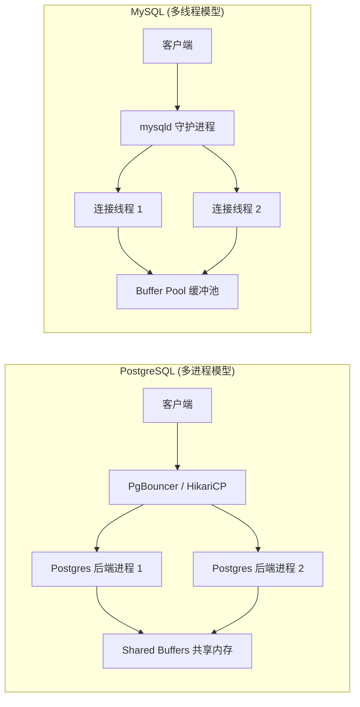
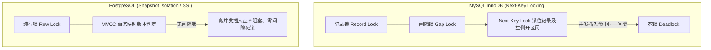

# 11. PostgreSQL 17 与 MySQL 8.x 全维度深度对比与迁移指南

## 1. 章节定位与导读

对于大多数从 MySQL 转向 PostgreSQL，或者在技术选型中权衡两者的开发者与架构师而言，最常见的误区是**将 PostgreSQL 仅仅当成“语法略有不同的 MySQL”来使用**。这种思维容易导致：
1. 忽视 PG 的高级特性（如 `RETURNING`、`JSONB + GIN`、部分索引、咨询锁），写出低效繁琐的应用层代码。
2. 踩入底层机制差异的深坑（如隐式类型转换报错、大小写强制小写、DDL 事务性、多进程连接模型、MVCC 与 VACUUM 原理）。

本章对 **PostgreSQL 17** 与 **MySQL 8.x (InnoDB)** 进行系统、全维度的深度技术对比，涵盖架构、语法、数据类型、索引、事务与锁、查询、函数、服务端编程及常见迁移代码对照。

---

## 2. 十大核心维度技术对比全景表

```
+--------------------------------------------------------------------------------------------------------------------+
| 维度                    | PostgreSQL 17                              | MySQL 8.x (InnoDB)                          |
+-------------------------+--------------------------------------------+---------------------------------------------+
| 1. 核心定位与模型       | ORDBMS (对象-关系型)，标准兼容度极高       | RDBMS (纯关系型)，互联网高并发读写驱动      |
| 2. 并发进程/线程模型    | 多进程模型 (Multi-Process)，单连接开销大   | 多线程模型 (Multi-Thread)，单连接开销较小   |
| 3. 事务性 DDL           | 原生支持 (DDL 可在 BEGIN...ROLLBACK 回滚)  | 不支持 (DDL 自动隐式提交，失败不可回滚)     |
| 4. 标识符大小写         | 默认强制转小写，双引号区分大小写           | 依赖 OS 与 lower_case_table_names，反引号   |
| 5. 类型系统与转换       | 强类型系统，拒绝隐式强转，不匹配直接报错   | 弱类型宽容，自动隐式类型转换 (易致索引失效) |
| 6. 数据写入返回         | 原生支持 RETURNING (INSERT/UPDATE/DELETE)  | 不支持 (需二次查询或借助 LAST_INSERT_ID)    |
| 7. 高级数据类型         | 原生 JSONB、Array 数组、Range 范围、UUID   | 仅 JSON (弱)，无原生数组/范围类型           |
| 8. 索引多样性           | 6 大内置索引 (B-Tree, GiST, GIN, BRIN 等)  | 几乎仅依赖 B+Tree (空间/全文索引能力有限)   |
| 9. 条件/部分索引        | 原生支持 Partial Index (WHERE 过滤建索引)  | 不支持 (只能建全量索引或依赖虚拟列)         |
| 10. MVCC 实现原理       | 堆表元组多版本 (Append-only) + VACUUM 回收 | Undo Log 回滚段 + 最新行原地更新            |
| 11. 锁与防幻读机制      | 无间隙锁，依赖快照隔离 (SSI) 彻底防幻读    | Next-Key Locks (记录锁+间隙锁，易死锁)      |
| 12. 任务队列调度        | FOR UPDATE SKIP LOCKED / NOWAIT (成熟稳定) | 8.0 引入 SKIP LOCKED / NOWAIT               |
| 13. 应用级分布式锁      | 原生 Advisory Locks 咨询锁 (支持事务/会话) | 仅 GET_LOCK() (无事务绑定，功能简陋)        |
| 14. Join 关联算法       | 支持 Nested Loop, Hash Join, Merge Join    | 仅支持 Nested Loop 与 Hash Join (8.0)       |
| 15. 统计信息扩展        | 支持 Extended Statistics 多列多元统计信息  | 仅支持单列直方图，无多列联合依赖统计        |
| 16. 服务端编程语言      | 支持 PL/pgSQL, PL/Python, PL/v8, C 等      | 仅支持内置存储过程语法                      |
| 17. 异步消息通知        | 内置 LISTEN / NOTIFY (事务提交原子广播)    | 无原生通知 (依赖外部轮询或 Binlog)          |
| 18. 扩展插件生态        | 极其强大 (pgvector, PostGIS, pg_trgm 等)   | 插件受限 (主要在引擎层与少量 UDF)           |
+--------------------------------------------------------------------------------------------------------------------+
```

---

## 3. 核心机制差异深度剖析

### 3.1 架构与连接模型：多进程 vs 多线程



- **MySQL**：每个客户端连接由一个轻量级线程处理，创建连接开销较小，单机常可支撑几千个空闲连接。
- **PostgreSQL**：每个连接对应一个独立的操作系统级进程（拥有独立的内存空间与 `work_mem`）。连接开销大（约 5~10MB/连接）。
- **开发与架构启示**：
  - 在 PG 环境下，**必须使用连接池**（如 PgBouncer 或应用层 HikariCP），严禁让成百上千个微服务 Pod 直接直连数据库建立长连接。
  - PG 的连接池大小建议保持在 `(CPU核心数 * 2) ~ 60` 左右，过大连接数反而会因 CPU 上下文切换导致吞吐暴跌。

---

### 3.2 事务性 DDL (Transactional DDL) 对比

#### MySQL (InnoDB)：
MySQL 中执行任何 DDL 语句（`CREATE TABLE`, `ALTER TABLE`, `DROP INDEX` 等）都会**隐式触发当前事务自动提交（Implicit Commit）**。如果在一个发版升级脚本中有 5 条 DDL，第 3 条失败了，前 2 条**无法回滚**，数据库会处于破坏性的“半迁移状态”。

#### PostgreSQL 17：
PostgreSQL 原生将 DDL 纳入事务管理器中。在 `BEGIN ... COMMIT` 代码块中，DDL 与 DML 一样可以随时 `ROLLBACK`：

```sql
-- PostgreSQL 原生安全的原子数据库迁移脚本
BEGIN;

ALTER TABLE users ADD COLUMN phone VARCHAR(20);
ALTER TABLE users ADD CONSTRAINT chk_phone_format CHECK (phone ~ '^\+?[0-9]{10,15}$');
CREATE INDEX idx_users_phone ON users (phone);

-- 模拟出错业务逻辑或校验失败
-- 一旦抛出异常，执行 ROLLBACK，上述所有加字段、加约束、加索引全部无痕回滚！
ROLLBACK;
```

---

### 3.3 MVCC 与并发控制：堆表追加 vs Undo Log 回滚段

| 维度 | PostgreSQL (元组追加写入) | MySQL InnoDB (Undo 回滚段) |
| :--- | :--- | :--- |
| **UPDATE 机制** | 插入一行全新元组（带有新 `xmin`），旧元组标记 `xmax` 为当前事务 ID。 | 原地（In-place）修改主键聚簇索引行，将旧版本数据写入 Undo Log。 |
| **存储位置** | 新旧版本数据均存放在数据堆表（Heap Table）中。 | 最新数据在聚簇表空间，历史版本在独立 Undo 表空间。 |
| **空间回收** | 依赖 `VACUUM` / `autovacuum` 清理无用死元组（Dead Tuples）。 | 依赖后台 Purge 线程清理 Undo Log。 |
| **长事务影响** | 长事务会阻止 `autovacuum` 清理死元组，导致**表膨胀（Table Bloat）**。 | 长事务会导致 **Undo Log 持续膨胀**，拖慢全局回滚与查询性能。 |
| **读写冲突** | 读不阻塞写，写不阻塞读。 | 读不阻塞写，写不阻塞读。 |
| **HOT 优化** | **HOT (Heap-Only Tuples)**：如果更新未改变索引列且页内有空闲空间，不修改索引指针，开销大幅降低。 | 二级索引回表通过主键定位，原地更新非主键字段无需重建主键树。 |

---

### 3.4 锁机制与防幻读：无间隙锁 vs Next-Key Lock

这是导致 MySQL 开发者在编写高并发业务时最容易踩坑的差异：



1. **MySQL**：在可重复读（Repeatable Read）隔离级别下，为了防止幻读（Phantom Read），InnoDB 引入了 **Next-Key Locks（行锁 + 间隙锁 Gap Lock）**。当执行 `SELECT ... FOR UPDATE` 或范围更新时，会锁住不存在的“间隙”，并发向该间隙插入数据时极易发生死锁。
2. **PostgreSQL**：在可重复读（Repeatable Read）隔离级别下，**天生杜绝幻读**且**没有任何间隙锁（No Gap Lock）**！
   - PG 使用基于快照的 MVCC 判定可见性；
   - 在可串行化（Serializable）级别下，使用先进的 **SSI（可串行化快照隔离算法）** 通过读写依赖图（SIREAD 锁）自动检测并发冲突，冲突时直接抛出 `40001 serialization_failure` 由应用层重试，完全不需要锁住数据间隙。

---

## 4. 关键语法与常用开发场景对比对照表

### 4.1 数据写入与主键返回

#### MySQL 8.x:
```sql
-- 1. 插入数据
INSERT INTO orders (user_id, amount) VALUES (101, 88.5);
-- 2. 必须发起第二次调用或客户端获取自增 ID
SELECT LAST_INSERT_ID();
```

#### PostgreSQL 17:
```sql
-- 单条语句原子完成插入并直接返回生成的 ID 及计算列
INSERT INTO orders (user_id, amount) 
VALUES (101, 88.5) 
RETURNING id, created_at, (amount * 0.9) AS discounted_amount;
```

---

### 4.2 UPSERT（存在则更新，不存在则插入）

#### MySQL 8.x:
```sql
INSERT INTO user_stats (user_id, login_count, last_login)
VALUES (1001, 1, NOW())
ON DUPLICATE KEY UPDATE 
    login_count = login_count + 1,
    last_login = VALUES(last_login);
```

#### PostgreSQL 17:
```sql
-- 更加灵活：可精准指定冲突的目标索引列，支持 WHERE 过滤，并使用 EXCLUDED 伪表
INSERT INTO user_stats (user_id, login_count, last_login)
VALUES (1001, 1, NOW())
ON CONFLICT (user_id) 
DO UPDATE SET 
    login_count = user_stats.login_count + 1,
    last_login = EXCLUDED.last_login
WHERE user_stats.is_active = TRUE  -- 支持条件更新
RETURNING login_count;             -- 支持直接返回更新后的值！
```

---

### 4.3 批量合并数据：MERGE 语句

- **MySQL 8.x**：不支持 ANSI `MERGE` 语法。
- **PostgreSQL 17**：全面支持标准 `MERGE`，并增强支持 `RETURNING` 子句！

```sql
MERGE INTO inventory AS target
USING incoming_stock AS source
ON target.product_id = source.product_id
WHEN MATCHED AND source.quantity = 0 THEN
    DELETE
WHEN MATCHED THEN
    UPDATE SET stock = target.stock + source.quantity, updated_at = NOW()
WHEN NOT MATCHED THEN
    INSERT (product_id, stock, updated_at) VALUES (source.product_id, source.quantity, NOW())
RETURNING merge_action(), target.product_id, target.stock;
```

---

### 4.4 树形层级与递归查询

#### MySQL 8.x:
```sql
WITH RECURSIVE org_tree AS (
    SELECT id, name, parent_id FROM departments WHERE id = 1
    UNION ALL
    SELECT d.id, d.name, d.parent_id 
    FROM departments d
    JOIN org_tree ot ON d.parent_id = ot.id
)
SELECT * FROM org_tree;
-- 注意：MySQL 8.0 不支持标准 CYCLE 环路检测，若数据有死循环会导致死锁或耗尽内存
```

#### PostgreSQL 17:
```sql
-- PG 原生支持标准 CYCLE 语法自动检测数据环路，防止无限递归爆栈
WITH RECURSIVE org_tree AS (
    SELECT id, name, parent_id, ARRAY[name] AS path_names
    FROM departments WHERE id = 1
    UNION ALL
    SELECT d.id, d.name, d.parent_id, ot.path_names || d.name
    FROM departments d
    JOIN org_tree ot ON d.parent_id = ot.id
)
CYCLE id SET is_cycle USING path
SELECT id, name, array_to_string(path_names, ' > ') AS full_path, is_cycle
FROM org_tree;
```

---

### 4.5 范围与条件部分索引（Partial Index）

#### 场景：千万级表中只给未完成订单（占 1%）加索引

#### MySQL 8.x（不支持部分索引）：
```sql
-- 必须对整张千万级表建立全量索引，占用几百兆磁盘且每次写操作都要维护索引
CREATE INDEX idx_orders_status ON orders (status, created_at);
```

#### PostgreSQL 17（部分索引）：
```sql
-- 仅对 status = 'PENDING' 的 1% 数据建索引，索引体积缩减 99%，写性能提升数倍！
CREATE INDEX idx_orders_pending ON orders (created_at) 
WHERE status = 'PENDING';
```

---

### 4.6 高性能任务调度与分布式锁

#### 场景：多个后台 Worker 并发领取待处理任务，要求零锁冲突、高吞吐

#### PostgreSQL 17:
```sql
-- Worker 1、Worker 2 并发执行，自动跳过被其他 Worker 锁住的行，绝不互相阻塞！
BEGIN;
SELECT id, task_payload 
FROM task_queue
WHERE status = 'QUEUED'
ORDER BY priority DESC, id ASC
LIMIT 10
FOR UPDATE SKIP LOCKED;

-- 处理完成后直接更新状态并提交
UPDATE task_queue SET status = 'PROCESSING' WHERE id IN (...);
COMMIT;
```

#### 原生应用级分布式锁（Advisory Locks）：
```sql
-- 获取与事务绑定的独占咨询锁（无需 Redis，毫秒级轻量）
SELECT pg_try_advisory_xact_lock(10086); -- 成功返回 true，被占用返回 false
```

---

## 5. 从 MySQL 迁移到 PostgreSQL 的必备避坑指南

```
+----+-----------------------+----------------------------------+----------------------------------+---------------------------------------------+
| 序 | 避坑点                | MySQL (InnoDB) 表现              | PostgreSQL 17 表现               | 开发者规范与应对方案                        |
+----+-----------------------+----------------------------------+----------------------------------+---------------------------------------------+
| 1  | 标识符大小写          | 允许小写/驼峰，用反引号 `col`    | 默认全部转小写，双引号区分       | 一律使用全小写 + 下划线 (snake_case)        |
| 2  | 字符串与双引号        | 允许用双引号 `"str"` 表示字符串  | 双引号代表列名/表名，单引号代表字面量 | 字符串一律使用标准单引号 'str'              |
| 3  | 隐式类型转换          | 字符串与数字混比自动强转 (全表扫)| 严格强类型报错，拒绝自动强转     | 参数类型必须与字段严格一致，或使用 ::cast   |
| 4  | NULL 排序行为         | ORDER BY ASC 时 NULL 排在最前面  | ORDER BY ASC 时 NULL 默认在最后面| 显式使用 NULLS FIRST 或 NULLS LAST          |
| 5  | 时间时区存储          | DATETIME 无时区，TIMESTAMP 仅到2038| 推荐 TIMESTAMPTZ (存UTC/带时区)   | 业务时间字段一律选用 TIMESTAMPTZ            |
| 6  | 批量更新关联          | UPDATE t1 JOIN t2 ON ... SET ... | 不支持直接 JOIN，使用 UPDATE...FROM | 改写为 UPDATE t1 SET ... FROM t2 WHERE ...  |
| 7  | GROUP BY 聚合         | 宽松模式下允许 SELECT 非聚合列   | 严格遵循 SQL 标准，非法列直接报错| SELECT 列必须在 GROUP BY 中或在主键函数依赖中|
| 8  | 自增主键机制          | AUTO_INCREMENT (表级元数据)      | GENERATED ALWAYS AS IDENTITY     | 优先采用 SQL 标准 IDENTITY 语法代替 SERIAL  |
| 9  | JSON 类型选型         | 仅 JSON 类型                     | 提供 JSON 与 JSONB 两种          | 99.9% 业务场景无脑选择 JSONB (支持 GIN 索引)|
| 10 | 长事务与垃圾回收      | 长事务导致 Undo Log 暴涨         | 长事务导致 Dead Tuples 堆积(表膨胀)| 严禁长事务，合理配置 autovacuum 阈值        |
+----+-----------------------+----------------------------------+----------------------------------+---------------------------------------------+
```
